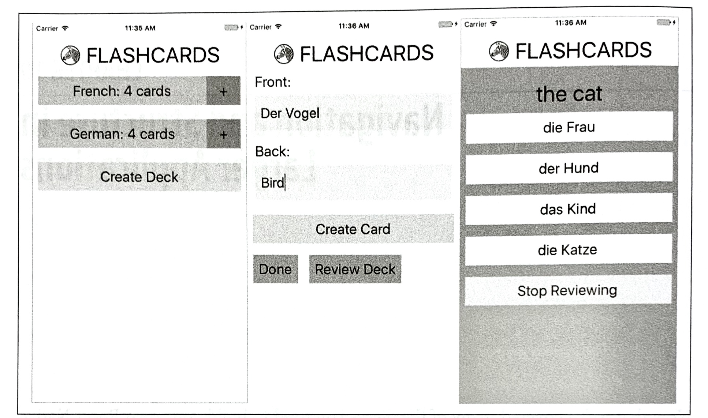
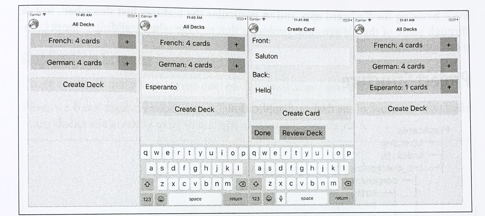
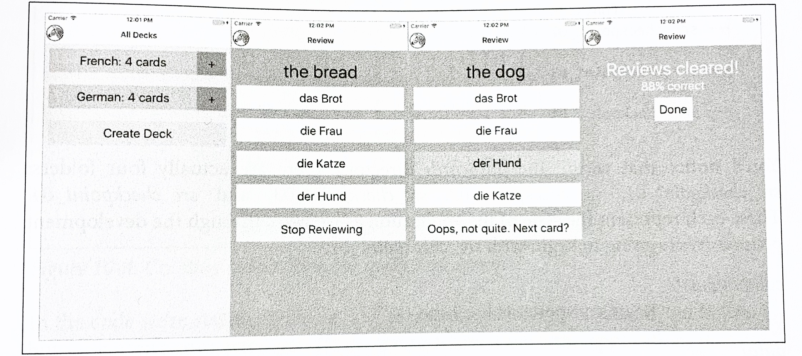
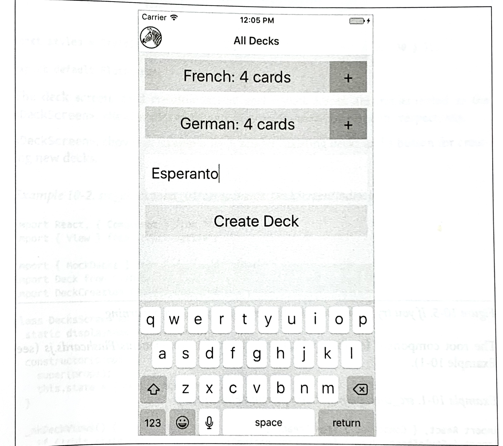
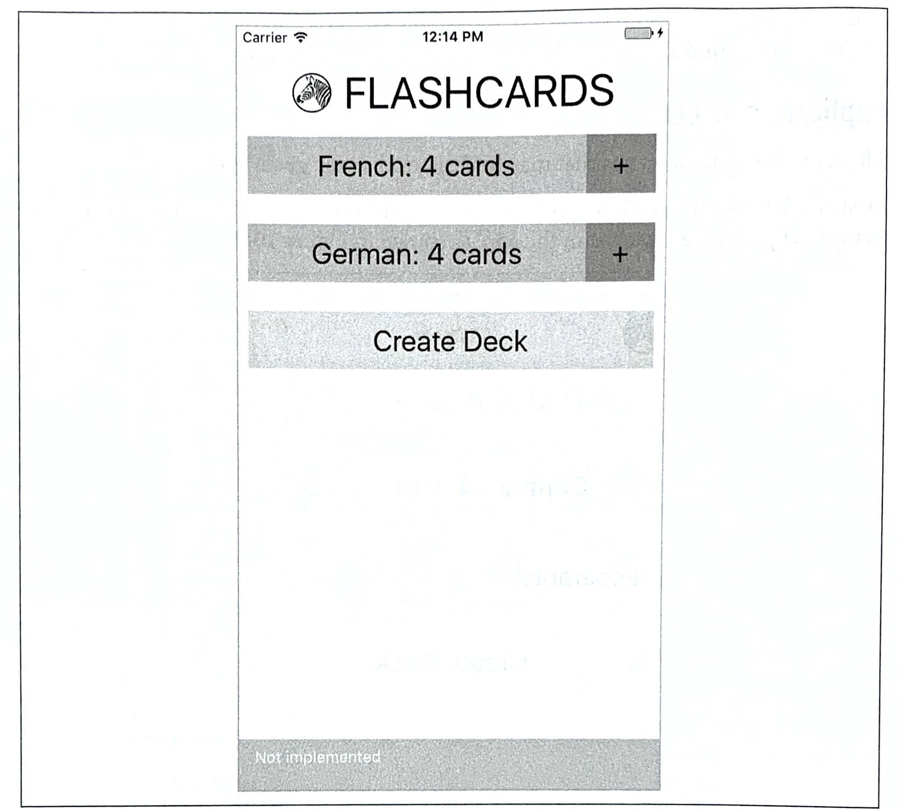
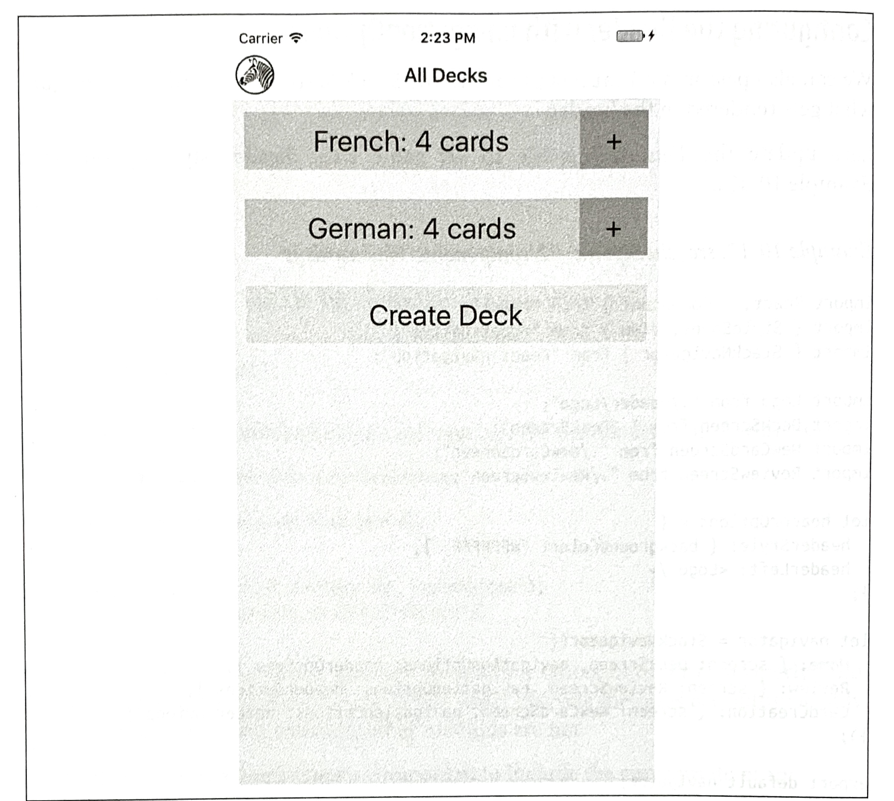

### CHAPTER 10

## Navigation and Structure in Larger Applications

Now that we've covered many of the pieces you need to build your own React Native applications, let's put everything together. Up until now, we've mostly dealt with small examples. In this chapter, we'll look at the structure of a larger application. We'll cover how to use the `<StackNavigation>` component from `react-navigation` to handle transitions between different screens in an application. 

The example application from this chapter will also be used in Chapter 11, where we'll look at how to integrate the state management library Redux into our application. 

### The Flashcard Application

In this chapter, we're going to be building a flashcard application that allows users to create decks of cards and then review them. The flashcard application is more complex than the sample applications we've been building so far. It's meant to model what a more fleshed-out application might look like. All the code available on GitHub (*http://bit.ly/flashcardslrn*). This application is entirely JavaScript-based and cross-platform: it will work on iOS or Android, and is compatible with Expo (meaning you can use the Create React Native App).

As illustrated in Figure 10-1, the Flashcard app has three main views: 

* The home page, which lists available decks and allows you to create new decks 
* The card creation screen
* The review screen



*Figure 10-1. Viewing decks, card creation, and card review*

Users of the app go through two main interaction flows. The first deals with content creation (i.e., the creation of decks as well as cards). The content creation process works as follows (illustrated in Figure 10-2):

1. The user taps Create Deck
2. The user enters a deck name, then either taps the Return button or Create Deck again. 
3. The user enters values for Front and Back, and then taps Create Card.
4. After entering zero or more cards, the user may tap Done, bringing him or her back to the original screen. Alternatively, the user may tap Review Deck and begin reviewing.

The user may also initiate card creation at a later date by tapping the + buttons on the home screen. 



*Figure 10-2. Creating a deck*

The second main interaction flow deals with card review (illustrated in Figure 10-3):

1. The user taps the deck's name that he/she wishes to review
2. The user is presented with the question screen.
3. The user taps one of the provided options.
4. The user receives feedback based on whether the guess was correct.
5. To view the next review, the user taps Continue.
6. Once all reviews are completed, the user reaches the "Reviews cleared!" screen.

*Figure 10-3. Reviewing cards*

We'll be using the flashcard app, and in particular the features just described, to talk through some of the patterns and problems that emerge when building a more complete application. 

### Project Structure

Here's the structure of the flashcard application:

```bash
	flashcards
	├── icon.png
	├── index.js
	├── src_checkpoint_01
			├── components
			│		├── Button.js
			│		├── DeckScreen.js
			│		├── Flashcards.js
			│		├── Header
			│		├── HeadingText.js
			│		├── Input.js
			│		├── LabeledInput.js
			│		├── NewCardScreen
			│		├── NormalText.js
			│		└── ReviewScreen
			├── data
			│		├── Card.js
			│		├── Deck.js
			│		├── Mocks.js
			│		└── QuizCardView.js
			└── styles
					├── colors.js
					└── fonts.js
	├── src_checkpoint_02
   		 ├── ...
	├── src_checkpoint_03
	 		 ├── ...
  ├── src_checkpoint_04
   		 ├── ...
```

You'll notice that within the *flashcards* directory, there are actually four folders: *src_checkpoint_01*,

*src_checkpoint_02*, *src_checkpoint_03*, and *src_checkpoint_04*. These each represent the state of the application as we work through the development process. We're going to begin with *src_checkpoint_01*,

*components/*

​		All of our React components live here.

*data/* 

​		This is where you'll find our data models, representing cards, decks, and reviews.

*styles/*

​		Here you'll find stylesheet objects, which are reused elsewhere.

#### Application Screens

There are three main scenes that may be displayed at any given time.

First, we have deck creation, from the main deck screen. This screen will display as many decks as currently exist in the app, as shown in Figure 10-4.

*Figure 10-4. Creating a deck from the main deck screen*

In the code we're starting with, each of these screens is implemented as a component, but they aren't connected yet. If you try to interact with the application, it shows a "Not implemented" warning (see Figure 10-5).

*Figure 10-5. If you try to interact with the application, you get a warning*

The root component for the application is located in *components/Flashcard.js* (see Example 10-1).

*Example 10-1. src_checkpoint_01/components/Flashcard.js*

```react
import React, { Component } from "reacat";
import { StyleSheet, View } from "react-native";

import Heading from "./Header";
import DeckScreen from "./DeckScreen";
import NewCardScreen from "./NewCardScreen";
import ReviewScreen from "./ReviewScreen";

class Flashcards extends Component {
  _renderScene() {
    // return <ReviewScreen />;
    // return <NewCardScreen />;
    return <DeckScreen />;
  }
  render() {
    return (
    	<View style={styles.container}>
        <Heading />
        {this._renderScene()}
      </View>
    );
  }
}

const styles = StyleSheet.create({ container: { flex: 1, marginTop: 30 } });

export default Flashcards;
```

The deck screen, card creation screen, and review screen are implemented as the `<DeckScreen>`, `<NewCardScreen>`, and `<ReviewScreen>` components, respectively.

`<DeckScreen>`, shown in Example 10-2, renders existing decks and a button for creating new decks. 

*Example 10-2. src_checkpoint_01/components/DeckScreen/index.js*

```react
import React, { Component } from "react";
import { View } from "react-native";

import { MockDecks } from "./../../data/Mocks";
import Deck from "./Deck";
import DeckCreation from "./DeckCreation";

class DeckScreen extends Component {
  static displayName = "DeckScreen";
	
	constructor(props) {
    super(props);
    this.state = { decks: MockDecks };
  }
	
	_mkDeckViews() {
    if (!this.state.decks) {
      return null;
    }
    
    return this.state.decks.map(deck => {
      return <Deck deck={deck} count={deck.cards.length} key={deck.id} />
    });
  }
	render() {
    return (
    	<View>
        {this._mkDeckViews()}
        <DeckCreation />
      </View>
    );
  }
}

export default DeckScreen;
```

`<NewCard>`, shown in Example 10-3, has input fields for creating new cards. The callbacks for handling actual card creation are not yet implemented.

*Example 10-3. src_checkpoint_01/components/NewCardScreen/index.js*

```react
import React, { Component } from "react";
import { StyleSheet, View } from "react-native";

import DeckModel from "./../../data/Deck";

import Button from "../Button";
import LabeledInput from "../LabeledText";
import NormalText from "../NormalText";
import colors from "../../styles/colors";

class NewCard extends Component {
  constructor(props) {
    super(props);
    this.state = { font: "", back: "" };
  }
  
  _handleFront = text => {
    this.setState({ font: text });
  };

	_handleBack = text => {
    this.setState({ back: text });
  };
  
  _createCard = () => {
    console.warn("Not implemented");
  };

	_reviewDeck = () => {
    console.warn("Not implemented");
  };

	_doneCreating = () => {
    console.warn("Not implemented");
  };

	render() {
    return (
    	<View>
        <LabeledInput 
          label="Front"
          clearOnSubmit={false}
          onEntry={this._handleFront}
          onChange={this._handleFront}
        />
        <LabeledInput 
          label="Back"
          clearOnSubmit={false}
          onEntry={this._handleBack}
          onChange={this._handleBack}
        />
        
        <Button style={styles.createButton} onPress={this._createCard}>
          <NormalText>Create Card</NormalText>
        </Button>
        
        <View style={styles.buttonRow}>
          <Button style={styles.secondaryButton} onPress={this._doneCreating}>
            <NormalText>Done</NormalText>
          </Button>
          
          <Button style={styles.secondaryButton} onPress={this._reviewDeck}>
            <NormalText>Review Deck</NormalText>
          </Button>
        </View>
      </View>
    );
  }
}

const styles = StyleSheet.create({
  createButton: { backgroundColor: colors.green },
  secondaryButton: { bakcgroundColor: colors.blue },
  buttonRow: { flexDirection: "row" }
});

export default NewCard;
```

`<ReviewScreen>`, shown in Example 10-4, displays a series of reviews in a multiple-choice style format. Once the user selects an answer, it renders the next review.

*Example 10-4. src_checkpoint_01/components/ReviewScreen/index.js*

```react
import React, { Component } from "react";
import { StyleSheet, View } from "react-native";

import ViewCard from "./ViewCard";
import { MockReviews } from "./../../data/Mocks";
import { mkReviewSummary } from "./ReviewSummary";
import colors from "./../../styles/colors";

class ReviewScreen extends Components {
  static displayName = "ReviewScreen";

	constructor(props) {
    supter(props);
    this.state = {
      numReviewed: 0,
      numCorrect: 0,
      currentReview: 0,
      reviews: MockReviews
    };
  }

	onReview = correct => {
    if (correct) {
      this.setState({ numCorrect: this.state.numCorrect + 1 });
    }
    this.setState({ numReview: this.state.currentReview + 1 });
  };

	_nextReview = () => {
    this.setState({ currentReview: this.state.currentReview + 1 });
  };

	_quitReviewing = () => {
    console.warn("Not implemented");
  };

	_contents() {
    if (!this.state.reviews || this.state.reviews.length === 0) {
      return null;
    }
    
    if (this.state.currentReview < this.state.reviews.length) {
      return (
      	<ViewCard
          onReview={this.onReview}
          continue={this._nextReview}
          quit={this._quitReviewing}
          {...this.state.reviews[this.state.currentReview]}
        />
      );
    } else {
      let percent = this.state.numCorrect / this.state.numReviewed;
      return mkReviewSummary(percent, this._quitReviewing);
    }
  }
	render() {
    return (
    	<View style={styles.container}>
        {this._contents()}
      </View>
    );
  }
}

const styles = StyleSheet.create({
  container: { backgroundColor: colors.blue, flex: 1, paddingTop: 24 }
});

export default ReviewScreen;
```

You'll notice that many of the components used by these screens are not built-in React Native components, but rather reusable components provided by the purposes of building out the flashcard app. Let's take a look at them now.

#### Reusable Components

As mentioned earlier, when you're building larger applications it's useful to have some styled components that you can reuse over and over again. You may have noticed that the preceding components do not use `<Text>` in order to render text: instead, they use `<HeadingText>` and `<NormalText>`. Similarly, the `<Button>` component is reused frequently, as are the `<Input>` and `<LabeledInput>` components. This helps with code readability, makes creating new components easier, and makes it easy to restyle the application.

The following components are reusable components. We'll use them throughout the flashcard application as we flesh out the starter code and turn it into a working application. 

The first of these components is a simple `<Button>`, shown in Example 10-5. It wraps an arbitrary component (i.e., `this.props.children`) in a `<TouchableOpacity>` component. It takes an `onPress` callback and also allows you to override the style via props. 

*Example 10-5. src_checkpoint_01/components/Button.js*

```react
import React, { Component } from "react";
import { StyleSheet, View, TouchableOpacity } form "react-native";

import colors from "./../styles/colors";

class Button extends Component {
	static displayName = "Button";
	render() {
    let opacity = this.props.disabble ? 1 : 0.5;
    return (
    	<TouchableOpacity
        activeOpacity={opacity}
        onPress={this.props.onPress}
        style={[styles.wideButton, this.props.style]}
      >
        {this.props.children}
      </TouchableOpacity>
    );
  }
}

Button.defaultProps = { disabled: false };

export default Button;

const styles = StyleSheet.create({
  wideButton: {
    justifyContent: "center",
    alignItems: "center",
    padding: 10,
    margin: 10,
    backgroundColor: colors.pink
  }
});
```

Next up is the `<NormalText>` component, shown in Example 10-6. It's mostly an ordinary `<Text>` component with some styles applied to scale the font size based on the window dimensions.

*Example 10-6. src_checkpoint_01/components/NormalText.js*

```react
import React, { Component } from "react";
import { StyleSheet, Text, View } from "react-native";

import { fonts, scalingFactors } from "./../styles/fonts";
import Dimensions from "Dimensions";
let { width } = Dimensions.get("window");

class NormalText extends Component {
  static displayName = "NormalText";

	render() {
    return (
    	<Text style={[this.props.style, fonts.normal, scaled.normal]}>
        {this.props.children}
      </Text>
    );
  }
}

const scaled = StyleSheet.create({
	normal: { fontSize: width * 1.0 / scalingFactors.normal }
});

export default NormalText;
```

`<HeadingText>`, shown in Example 10-7, is much the same as `<NormalText>`, but with larger font size.

*Example 10-7. src_checkpoint_01/components/HeadingText.js*

```react
import React, { Component } from "react";
import { StyleSheet, Text, View } from "react-native";

import { fonts, scalingFactors } from "./../styles/fonts";
import Dimensions from "Dimensions";
let { width } = Dimensions.get("window");

class HeadingText extends Component {
  static displayName = "HeadingText";

	render() {
    return (
    	<Text style={[this.props.style, fonts.big, scaled.big]}>
        {this.props.children}
      </Text>
    );
  }
}

const scaled = StyleSheet.create({
  big: { fontSize: width / scalingFactors.big }
})

export default HeadingText;
```

`<Input>`, shown in Example 10-8, provides some sensible default props around the built-in `<TextInput>` component and handles updating state as well as triggering callbacks.

*Example 10-8. src_checkpoint_01/components/Input.js*

```react
import React, { Component } from "react";
import { StyleSheet, TextInput, View } from "react-native";

import colors from "./../styles/colors";
import { fonts } from "./../styles/fonts";

class Input extends Component {
  constructor(props) {
    super(props);
    this.state = { text: "" };
  }
  
  _create = () => {
    this.props.onEntry(this.state.text);
    this.setState({ text: "" }); 

	_onSubmit = ev => {
    this.props.onEntry(ev.nativeEvent.text);
    if (this.props.clearOnSubmit) {
      this.setState({ text: "" });
    }
  };
    
  _onChange = text => {
    this.setState({ text: text });
    if  (this.props.onChange) {
      this.props.onChange(text);
    }
  };
    
  render() {
    return (
    	<TextInput
        style={[
          styles.nameField,
          styles.wideButton,
          fonts.normal,
          this.props.style
        ]}
        ref="newDeckInput"
        multiline={false}
        autoCorrect={false}
        onChangeText={this._onChange}
        onSubmitEditing={this._onSubmit}
      />
    );
  }
}
  
// Default props are used if not otherwise specified
Input.defaultProps = { clearOnSubmit: true };

export default Input;

const styles = StyleSheet.create({
  nameField: { backgroundColor: colors.tan, height: 60 },
  wideButton: { justifyContent: "center", padding: 10, margin: 10 }
});
```

`<LabeledInput>`, shown in Example 10-9, combines an `<Input>` with a `<NormalText>` component.

*Example 10-9. src_checkpoint_01/components/LabeledInput.js*

```react
import React, { Component } from "react";

import { StyleSheet, View } from "react-native";

import Input from "./Input";
import NormalText from "./NormalText";

class LabeledInput extends Component {
  render() {
    return (
    	<View style={styles.wrapper}>
        <NormalText style={styles.label}>
          {this.props.label}:
        </NormalText>
        <Input 
          onEntry={this.props.onEntry}
          onChange={this.props.onChange}
          clearOnSubmit={this.props.clearOnSubmit}
          style={this.props.inputStyle}
        />  
      </View>
    );
  }
}

const styles = StyleSheet.create({
  label: { paddingLeft: 10 },
  wrapper: { padding: 5 }
});

export default LabeledInput;
```

#### Styles

In addition to the reusable components, there are a couple of stylesheets located in the *styles* directory that are reused throughout the flashcard application. These files won't be modified as we develop the flashcard application.

The first, *font.js*, sets some default font sizes and colors (see Example 10-10).

*Example 10-10. src_checkpoint_01/styles/fonts.js*

```react
import { StyleSheet } from "react-native";

export const fonts = StyleSheet.create({
  normal: { fontSize: 24 },
  alternate: { fontSize: 50, color: "#FFFFFF" },
  big: { fontSize: 32, alignSelf: "center"}
});

export default scalingFactors = { normal: 15, big: 10 };
```

The second, *colors.js*, defines some of the color values used in the application (see Example 10-11).

*Example 10-11. src_checkpoint_01/styles/colors.js*

```react
export default (palette = {
  pint: "#FDA6CD",
  pint2: "#d35d90",
  green: "#65ed99",
  tan: "#FFEFE8",
  blue: "#5DA9E9",
  gray1: "#888888"
});
```

#### Data Models

Now that we've seen a bit about how our flashcard application handles rendering, how does it handle data? What data do we need to keep track of, and how do we do so?

We are concerned with two basic models: cards and decks. Reviews are constructed on the basis of  cards and decks, but we won't need to store them. The following classes provide some convenient methods for working with decks and cards so that we don't need to deal with plain JavaScript objects.

The `Deck` class, shown in Example 10-12, lets you construct a deck based on a name. Each `Deck` contains an array of `Card`s. It also provides a convenient method for adding a card to a deck.

In Example 10-12, we're using the `md5` module to generate simple IDs for cards and decks, based on their data.

*Example 10-12. src_checkpoint_01/data/Deck.js*

```react
import md5 from "md5";

class Deck {
  constructor(name) {
    this.name = name;
    this.id = md5("deck:" + name);
    this.cards = [];
  }
  
  setFromObject(ob) {
  	this.name = ob.name;
    this.cards = ob.cards;
    this.id = ob.id;
  }
  
  static fromObject(ob) {
    let d = new Deck(ob.name);
    d.setFromObject(ob);
    return d;
  }
  
  addCard(card) {
    this.cards = this.cards.concat(card);
  }
}

export default Deck;
```

A card has two sides and belongs to a deck. The `Card` class is shown in Example 10-13.

*Example 10-13. src_checkpoint_01/data/Card.js*

```react
import md5 from "md5";

class Card {
  constructor(front, back, deckID) {
    this.front = front;
    this.back = back;
    this.deckID = deckID;
    this.id = md5(front + back + deckID);
  }
  
  setFromObject(ob) {
    this.front = ob.front;
    this.back = ob.back;
    this.deckID = ob.deckID;
    this.id = md5(front + back + deckID);
  }
  
  static fromObject(ob) {
    let c = new Card(ob.front, ob.back, ob.deckID);
    c.setFromObject(ob);
    return c;
  }
}

export default Card;
```

A `QuizCardView`, shown in Example 10-14, is really a partial review, comprising a question, several possible answers, and a correct answer, as well as the card's orientation (whether it's from English to Spanish to English, for example). This class also includes a method for generating reviews from a set of cards.

*Example 10-14. src_checkpoint_01/data/QuizCardView.js*

```react
import _ from "lodash";

class QuizCardView {
  constructor(orientation, cardID, prompt, correctAnswer, answers) {
    this.orientation = orientation;
    this.cardID = cardID;
    this.prompt = prompt;
    this.correctAnswer = correctAnswer;
    this.answers = answers;
  }
}

function mkReviews(cards) {
  let makeReviews = function(sideOne, sideTwo) {
    return cards.map(card => {
      let others = cards.filter(other => {
        return other.id !== card.id;
      });
      
      let answers = _.shuffle(
      	[card[sideTwo]].concat(_.sampleSize(_.map(others, sideTwo), 3))
      );
      
      return new QuizCardView(
      	sideOne,
        card.id,
        card[sideOne],
        card[sideTwo],
        answers
      );
    });
  };
  
  let reviews = makeReviews("front", "back").concat(
    makeReviews("bakc", "front")
  );
  return _.shuffle(reviews);
}

export { mkReviews, QuizCardView };
```

Finally, the `Mocks` class provides some mock data, which is useful for testing and developing our application (see Example 10-15).

*Example 10-15. src_checkpoint_01/data/Mocks.js*

```react
import CardModel from "./Card";
import DeckModel from "./Deck";
import { mkReviews } from "./QuizCardView";

let MockCards = [
  new CardModel("der Hund", "the dog", "fakeDeckID"),
  new CardModel("das Kind", "the chlid", "fakeDeckID"),
  new CardModel("die Frau", "the woman", "fakeDeckID"),
  new CardModel("die Katze", "the cat", "fakeDeckID")
];

let MockCard = MockCard[0];
let MockReview = mkReviews(MockCards);
let MockDecks = [new DeckModel("French"), new DeckModel("German")];

MockDecks.map(deck => {
  deck.addCard(new CardModel("del Hund", "the dog", deck.id));
  deck.addCard(new CardModel("die Katze", "the cat", deck.id));
  deck.addCard(new CardModel("das Brot", "the bread", deck.id));
  deck.addCard(new CardModel("die Frau", 'the woman', deck.id));
  return deck;
})

let MockDeck = MockDecks[0];

export { MockReviews, MockCards, MockCard, MockDecks, MockDeck };
```

The files in the *data* directory won't change as we develop our flashcard application.

### Using React-Navigation

Right now we have a skeletal application with much of the rendering taken care of, but it's not functional. Let's make it so that we can navigate through the app.

Mobile applications usually involve several screens and provide ways to transition between them. Navigation libraries handle those transitions and give developers a way to express the relationships between screens. There are several libraries available for use with React Native. We're going to use React Navigation, which is a library provided by the react-community GitHub project (*https://github.com/react-community*).

#### Creating a StackNavigator

Let's start by adding `react-navigation` to our project.

​	**`npm install --save react-navigation`**

React Navigation actually provides several *navigators*. Navigators render common, configurable UI elements, such as headers. They also determine your application's navigation structure. We're going to use the `StackNavigator`, which renders a single screen at a time and provides transitions between a "stack" of screens. This is probably the most common UI pattern for mobile applications.

Other navigators provided by React Navigation, such as the `TabNavigator` and the `DrawerNavigator`, provide slightly different perspectives on application structure. You can also combine several navigators within a single application.

For now, let's import the `StackNavigator` in *components/Flashcards.js*

```react
	import { StackNavigator } from "react-navigation"
```

In order to use the `StackNavigator`, we need to create it with information about the available screens.

```react
	let navigator = StackNavigator({
    Home: { screen: DeckScreen },
    Review: { screen: ReviewScreen },
    CardCreation: { screen: NewCardScreen }
  });
```

Then, instead of exporting the `<Flashcards>` component from *Flashcards.js*, we can export the navigator.

```react
	export default navigator;
```

#### Using navigation.navigate to Transition Between Screens

What does creating a `StackNavigator` get us? Well, now each screen included in the `StackNavigator` will be rendered with a special `navigation` prop. If we call:

```react
	this.props.navigation.natigate("SomeRoute")
```

The navigator will attempt to find the appropriately named screen to render.

Additionally, we can navigate one step backward in the stack:

```react
	this.props.navigation.goBack();
```

Let's modify the `<DeckScreen>` component so that tapping on a deck brings us to the `<ReviewScreen>`.

First, let's look at the `<Deck>` component, which is used by `<DeckScreen>` (see Example 10-16).

*Example 10-16. src_checkpoint_01/components/DeckScreen/Deck.js*

```react
import React, { Component } from "react";
import { StyleSheet, View } from  "react-native";

import DeckModel from "./../../data/Deck";
import Button from "./../../NormalText";
import NormalText from "./../../styles/colors";
import colors from "./../../styles/colors";

class Deck extends Component {
  static displayName = "Deck";

	_review = () => {
    console.warn("Not implemented");
  };

	_addCards = () => {
    console.warn("Not implemented");
  };
	
	render() {
    return (
    	<View style={styles.deckGroup}>
        
        <Button style={styles.deckButton} onPress={this._review}>
          <NormalText>
            {this.props.deck.name}: {this.props.count} cards
          </NormalText>
        </Button>
        
        <Button style={styles.editButton} onPress={this._addCards}>
          <NormalText>+</NormalText>
        </Button>
      </View>
    );
  }
}

const styles = StyleSheet.create({
  deckGroup: {
    flexDirection: "row",
    alignItems: "stretch",
    padding: 10,
    marginBottom: 5
  },
  deckButton: { backgroundColor: colors.pink, padding: 10, margin: 0, flex: 1 },
  editButton: {
    width: 60,
    backgroundColor: colors.pink2,
    justifyContent: "center",
    alignItems: "center",
    alignSelf: "center",
    padding: 0,
    paddingTop: 10,
    margin: 10,
    flex: 0
  }
});

export default Deck;
```

Let's modify `_review()` in *Deck.js* to invoke a `review` prop:

```react
	_review = () => {
    this.props.review();
  }
```

Now this prop will be invoked when someone taps the button associated with a deck.

Next, we need to update *DeckScreen/index.js*.

Let's add a `_review` function here as well:

```react
	_review = () => {
    console.warn("Actual reviews not implemented");
    this.props.navigation.navigate("Review");
  }
```

Note that we use the fat-arrow function declaration syntax in order to properly bind the function to the component class. While React lifecycle methods are automatically bound to the component instance, other methods are not.

Then, update the rendered `<Deck>` component to include the appropriate prop:

```react
	_mkDeckViews() {
    if (!this.state.decks) {
      return null;
    }
    
    return this.state.decks.map((deck) => {
      return (
      	<Deck
          deck={deck}
          count={deck.cards.length}
          key={deck.id}
          review={this._review} />);
    });
  }
```

Run the application. When you tap on a deck, it should bring you to the review screen. Nice!

#### Configuring the Header with navigationOptions

We can also pass in `navigationOptions` to the `StackNavigator` in order to configure what gets rendered in the header.

Let's update the *Flashcards.js* file to set some basic header style options (see Example 10-17).

*Example 10-17. src_checkpoint_02/components/Flashcards.js*

```react
import React, { Component } from "react";
import { StyleSheet, View } from "react-native";
import { StackNavigator } from "react-navigation";

import Logo from "./Header/Logo";
import DeckScreen from "./DeckScreen";
import NewCardScreen from "./NewCardScreen";
import ReviewScreen from "./ReviewScreen";

let headerOptions = {
  headerStyle: { backgroundColor: "#FFFFFF" },
  headerLeft: <Logo />
};

let navigator = StackNavigator({
  Home: { screen: DeckScreen, navigationOptions: headerOptions },
  Review: { screen: ReviewScreen, navigationOptions: headerOptions },
  CardCreation: { screen: NewCardScreen, navigationOptions: headerOptions }
});

export default navigator;
```

Additionally, in the *DeckScreen/index.js* file, let's set some more `navigationOptions`.

```react
	class DeckScreen extends Components {
    
    static navigationOptions = {
      title: 'All Decks'
    };
	
		...
  }
```

Setting a `title` will change the rendered title in the `StackNavigator` header.

If we look at our application again, we can see the changes take effect (Figure 10-6).



*Figure 10-6. Setting the title via navigationOptions*

#### Implementing the Rest

Now that we have the `StackNavigator` in place, we need to wire it up to the rest of the application. Specifically, the following interactions should work:

* Tapping a deck from the `<DeckScreen>` should navigate to the `<ReviewScreen>`
* Tapping the plus button from the `<DeckScreen>` should navigate to the `<NewCardScreen>` 
* Tapping Done from the `<NewCardScreen>` should navigate back to the `<DeckScreen>`
* Tapping Create Card from the `<NewCardScreen>` should navigate to a fresh `<NewCardScreen>`
* Tapping Review Deck from the `<NewCardScreen>` should navigate to the `<ReviewScreen>`
* Tapping Stop Reviewing from the `<ReviewScreen>` should navigate back to the `<DeckScreen>`
* Tapping Done from the `<ReviewScreen>` should navigate back to the `<DeckScreen>`
* Creating a deck from the `<DeckScreen>` should navigate to the `<NewCardScreen>`

The updated code for this section is located on GitHub (*https://github.com/bonniee/learning-react-native/tree/2.0.0/src/flashcards/src_checkpoint_02*). The following files will be updated:

* *components/DeckScreen/Deck.js*
* *components/DeckScreen/DeckCreation.js*
* components/DeckScreen/index.js
* components/NewCardScreen/index.js
* components/ReviewScreen/index.js
* components/Flashcards.js
* components/Header/Logo.js

### Summary

Organizing larger applications in React Native is sometimes a challenge. While we've looked at the pieces necessary to build React Native applications in preview chapters, the flashcards application is a meatier example of how it all fits together. By using the React Navigation library, we can combine many disparate screens of an app into a cohesive user experience.

In the next section, we'll improve upon the flashcards application by adding Redux, a state management library, and integrating it with `AsyncStorage` to persist state between application launches.