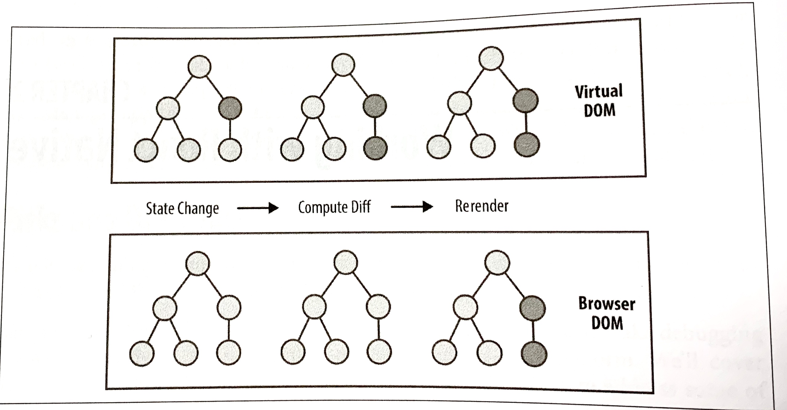
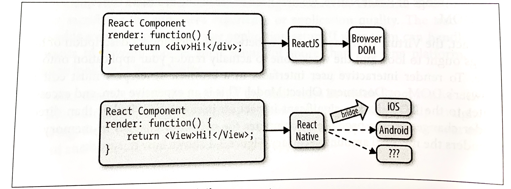
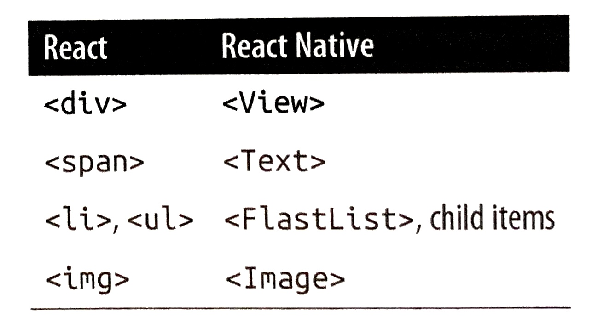

### CHAPTER 2

## Working with React Native

In this chapter, we'll cover the *bridge*, and review how React Native works under the hood. Then, we'll look at how React Native components differ from their web counterparts, and cover what you'll need to know in order to create and style components for mobile.

### How Does React Native Work?

The idea of writing mobile applications in JavaScript feels a little odd. How is it possible to use React in a mobile environment? In order to understand the technical underpinnings of React Native, we first need to recall one of React's concepts: the Virtual DOM.

In React, the Virtual DOM acts as a layer between the developer's description of how things ought to look and the work done to actually render your application onto the page. To render interactive user interfaces in a browser, developers must edit the browser's DOM, or Document Object Model. This is an expensive step, and excessive writes to the DOM have a significant impact on performance. Rather than directly render changes on the page, React computes the necessary changes in-memory and rerenders the minimal amount necessary. Figure 2-1 shows how this works.



*Figure 2-1. Performing calculations in the Virtual DOM limits reredering in the browser's DOM*

In the context of React on the web, most developers think of the Virtual DOM as a performance optimization. The Virtual DOM certainly has performance benefits, but its real potential lies in the power of its abstraction. Placing a clean abstraction layer between the developer's code and the actual rendering opens up a lot of interesting possibilities. What if React could render to a target other than the browser's DOM? After all, React already "understands" what your application is *supposed* to look like.

Indeed, this is how React Native works, as shown in Figure 2-2. Instead of rendering to the browser's DOM, React Native invokes Object-C APIs to render to iOS components, or Java APIs to render to Android components. This sets React Native apart from other cross-platform app development options, which often end up rendering web-based views. 



*Figure 2-2. React can render to different targets*

This is all possible because of the bridge, which provides React with an interface into the host platform's native UI elements. React components return markup from their `render` function, which describes how they should look. With React for the web, this translates directly to the browser's DOM. For React Native, this markup is translated to suit the host platform, so a `<View>` might become an iOS-specific `UIView`.

The core React Native project supports iOS and Android. Because of the abstraction layer provided by the Virtual DOM, React Native can target other platforms, too—someone just needs to write the bridge. For example, there are community implementations of React Native for Windows (*https://github.com/Microsoft/react-native-windows*) and Ubuntu (*https://github.com/CanonicalLtd/react-native*), so you can also use React Native to create desktop applications.

### Rendering Lifecycle

If you are accustomed to working in React, the React lifecycle should be familiar to you. When React runs in the browser, the render lifecycle begins by mounting your React components (Figure 2-3).


*Figure 2-3. Mounting components in React*

After that, React handles the rendering and rerendering of your component as necessary (Figure 2-4).


*Figure 2-4. Rerendering components in React*

For the render stage, the developer returns HTML markup from a React component's `render` method, which React then renders directly into the page as necessary. 

For React Native, the lifecycle is the same, but the rendering process is slightly different because React Native depends on the bridge. We looked at the bridge briefly in Figure 2-2. The bridge translates JavaScript calls and invokes the host platform's underlying APIs and UI elements (i.e., in Object-C or Java, as appropriate). Because React Native doesn't run on the main UI thread, it can perform these asynchronous calls without impacting the user's experience. 

### Creating Components in React Native

All React code lives in React components. React Native components are largely the same as ordinary React components, with some important differences around rendering and styling.

#### Working with Views

When writing in React for the web, you render normal HTML elements (`<div>`, `<p>`, `<span>`, `<a>`, etc.). With React Native, all of these elements are replaced by platform-specific React components (see Table 2-1). The most basic is the cross-platform `<View>`, a simple and flexible UI element that can be thought of as analogous to the `<div>`. On iOS, for instance, the `<View>` component renders to a `UIView`, whereas on Android it renders to a `View`.

*Table 2-1. Basic React elements for the web compared with React Native*

Other components are platform-specific. For instance, the `<DatePickerIOS>` component (predictably) renders the iOS standard date picker (Figure 2-5). Here is an excerpt from the `RNTester` sample app, demonstrating an iOS date picker. The usage is straightforward, as you would expect:

```react
  <DatePickerIOS
    date={this.state.date}
    mode="time"
  />
```


*Figure 2-5. The <DatePickerIOS> component is, as the name suggests, iOS-specific*

Because all of our UI elements are now React components rather than basic HTML elements like the `<div>`, you will need to explicitly import each component you want to use. For instance, we need to import the `<DatePickerIOS>` component like so: 

```react
	import { DatePickerIOS } from "react-native";
```

The `RNTester` application, which is bundled into the React Native GitHub project (*https://github.com/facebook/react-native/tree/master/RNTester*), allows you to view all of the supported UI elements. I encourage you to examine the various elements included in the `RNTester` app. It also demonstrates many styling options and interactions. 

>**TIP**
>
>Platform-specific components and APIs have special tags in the documentation, and typically use the platform name as a suffix—for example, `<TabBarIOS>` and `<ToolbarAndroid>`.

Because these components vary from platform to platform, how you structure your React components becomes even more important when you're working in React Native. In React for the web, we often have a mix of React components: some manage logic and their child components, while others render raw markup. If you want to reuse code when working in React Native,  maintaining separation between these types of components becomes critical. A React `<DatePickerIOS>` component obviously cannot be reused for Android. However, a component that encapsulates the associated *logic* can be reused. Then the visual component can be swapped out based on your platform. You can also designate platform-specific versions of components if you want, so you could have a *picker.ios.js* and a *picker.android.js* file, each with a separate implementation of the same component. We'll cover this in "Components with Platform-Specific Implementations" on page 134.

#### Using JSX

In React Native, just as in React, we write our views using JSX, combining markup and the JavaScript that controls it into a single file. JSX met with strong reactions when React first debuted. For many web developers, the separation of files based on technologies is a given: you keep your CSS, HTML, and JavaScript files separate. The idea of combining markup, control logic, and even styling into one language can be confusing. 

JSX prioritizes the separation of *concerns* over the separation of technologies. In React Native, this is even more strictly enforced. In a world without the browser, it makes even more sense to unify our styles, markup, and behavior in a single file for each component. Accordingly, your *.js* files in React Native are in fact JSX files. If you've been using vanilla JavaScript when working with React for the web, you will want to transition to JSX syntax for your work in React Native. 

If you've never seen JSX before, don't worry: it's pretty simple. As an example, a pure-JavaScript React component for the web might look something like this: 

```react
	class HelloMessage extends React.Component {
    render() {
      return React.createElement(
      	"div",
        null,
        "Hello ",
        this.props.name
      );
    }
  }
```

We can render this more succinctly by using JSX. Instead of calling `React.createElement` and passing in a list of HTML attributes, we use XML-like markup

```react
	class HelloMessage extends Component {
    render() {
      	// Instead of calling createElement, we return markup
      return <div>Hello {this.props.name}</div>;
    }
  }

	// we no longer need a createElement call here
	ReactDOM.render(<HelloMessage name="Bonnie" />, mountNode);
```

Both of these will render the following HTML onto the page:

```react
	<div>Hello Bonnie</div>
```

#### Styling Native Components

On the web, we style React components using CSS, just as we would any other HTML element. Whether you love it or hate it, CSS is a necessary part of the web. React usually does not affect the way we write CSS. It does make it easier to dynamically build class names based on `props` and `state`, but otherwise React is mostly agnostic about how we handle styles on the web.

Non-web platforms have a wide array of approaches to layout and styling. When we work with React Native, thankfully, we utilize one standardized approach to styling. Part of the bridge between React and the host platform includes the implementation of a heavily pruned subset of CSS. This narrow implementation of CSS relies primarily on flexbox for layout, and focuses on simplicity rather than implementing the full range of CSS rules. Unlike the web, where CSS support varies across browsers, React Native is able to enforce consistent support of style rules. As with the various UI elements, you can see many examples of supported styles in the `RNTester` (*https://github.com/facebook/react-native/tree/master/RNTester*) application, which is one of the examples that ships with React Native.

React Native also insists on the use of inline styles, which exist as JavaScript objects. The React team has advocated for this approach before in React for web applications. If you have previously experimented with inline styles in React, the syntax will look familiar to you:

```react
	// Define a style...
	const style = {
    backgroundColor: 'white',
    fontSize: '16px'
  };

	// ...and then apply it.
	const txt = (
    <Text style={style}>
      A styled Text
    </Text>);
```

React Native also provides some utilities for creating and extending style objects that make dealing with inline styles a more manageable process. We will explore those later in Chapter 5.

Does looking at inline styles make you twitch? If you're coming from a web-based background, this is a break from standard practice. Working with style objects, as opposed to stylesheets, takes some mental adjustments and changes the way you need to approach writing styles. However, in the context of React Native, it is a useful shift. We will be discussing styling best practices and workflow in Chapter 5. Just try not to be surprised when you see them in use!

### Host Platform APIs

Perhaps the biggest difference between React for the web and React Native is the way we think about host platform APIs. On the web, we often deal with fragmentation and inconsistent adoption of standards; still, most browsers support a common core of shared features. With React Native, however, platform-specific APIs play a much larger role in creating an excellent, natural-feeling user experience. There are also many more options to consider. Mobile APIs include everything from data storage to location services to accessing hardware such as the camera. Unconventional platforms lead to even more interesting APIs—what should the interface look like between React Native and a virtual reality headset, for instance?

By default, React Native for iOS and Android includes support for many commonly used features, and React Native can support any asynchronous native API. We will take a look at many of them throughout this book. React Native makes it straightforward and simple to use host platform APIs, so you can experiment freely. Be sure to think about what feels *right* for your target platform, and design with natural interactions in mind. 

Inevitably, the React Native bridge will not explore all host platform functionality. If you find yourself in need of an unsupported feature, you have the option of adding it to React Native yourself. Alternatively, chances are good that someone else has done so already, so be sure to check for community implementations. We'll cover this in Chapter 7.

It is also worth noting that utilizing host platform APIs has implications for code reuse. React components that need platform-specific functionality will be platform-specific as well. Isolating and encapsulating those components will bring added flexibility to your application. Of course, this applies for the web, too: if you plan on sharing code between React Native and React, keep in mind that things like the DOM do not actually exist in React Native.

### Summary

Writing components for mobile is a bit different in React Native when compared with React for the web. JSX is mandatory, and our basic building blocks are now components such as `<View>` in lieu of HTML elements such as `<div>`. Styling is also quite different, based on a subset of CSS and we assign styles with inline syntax. Still, these adjustments are quite manageable. In the next chapter, we'll put this into practice as we build our first application!