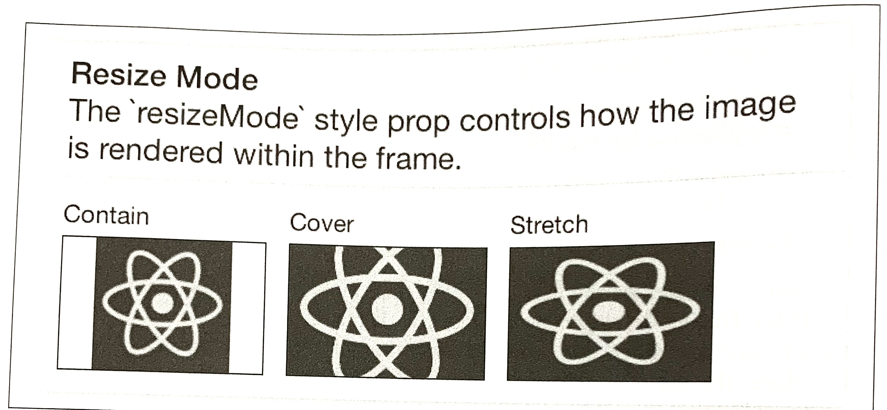
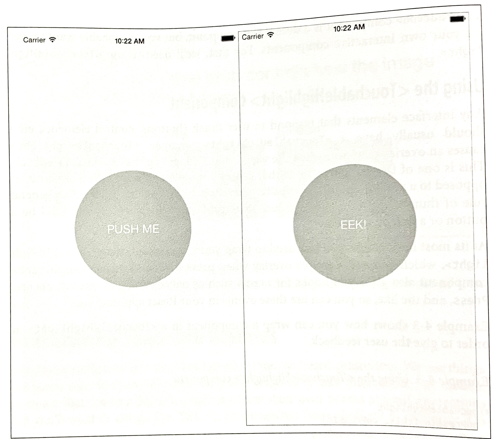
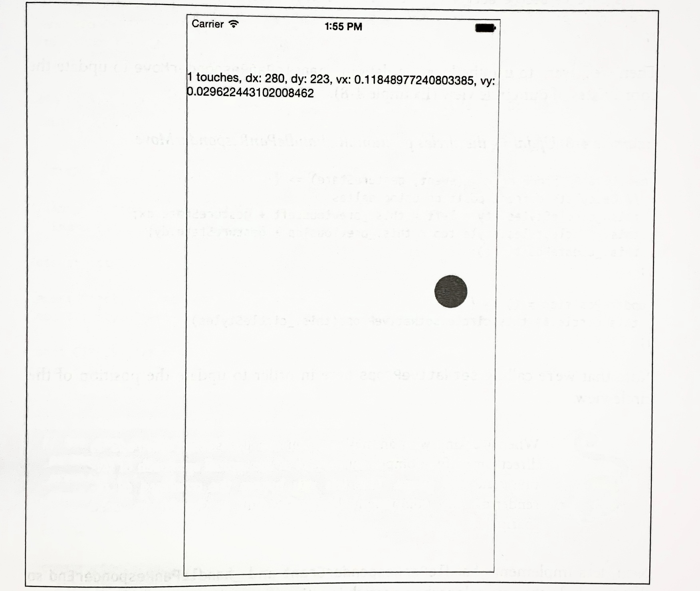
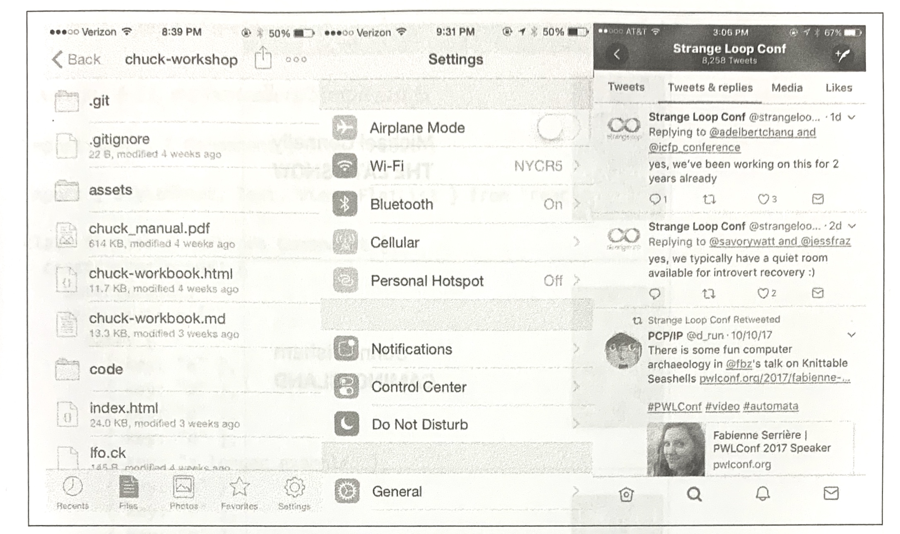
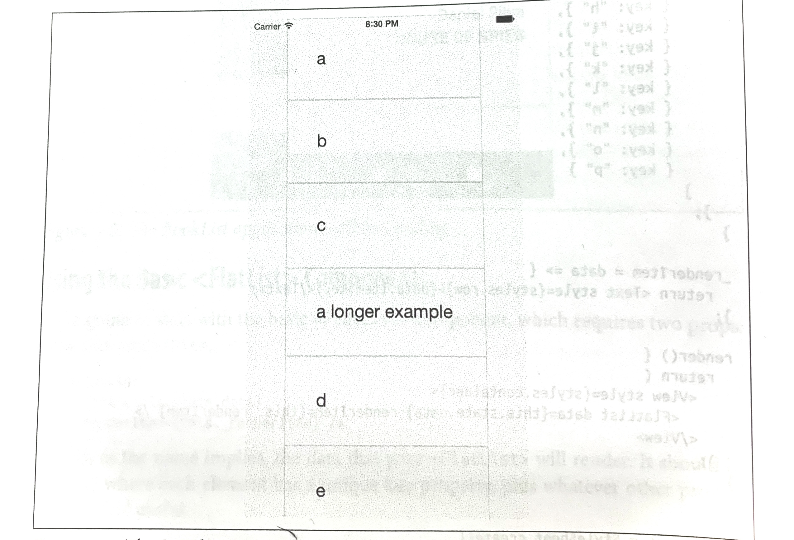
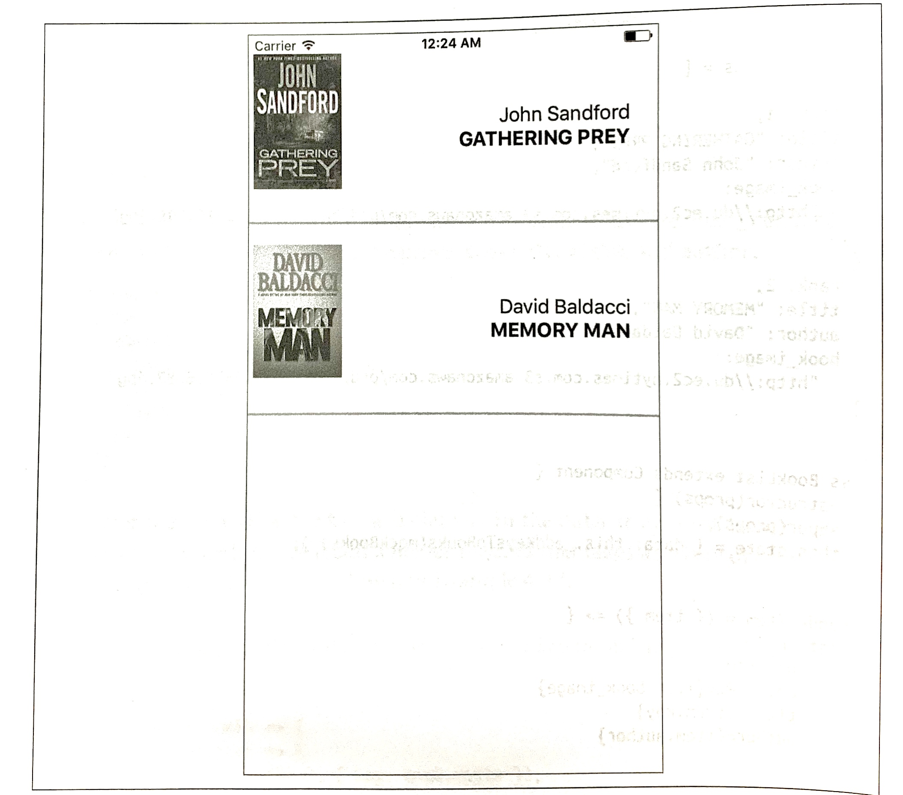
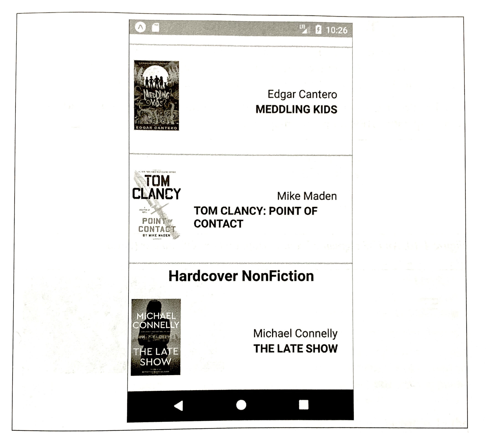
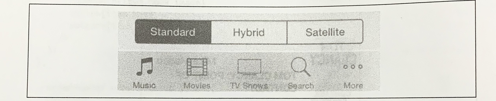

### CHAPTER 4

## Components for Mobile

In Chapter 3, we built a simple weather app. In doing so, we touched upon the basics of building interfaces with React Native. In this chapter, we will take a closer look at the mobile-based components used for React Native, and how they compare to basic HTML elements. Mobile interfaces are based on different primitive UI elements than web pages, and thus we need to use different components. 

This chapter starts with a more detailed overview of the most basic components: `<View>`, `<Image>`, and `<Text>`. Then, we will discuss how touch and gestures factor into React Native components, and how to handle touch events. Next, we will cover higher-level components, such as the tab bars,  navigators, and lists, which allow you to combine other views into standard mobile interface patterns.

### Analogies between HTML Elements and Native Components

When developing for the web, we make use of a variety of basic HTML elements. These include `<div>`, `<span>`, and ``, as well as organizational elements such as `<ol>`, `<ul>`, and`<table>`. (We could include a consideration of elements such as `<audio>`, `<svg>`, `<canvas>`, and so on, but we'll ignore them for now.)

When dealing with React Native, we don't use these HTML elements, but we use a variety of components that are nearly analogies to them (Table 4-1).

*Table 4-1. Analogous HTML and Native components*

| HTML      | React Native            |
| --------- | ----------------------- |
| div       | <View>                  |
| img       | <Image>                 |
| span, p   | <Text>                  |
| ul/ol, li | <FlatList>, child items |

Although these elements serve roughly the same purposes, they are not interchangeable. Let's take a look at how these components work on mobile with React Native and how they differ from their browser-based counterparts.

| Can I Share Code Between React Native and My Web App?        |
| ------------------------------------------------------------ |
| Out of the box, React Native supports rendering to Android and iOS. If you want to render web-compatible views with React Native, check out react-native-web (*https://github.com/necolas/react-native-web*). |
| Regardless of your approach, any JavaScript code—including React components—that doesn't render basic elements can be shared. So, if your business logic is isolated from your rendering code, you'll be able to reuse it. |

#### The <Text> Component

Rendering text is a deceptive basic function; nearly any application will need to render text somewhere. However, text within the context of React Native and mobile development works differently from text rendering for the web.

When working with text in HTML, you can include raw text strings in a variety of elements. Furthermore, you can style them with child tags such as `<strong>` and `<em>`. So, you might end up with an HTML snippet that looks like this: 

```html
	<p>The quick <em>brown</em> for jumped over the lazy <strong>dog</strong>.</p>
```

In React Native, only `<Text>` components may have plain-text nodes as children. In other words, this is not valid:

```react
	<View>
  	Text doesn't go here!
	</View>
```

Instead, wrap your text in a `<Text>` component: 

```react
	<View>
  	<Text>This is OK!</Text>
	</View>
```

When dealing with `<Text>` components in React Native, you no longer have access to subtags such as `<strong>` and `<em>`, though you can apply styles to achieve similar effects by using attributes such as `fontWeight` and `fontStyle`. Here's how you might achieve a similar effect by making use of inline styles:

```react
	<Text>
  	The quick <Text style={{fontStyle: "italic"}}>brown</Text> fox 
  	jumped over the lazy <Text style={{fontWeight: "bold"}}>dog</Text>.
	</Text>
```

This approach could quickly become verbose. You'll likely want to create styled components as a sort of shorthand when dealing with text, as shown in Example 4-1.

*Example 4-1. Creating reusable components for styling text*

```react
const styles = StyleSheet.create({
  bold: {
    fontWeight: "bold"
  },
  italic: {
    fontStyle: "italic"
  }
});

class Strong extends Component {
  render() {
    return (
    <Text style={styles.bold}>
    	{this.props.chidlren}
    </Text>);
  }
}

class Em extends Component {
  render() {
    return (
    	<Text style={styles.italic}>
        {this.props.children}
      </Text>);
  }
}
```

Once you have declared these styled components, you can freely make use of styled nesting. Now the React Native version looks quite similar to the HTML version (see Example 4-2).

*Example 4-2. Using styled components for rendering text*

```react
<Text>
  The quick <Em>brown</Em> for jumped
  over the lazy <Strong>dog</Strong>.
</Text>
```

Similarly, React Native does not inherently have any concept of header elements (`h1`, `h2`, etc.), but it's easy to declare your own styled `<Text>` elements and use them as needed.

In general, when dealing with styled text, React Native forces you to change your approach. Style inheritance is limited, so you lose the ability to have default font settings for all text nodes in the tree. Once again, the React Native documentation recommends solving this by using styled components: 

>  You also lose the ability to set up a default font for an entire subtree. The recommended way to use consistent fonts and sizes across your application is to create a component MyAppText that includes them and use this component across your app. You can also use this component to make more specific components like `MyAppHeaderText` for other kinds of text.

The `<Text>` component documentation (*http://bit.ly/1SVQxU3*) has more details on this. 

You've probably noticed a pattern here: React Native is very opinionated in its preference for reusing styled components over inheriting or reusing styles. While it can be time-consuming initially, this approach leads to better isolation so that you can render a component anywhere in your application and get the same result. This in turn makes it easier to maintain the styling code in your application. We'll discuss this approach further in the next chapter.

#### The <Image>Component

If text is *the* most basic element in an application, images are a close contender for both mobile and the web. When writing HTML and CSS for the web, we include images in a variety of ways: sometimes we use the `` tag whereas at other times we apply images via CSS, such as when we use the `background-image` property. In React Native, we have a similar `<Image>` component, but it behaves a little differently.

The basic usage of the `<Image>` component is straightforward; just set the `source` prop:

```react
	<Image source={require("./puppies.png")} />
```

The image path is resolved exactly as JavaScript modules are resolved. So, in the preceding example, *puppies.png* should be provided in the same folder as the component that requires it.

There's some filename magic going on here, too. If you provide *puppies.ios.png* and *puppies.android.png*, the appropriate file will be rendered on each platform. Similarly, if you provide images with suffixes `@2x` and `@3x`, the React Native packager will select the appropriate images for the device's screen density.

It is also possible to include web-based image sources instead of bundling your assets with your application. For example:

```react
	<Image source={{uri: "https://facebook.github.io/react/img/logo_og.png"}}
    style={{width: 400, height: 400}} />
```

When utilizing network resources, you will need to specify dimensions manually.

Downloading images via the network rather than including them as assets has some advantages. During development, for instance, it may be easier to use this approach while prototyping rather than carefully importing all of your assets ahead of time. It also reduces the size of your bundled mobile application so that users do not need to download all of your assets. However, it means that instead you'll be relying on their data plan whenever they access your application in the future. For most cases, you'll want to avoid using the URI-based method.

If you're wondering about working with the user's own images, we'll cover the camera roll in Chapter 6.

Because React Native emphasizes a component-based approach, images *must* be included as `<Image>` components instead of being referenced via styles. For instance, in Chapter 3, we wanted to use an image as a background for our weather application. Whereas in plain HTML and CSS you would likely use the `background-image` property to apply a background image, in React Native you instead use the `<Image>` as a container component, like so: 

```react
	<Image source={require("./puppies.png")}>
  	{/* Your content here... */}
	</Image>
```

Styling the images themselves is fairly straightforward. In addition to applying styles, you'll use certain props to control how the image will be rendered. You'll often make use of the `resizeMode` prop, for instance, which can be set to `contain`, `cover`, or `stretch`. The UIExplorer app demonstrates this well (Figure 4-1).



*Figure 4-1. The difference between resize, cover, and contain*

The `<Image>` component is very flexible. You will likely make extensive use of it in your own applications. 

### Working with Touch and Gestures

Web-based interfaces are usually designed for mouse-based controllers. We use things like hover state to indicate interactivity and respond to user interaction. For mobile, it's touch that matters. Mobile platforms have their own norms around interactions that you'll want to design for. This varies somewhat from platform to platform: iOS behaves differently from Android, which behaves differently yet again from Windows Phone.

React Native provides a number of APIs for you to leverage as you build touch-ready interfaces. In this section, we'll look at the humble `<Button>` component and the `<TouchableHighlight>` container component, as well as lower-level APIs that give you direct access to touch events.

#### Creating Basic Interactions with <Button>

If you're just getting started and need a basic, interactive button, the default `<Button>` component has you covered. It provides a simple API, which allows you to set the color, label text, and callback function.

```react
	<Button 
    onPress={this._onPress}
    title="Press me"
    color="#841854"
    accessibilityLabel="Press this button"
  />
```

This `<Button>` component is a decent starting point, but you'll probably want to create your own interactive components. For that, we'll need to use `<TouchableHighlight>`.

#### Using the <TouchableHighlight> Component

Any interface elements that respond to user touch (buttons, control elements, etc.) should usually have a `<TouchableHighlight>` wrapper. `<TouchableHighlight>` causes an overlay to appear when the view is touched, giving the user visual feedback. This is one of the key interactions that causes a mobile application to feel *native*, as opposed to a mobile-optimized website, where touch feedback is limited. As a general rule of thumb, you should use `<TouchableHighlight>` anywhere there would be a button or a link on the web.

At its most basic usage, you just need to wrap your component in a `<TouchableHighlight>`, which will add a simple overlay when pressed. The `<TouchableHighlight>` component also gives you hooks for events such as `onPressIn`, `onPressOut`, `onLongPress`, and the like, so you can use these events in your React applications.

Example 4-3 shows how you can wrap a component in a `<TouchableHighlight>` in order to give the user feedback.

*Example 4-3. Using the <TouchableHighlight> component*

```react
<TouchableHighlight
  onPressIn={this._onPressIn}
  onPressOut={this._onPressOut}
  accessibilityLabel={'PUSH ME'}
  style={styles.touchable}>
  	<View	style={styles.button}>
      <Text style={styles.welcom}>
        {this.state.pressing ? "EEK!" : "PUSH ME"}
      </Text>
  	</View>
</TouchableHighlight>
```

When the user taps the button, an overlay appears, and the text changes (Figure 4-2).

*Figure 4-2. Using <TouchableHighlight> to give the user visual feedback—the unpressed state(left) and the pressed state, with highlight (right)*

This is a contrived example, but it illustrates the basic interactions that make a button "feel" touchable on mobile. The overlay is a key piece of feedback that informs the user that an element can be pressed. Note that in order to apply the overlay, we don't need to apply any logic to our styles; the `<TouchableHighlight>` handles the logic of that for us. 

Example 4-4 shows the full code for this button component.

*Example 4-4. PressDemo.js illustrates the use of <TouchableHighlight>*

```react
import React, { Component } from "react";
import { StyleSheet, Text, View, TouchableHighlight } from "react-native";

class Button extends Component {
  constructor(props) {
    super(props);
    this.state = { pressing: false };
  }
  
  _onPressIn = () => {
    this.setState({ pressing: true });
  };

	_onPressOut = () => {
    this.setState({ pressing: false });
  };

	render() {
    return (
    	<View style={styles.container}>
        <TouchableHighlight
          onPressIn={this._onPressIn}
          onPressOut={this._onPressOut}
          style={styles.touchable}
        >

          <View style={styles.button}>  
            <Text style={styles.welcome}>
              {this.state.pressing ? "EEK!" : "PUSH ME"}
            </Text>
          </View>

        </TouchableHighlight>
      </View>
    );
  }
}

const styles = StyleSheet.create({
  container: {
    flex: 1,
    justifyContent: "center",
    alignItems: "center",
    backgroundColor: "#F5FCFF" 
  },
  welcome: { fontSize: 20, textAlign: "center", margin: 10, color: "#FFFFFF" },
  touchable: { borderRadius: 100 },
  button: {
    backgroundColor: "#FF0000",
    borderRadius: 100,
    height: 200,
    width: 200,
    justifyContent: "center"
  }
});

export default Button;
```

Try editing this button to respond to other events, by using hooks like `onPress` and `onLongPress`. The best way to get a sense for how these events map onto user interaction is to experiment using a real device.

#### Using the PanResponder Class

Unlike `<TouchableHighlight>`, `PanResponder` is not a component but rather a class provided by React Native. A `PanResponder gestureState` object gives you access to raw position data as well as information such as velocity and accumulated distance of the current gesture.

To make use of `PanResponder` in a React component, we need to create a `PanResponder` object and then attach it to a component's `render` method.

Creating a `PanResponder` requires us to specify the proper handlers for `PanResponder` events (Example 4-5).

*Example 4-5. Creating a PanResponder requires us to register several callbacks*

```react
this._panResponder = PanResponder.create({
  onStartShouldSetPanResponder: this._handleStartShouldSetPanResponder,
  onMoveShouldSetPanResponder: this._handleMoveShouldSetPanResponder,
  onPanResponderGrant: this._handlePanResponderGrant,
  onPanResponderMove: this._handlePanresponderMove,
  onPanResponderRelease: this._handlePanResponderEnd,
  onPanResponderTerminate: this._handlePanResponderEnd,
});
```

These six functions give us access to the full lifecycle of a touch event. `onStartShouldSetPanResponder` and `onMoveShouldSetPanResponder` determine whether or not we should respond to a given touch event. `onPanResponderGrant` will be invoked when a touch event begins, and `onPanResponderRelease` and `onPanResponderTerminate` will be invoked when a touch event ends. We'll be able to access data about the ongoing touch event during `onPanResponderMove`. 

We use spread syntax to attach the `PanResponder` to the view in our component's `render` method (Example 4-6).

*Example 4-6. Attaching the PanResponder using spread syntax*

```react
render: function() {
  return (
  	<View>
      {...this._panResponder.panHandlers}
      { /* View contents here */ }
    </View>
  );
}
```

After this, the handlers that you passed to the `PanResponder.create` call will be invoked during the appropriate move events if the touch originates within this view.

Figure 4-3 renders a circle that you can drag around the screen. Its coordinates will be updated as you move it.



*Figure 4-3. PanResponder demo*

In order to implement this, let's flesh out our `PanResponder` callbacks now. The first two are strightforward: by implementing `_handleStartShouldSetPanResponder` and `_handleMoveShouldSetPanResponder`, we can declare that we want this responder to receive touch events (Example 4-7).

*Example 4-7. For the first two callbacks, we simply return true*

```react
_handleStartShouldSetPanResponder = (event, gestureState) => {
  // Should we become active when the user presses down on the circle?
  return true;
}

_handleMoveShouldSetPanResponder = (event, gestureState) => {
  // Should we become active when the user moves a touch over the circle?
  return true;
}
```

Then we'll want to use the location data in `_handlePanResponderMove` to update the coordinates of our circle view (Example 4-8).

*Example 4-8. Updating the circle's position in _handlePanResponderMov*

```react
_handlePanResponderMove = (event, gestureState) => {
  // Calculate current position using deltas
  this._circleStyles.style.left = this._previousLeft + gestureState.dx;
  this._circleStyles.style.top = this._previousTop + gestureState.dy;
  this._updatePosition();
};

_updatePosition = () => {
  this.circle && this.circle.setNativeProps(this._circleStyles);
};
```

Note that we're calling `setNativeProps` here in order to update the position of the circle view.

> **TIP**
>
> When working with animations, you can use `setNativeProps` to directly modify a component instead of the typical approach of setting state and props. This lets you bypass the overhead of rerendering the component hierarchy, but it should be used sparingly. 

Next, let's implement `_handlePanResponderGrant` and `_handlePanResponderEnd` so that the circle changes color when a touch is active (Example 4-9).

*Example 4-9. Implementing highlight behavior*

```react
_highlight = () => {
  this.circle &&
    this.circle.setNativeProps({
    	style: { backgroundColor: "blue" }
  });
}

_unHightlight = () => {
  this.circle &&
    this.circle.setNativeProps({ style: { backgroundColor: "green" } });
};

_handlePanResponderGrant = (event, gestureState) => {
  this._highlight();
};

_handlePanResponderEnd = (event, gestureState) => {
  this._unHighlight();
};
```

Let's put it all together to build an interactive view using `PanResponder`, as shown in Example 4-10.

*Example 4-10. PanDemo.js illustarates the use of PanResponder*

```react
// Adapted from https://github.com/facebook/react-native/blob/master/
// Examples/UIExplorer/PanResponderExample.js

"use strict";

import React, { Component } from "react";
import { StyleSheet, PanResponder, View, Text } from "react-native";

const CIRCLE_SIZE = 40;
const CIRCLE_COLOR = "blue";
const CIRCLE_HIGHLIGHT_COLOR = "green";

class PanResponderExample extends Component {
  // Set some initial values.
  _panResponder = {};
  _previousLeft = 0;
  _previousTop = 0;
  _circlceStyles = {};
  circle = null;

  constructor(props) {
    super(props);
    this.state = {
      numberActiveTouches: 0,
      moveX: 0,
      moveY: 0,
      x0: 0,
      y0: 0,
      dx: 0,
      dy: 0,
      vx: 0,
      vy: 0
    };
  }

  componentWillMount() {
    this._panResponder = PanResponder.create({
      onStartShouldSetPanResponder: this._handleStartShouldSetPanResponder,
      onMoveShouldSetPanresponder: this._handleMoveShouldSetPanResponder,
      onPanResponderGrant: this._handlePanResponderGrant,
      onPanResponderMove: this._handlePanResponderMove,
      onPanResponderRelease: this._handlePanResponderEnd,
      onPanResponderTerminate: this._handlePanResponderEnd
    });
    this._previousLeft = 20;
    this._previousTop = 84;
    this._circleStyles = {
      style: { left: this._previousLeft, top: this._previousTop }
    };
  }

  componentDidMount() {
    this._updatePosition();
  }

  render() {
    return (
      <View style={styles.container}>
        <View 
          ref={circle => {
            this.circle = circle;
          }}
          style={styles.circle}
          {...this._panResponder.panHandlers}
        />
        <Text>
          {this.state.numberActiveTouches} touches,
          dx: {this.state.dx},
          dy: {this.state.dy},
          vx: {this.state.vx},
          vy: {this.state.vy}
        </Text>
      </View>
    );
  }

  // _hightlight and _unHighlight get called by PanResponder methods,
  // providing visual feedback to the user.
  _highlight = () => {
    this.circle &&
      this.circle.setNativeProps({
        style: { backgroundColor: CIRCLE_HIGHLIGHT_COLOR }
      });
  };

  _unHighlight = () => {
    this.circle && 
      this.circle.setNativeProps({ style: { backgroundColor: CIRCLE_COLOR } });
  };

  // We're controlling the circle's position directly with setNativeProps.
  _updatePosition = () => {
    this.circle && this.circle.setNativeProps(this._circleStyles);
  };

  _handleStartShouldSetPanResponder = (event, gestureState) => {
    // Should we become active when the user presses down on the circle?
    return true;
  };

  _handleMoveShouldSetPanResponder = (event, gestureState) => {
    // Should we become active when the user moves a touch over the circle?
    return true;
  };

  _handlePanResponderGrant = (event, gestureState) => {
    this._highlight();
  };

  _handlePanResponderMove = (event, gestureState) => {
    this.setState({
      stateID: gestureState.stateID,
      moveX: gestureState.moveX,
      moveY: gestureState.moveY,
      x0: gestureState.x0,
      y0: gestureState.y0,
      dx: gestureState.dx,
      dy: gestureState.dy,
      vx: gestureState.vx,
      vy: gestureState.vy,
      numberActiveTouches: gestureState.numberActiveTouches
    });

    // Calculate current position using deltas
    this._circleStyles.style.left = this._previousLeft + gestureState.dx;
    this._circleStyles.style.top = this._previousTop + gestureState.dy;
    this._updatePosition();
  };

  _handlePanResponderEnd = (event, gestureState) => {
    this._unHighlight();
    this._previousLeft += gestureState.dx;
    this._previousTop += gestureState.dy;
  };
}

const styles = StyleSheet.create({
  circle: {
    width: CIRCLE_SIZE,
    height: CIRCLE_SIZE,
    borderRadius: CIRCLE_SIZE / 2,
    backgroundColor: CIRCLE_COLOR,
    position: "absolute",
    left: 0,
    top: 0
  },
  container: { flex: 1, paddingTop: 64 }
});

export default PanResponderExample;
```

If you plan on implementing your own gesture recognizer, I suggest experimenting with this application on a real device so that you can get a feel for how these values respond. Figure 4-3 shows a screenshot, but you'll want to experience it on a device with a real touchscreen.

##### Choosing how to handle touch

How should you decide when to use the touch and gesture APIs discussed in this section? It depends on what you want to build.

In order to provide the user with basic feedback and indicate that a button or another element is "tappable," use the `<TouchableHighlight>` component. 

In order to implement your own custom touch interfaces, you can use `PanResponder`. If you are designing a game, or an application with an unusual interface, you'll need to spend some time building out the custom touch interactions you want.

For many applications, you won't need to implement any custom touch handling. In the next section, we'll look at some of the higher-level components that implement common UI patterns for you.

### Working with Lists

Many mobile user interfaces feature lists as a central elements. You can see this interaction pattern in the Dropbox, Twitter, and iOS Settings apps (Figure 4-4).



*Figure 4-4. Lists as used by Dropbox, Twitter, and the iOS Settings app*

React Native provides two list components with convenient APIs. The `<FlatList>` component is designed to work with long scrolling lists of changing but similarly structured data. It has several performance optimizations baked in. The `<SectionList>` component is designed for data that is broken into logical sections, usually with section headings, similar to the iOS `UITableView`. Together, `<FlatList>` and `<SectionList>` cover most common use cases but if you need to peek under the hood and add some custom list handling, take a look at `<VirtualizedLIst>`.

> **TIP**
> Optimizing list-rendering performance is a notoriously tricky problem because different use cases fall for different approaches. Is your user swiping hastily through a contacts list to find a particular person or are they slowly perusing a feed of images? Do you have a homogenous list or is every child view different? If you hit performance issues, pay attention to your lists. 

In this section, we are going to build an app that displays the *New York Times* Best Sellers list and lets us view data about each book, as shown in Figure 4-5. We'll build two versions, one with `<FlatList>` and the other with `<SectionList>`.

If you'd like, you can grab you own API token from the *New York Times* (*http://developer.nytimes.com/apps/mykeys*). Otherwise, use the API token included in the sample code.


*Figure 4-5. The BookList application we'll be building*

#### Using the Basic <FlatList> Component

We're going to start with the basic `<FlatList>` component, which requires two props:

`data` and `renderItem`.

```react
	<FlatList 
    data={this.state.data}
    rednerItem={this._renderItem} />
```

`data` is, as the name implies, the data that your `<FlatList>` will render. It should be an array where each element has a unique `key` property, plus whatever other properties you find useful.

`renderItem` should be a function that returns a component based on the data from one element of the `data` array.

The basic usage of a `<FlatList>` is demonstrated in Example 4-11.

*Example 4-11. src/bestsellers/SimpleList.js*

```react
import React, { Component } from "react";

import { StyleSheet, Text, View, FlatList } from "react-native";

class SimpleList extends Component {
  constructor(props) {
    super(props);
    this.state = {
      data: [
        { key: "a" },
        { key: "b" },
        { key: "c" },
        { key: "d" },
        { key: "a longer example" },
        { key: "e" },
        { key: "f" },
        { key: "g" },
        { key: "h" },
        { key: "i" },
        { key: "j" },
        { key: "k" },
        { key: "l" },
        { key: "m" },
        { key: "n" },
        { key: "o" },
        { key: "p" }
      ]
    };
  }

  _renderItem = data => {
    return <Text style={styles.row}>{data.item.key}</Text>;
  }

  render() {
    return (
      <View style={styles.container}>
        <FlatList data={this.state.data} renderItem={this._renderItem} />
      </View>
    );
  }
}

const styles = StyleSheet.create({
  container: {
    flex: 1,
    justifyContent: "center",
    alignItems: "center",
    backgroundColor: "#F5FCFF"
  },
  row: { fontSize: 24, padding: 42, borderWidth: 1, borderColor: "#DDDDDD" }
})

export default SimpleList;
```

One of the common "gotchas" of working with `<FlatList>` is that `renderItem` gets passed an object with the actual data accessible via the `item` property. 

```react
	_renderItem = data => {
    return <Text style={styles.row}>{data.item.key}</Text>
  };
```

We could simplify this with destructing shorthand:

```react
	_renderItem = ({item}) => {
    return <Text style={styles.row}>{item.key}</Text>
  };
```

The app should look like Figure 4-6.



*Figure 4-6. The SimpleList component renders a bare-bones <FlatList>*

#### Updating the <FlatList> Contents

What if we want to do something a little more interesting? Let's create a `<FlatList>` with more complex data. We will be using the New York Times API to create a simple Best Sellers application, which renders the *New York Times* Best Sellers list.

To begin with, we'll use fake data to represent an example response from the New York Times API, as shown in Example 4-12.

*Example 4-12. Mock data based on the expected API response*

```react
const mockBooks = [
  {
    rank: 1,
    title: "GATHERING PREY",
    author: "John Sandford",
    book_image:
    	"http://du.ec2.nytimes.com.s3.amazonaws.com/prd/books/9780399168796.jpg"
  },
    {
    rank: 2,
    title: "MEMORY MAN",
    author: "David Baldacci",
    book_image:
    	"http://du.ec2.nytimes.com.s3.amazonaws.com/prd/books/978145586387.jpg"
  },
];
```

Then we'll add a component that can render this data. The `<BookItem>` component, shown in Example 4-13, uses a combination of `<View>`, `<Text>`, and `<Image>` to display basic information about each book. 

*Example 4-13. src/bestsellers/BookItem.js*

```react
import React, { Component } from "react";

import { StyleSheet, Text, View, Image, ListView } from "react-native";

const styles = StyleSheet.create({
  bookItem: {
    flexDirection: "row",
    backgroundColor: "#FFFFFF",
    borderBottomColor: "#AAAAAA",
    borderBottomWidth: 2,
    padding: 5,
    height: 175
  },
  cover: { flex: 1, height: 150, resizeMode: "contain" },
  info : {
    flex: 3,
    alignItems: "flex-end",
    flexDirection: "column",
    alignSelf: "center",
    padding: 20
  },
  author: { fontSize: 18 },
  title: { fontSize: 18, fontWeight: "bold"}
});

class BookItem extends Component {
  render() {
    return (
    	<View style={styles.bookItem}>
        <Image style={styles.cover} source= />
        <View style={styles.info}>
          <Text style={styles.author}>{this.props.author}</Text>
          <Text style={styles.title}>{this.props.title}</Text>
        </View>
      </View>
    );
  }
}

export default BookItem;
```

In order to use the `<BookItem>` component, we need to update our `_renderItem` function. A `<BookItem>` expects three props: `coverURL`, `title`, and `author`.

```react
	_renderItem = ({ item }) => {
    return (
      <BookItem 
        coverURL={item.book_image}
        title={item.key}
        author={item.author}
      />
    );
  };
```

Remember that in a `<Flatlist>`, each element in the `data` array must have a unique `key` property defined. So, we'll add a helper method that takes an array of objects and adds a key property to them, as shown in Example 4-14.

*Example 4-14. The _addKeysToBooks* method adds a key to each object in the books array

```react
_addKeysToBooks = books => {
  return books.map(book => {
    return Object.assign(book, { key: book.title });
  });
};
```

Now that we have this helper method, we can update our initial state using the mock data from Example 4-12:

```react
	constructor(props) {
    super(props);
    this.state = { data: this._addKeysToBooks(mockBooks) };
  }
```

Once we put it all together, our mocked-out Best Sellers application code should look like Example 4-15, with the resulting app displayed in Figure 4-7.

*Example 4-15. src/bestsellers/MockBookList.js*

```react
import React, { Component } from "react";

import { StyleSheet, Text, View, Image, FlatList } from "react-native";

import BookItem from "./BookItem";

const mockBooks = [
  {
    rank: 1,
    title: "GATHERING PREY",
    author: "John Sandford",
    book_image:
    	"http://du.ec2.nytimes.com.s3.amazonaws.com/prd/books/9780399168796.jpg"
  },
    {
    rank: 2,
    title: "MEMORY MAN",
    author: "David Baldacci",
    book_image:
    	"http://du.ec2.nytimes.com.s3.amazonaws.com/prd/books/978145586387.jpg"
  },
];

class BookList extends Component {
  constructor(props) {
    super(props);
    this.state = { data: this._addKeysToBooks(mockBooks) };
  }

	_renderItem = ({ item }) => {
    return (
      <BookItem 
        coverURL={item.book_image}
        title={item.key}
        author={item.author}
      />
    );
  };

  _addKeysToBooks = books => {
    return books.map(book => {
      return Object.assign(book, { key: book.title });
    });
  };  

  render() {
    return <FlatList data={this.state.data} renderItem={this._renderItem} />
  }
}

const styles = StyleSheet.create({ container: { flex: 1, paddingTop: 22 } });

export default BookList;
```



*Figure 4-7. Mock data displayed using <FlatList>*

#### Integrating Real Data

Hardcoded data is well and good, but let's test the real thing. The actual code to access the New York Times API is provided in Example 4-16.

*Example 4-16. src/bestsellers/NYT.js*

```react
const API_KEY = "73b19491b83909c7e07016f4bb4644f9:2:60667290";
const LIST_NAME = "hardcover-fiction";
const API_STEM = "https://api.nytimes.com/svc/books/v3/lists";

function fetchBooks(list_name = LIST_NAME) {
  let url = `${API_STEM}/${LIST_NAME}?response-format=json&api-key=${API_KEY}`;
  return fetch(url)
    .then(response => response.json())
    .then(responseJson => {
      return responseJson.results.books;
    })
    .catch(error => {
      console.log(error);
    });
}

export default { fetchBooks: fetchBooks };
```

Let's import that library into our component now.

```react
	import NYT from "./NYT"
```

Now let's add a `_refreshData` method that invokes the New York Times API:

```react
  _refreshData = () => {
    NYT.fetchBooks().then(books => {
      this.setState({ data: this._addKeysToBooks(books) });
		});
  };
```

Finally, we need to set our initial state to an empty array and call `_refreshData` in `componentDidMount`. Once we do that, our application will render live data from the *New York Times* Best Sellers list! The full code is shown in Example 4-17, and you can see the updated app in Figure 4-8.

*Example 4-17. src/bestsellers/BookList.js*

```react
import React, { Component } from "react";

import { StyleSheet, Text, View, Image, FlatList } from "react-native";

import BookItem from "./BookItem";
import NYT from "./NYT"

class BookList extends Component {
  constructor(props) {
    super(props);
    this.state = { data: [] };
  }

  componentDidMount() {
    this._refreshData();
  }

	_renderItem = ({ item }) => {
    return (
        <BookItem 
          coverURL={item.book_image}
          title={item.key}
          author={item.author}
        />
    );
  };

  _addKeysToBooks = books => {
    // Takes the API response from the NYTimes
    // and adds a key property to the object
    // for rendering purposes
    return books.map(book => {
      return Object.assign(book, { key: book.title });
    });
  };  

  _refreshData = () => {
    NYT.fetchBooks().then(books => {
      this.setState({ data: this._addKeysToBooks(books) });
		});
  };

  render() {
    return (
      <View style={styles.container}>
        <FlatList data={this.state.data} renderItem={this._renderItem} />
      </View>
    )
  }
}

const styles = StyleSheet.create({ container: { flex: 1, paddingTop: 50 } });

export default BookList;
```


*Figure 4-8. Viewing current best sellers, with <FlatList>*

As you can see, working with the `<FlatList>` component is straightforward as long as you remember to structure your data properly. In addition to handling scrolling and touch interactions, `<FlatList>` also includes many performance optimizations to speed up rendering and reduce memory usage.

#### Working with <SectionList>

The <SectionList> component is designed for data sets where you have mostly homogenous items plus optional section headings. For example, if we wanted to render several different kinds of best sellers lists with headings between them, a `<SectionList>` would be a good choice.

A `<SectionList>` expects the props `sections`, `renderItem`, and `renderSectionHeader`. We'll start with `sections`, which should be an array where each object contains section data. Each section object must have the `title` and `data` keys. The `data` must look similar to `data` in a `<FlatList>`: it should be an array where each element has a unique `key` property.

Let's update our `_renderData` method to fetch both the fiction and nonfiction best sellers lists, and update our component's state accordingly.

```react
	_refreshData = () => {
    Promise
    	.all([
  			NYT.fetchBooks("hardcover-fiction"),
      	NYT.fetchBooks("hardcover-nonfiction")
	    ])
    	.then(results => {
	      if (results.length !==2) {
          console.error("Unexpected results");
        }
      
      	this.setState({
          sections: [
            {
              title: "Hardcover Fiction",
              data: this._addKeysToBooks(results[0])
            },
            {
              title: "Hardcover NonFiction",
              data: this._addKeysToBooks(results[1])
            }
          ]
        });
    	});
  };
```

We don't need to update our `_renderItem` method, but we do need to add a new `_renderHeader` method. Let's do that next.

```react
	_rednerHeader = ({ section }) => {
    return (
      <Text style={styles.headingText}>
        {section.title}
      </Text>
		);
  };
```

Finally, we need to update our `render` method to return a `<SectionList>` instead of a `<FlatList>`.

```react
	<SectionList
    sections={this.state.sections}
    renderItem={this._renderItem}
    renderSectionHeader={this._renderHeader}
  />
```

When we put everything together, our usage of `<SectionList>` should look like Example 4-18, resulting in the updated app shown in Figure 4-9.

*Example 4-18. src/bestsellers/BookSectionList.js*

```react
import React, { Component } from "react";

import { StyleSheet, Text, View, Image, SectionList } from "react-native";

import BookItem from "./BookItem";
import NYT from "./NYT";

class BookList extends Component {
  constructor(props) {
    super(props);
    this.state = { section: [] };
  }
  
  componentDidMount() {
    this._refreshData();
	}
  
  _addKeysToBooks = books => {
    // Takes the API response from the NYTimes
    // and adds a key property to the object
    // for rendering purposes
    return books.map(book => {
      return Object.assgin(book, { key: book.title });
    });
  };

	_refreshData = () => {
    Promise
    	.all([
      	NYT.fetchBooks("hardcover-fiction"),
      	NYT.fetchBooks("hardcover-nonfiction")
    	])
    	.then(results => {
  			if (results.length !==2) {
          console.error("Unexpected results");
        }
      
      	this.setState({
          sections: [
            {
              title: "Hardcover Fiction",
              data: this._addKeysToBooks(results[0])
            },
            {
              title: "Hardcover NonFiction",
              data: this._addKeysToBooks(results[1])
						}
          ]
        });
	    });
  };

	_renderItem = ({ item }) => {
    return (
      <BookItem
        coverURL={item.book_image}
        title={item.key}
        author={item.author}
      />
    );
  };
	
	_renderHeader = ({ section }) => {
    return (
      <Text style={styles.headingText}>
        {section.title}
      </Text>
    );
  };
	
	render() {
    return (
      <View style={styles.container}> 
        <SectionList
          sections={this.state.sections}
          renderItem={this._renderItem}
          renderSectionHeader={this._renderHeader}
        />
      </View>
    );
  }
}

const styles = StyleSheet.create({
  container: { flex: 1, paddingTop: 22 },
  headingText: {
    fontSize: 24,
    alignSelf: "center",
    backgroundColor: "#FFF",
    fontWeight: "bold",
    paddingLeft: 20,
    paddingRight: 20,
    paddingTop: 2,
    paddingBottom: 2
  }
});

export deafult BookList;
```



*Figure 4-9. Viewing current best sellers, with <SectionList>*

### Navigation

Navigation in the context of mobile apps refers, roughly, to the code that allows users to transition from one screen to another. On the web, this is part of the `window.history` API, which provides concepts such as "backward" and "forward".

Commonly used components for navigation in React Native include the built-in `<Navigator>` and `<NavigatorIOS>` components, as well as community solutions like `<StackNavigator>` (provided by the `react-navigation` library).

Navigation logic is necessary in order to move between screens in your mobile application. It also enables "deep linking," so that users can jump from a URL into a particular screen within your app.

We'll cover navigation in depth in Chapter 10.

### Other Organizational Components

There are plenty of other organizational components, too. A few useful ones includes `<TabBarIOS>` and `<SegmentedControlIOS>` (illustrated in Figure 4-10) and `<DrawerLayourAndroid>` and `<ToolBarAndroid>` (illustrated in Figure 4-11).

You'll notice that these are all named with platform-specific suffixes. That's because they wrap native APIs for platform-specific UI elements.



*Figure 4-10. An iOS segmented control (top) and an iOS tab bar (bottom)*


*Figure 4-11. An Android toolbar (left) and an Android drawer (right)*

These components are very useful for organizing multiple screens within your application. `<TabBarIOS>` and `<DrawerLayoutAndroid>`, for example, give you an easy way to switch between multiple modes or functions. `<SegmentedControlIOS>` and `<ToolbarAndroid>` are better suited for more fine-grained controls.

You'll want to refer to the platform-specific guidelines for how best to use these components:

* Android Design Guide (*http://bit.ly/android_design_guide*)
* iOS Human Interface Guidelines (*http://bit.ly/designing_for_ios*)

We'll cover how to use platform-specific components in more depth in Chapter 7.

### Summary

In this chapter, we dug into the specifics of a variety of the most important components in React Native. We discussed how to use basic low-level components, like `<Text>` and `<Image>`, as well as more abstract components like `<FlatList>`, `<SectionList>`, and `<TabBarIOS>`. We also looked at how to use various touch-focused APIs and components in case you want to build your own custom touch handlers.

At this point, you should be equipped to build basic functional applications using React Native! Now that you've acquainted yourself with the components discussed in this chapter, building upon them and combining them to create your own applications should feel remarkably similar to working with React on the web.

Of course, building up basic functioning applications is only part of the battle. In the next chapter, we'll focus on styling and how to use React Native's implementation of styles to get the look and feel you want on mobile.

