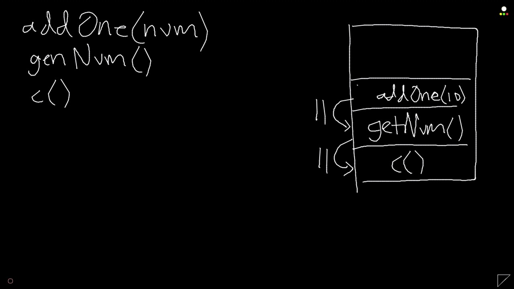
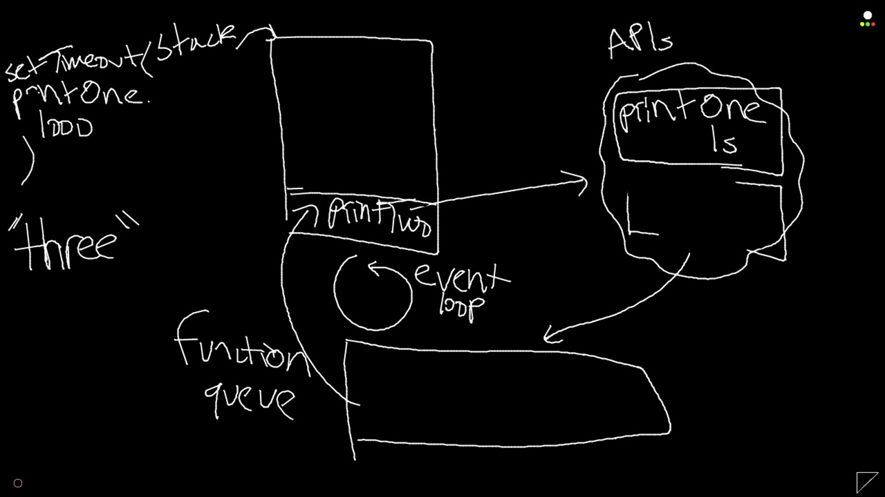
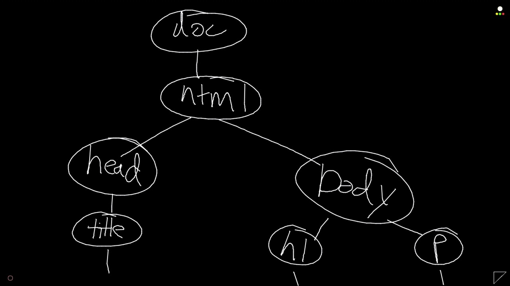

# Mobile App Development with React Native

---

# Lecture 1: JavaScript, ES6

## ES5, ES6, ES2016, ES2017, ES.Next

- ECMAScript vs JavaScript
- What do most environments support?
- Transpilers (Babel, TypeScript, CoffeeScript, etc.)

- Which syntax should I use?


## Closures

- Functions that refer to variables declared by parent function still have access to those variables

- Possible because of JavaScript's scoping

- Example (Closure bug)

  ```js
  function makeFunctionArray() {
    const arr = []
  
    for (var i = 0; i < 5; i++) {
      arr.push(function () { console.log(i) })
    }
  
    return arr
  }
  
  const functionArr = makeFunctionArray()
  
  // we expect this to log 0, but it doesn't
  functionArr[0]()
  ```

- Example

  ```js
  function makeHelloFunction() {
    var message = 'Hello!'
  
    function sayHello() {
      console.log(message)
    }
  
    return sayHello
  }
  
  const sayHello = makeHelloFunction()
  
  // the variable called message is not in scope here
  console.log('typeof message:', typeof message)
  // but the function sayHello still references a variable called message
  console.log(sayHello.toString())
  
  // because of the closure, sayHello still has access to the variables within scope
  // when it was declared
  sayHello()
  
  ```


## Immediately Invoked Function Expression (IIFE)

- A function expression that gets invoked immediately
- Creates closure
- Doesn't add to or modify global object

- Example

  ```js
  // this creates the same closure as in 1-closureExample.js, but doesn't pollute
  // the global scope with a function called makeHelloFunction like that example
  const sayHello = (function () {
    var message = 'Hello!'
  
    function sayHello() {
      console.log(message)
    }
  
    return sayHello
  })()
  
  // IIFEs can also be used to create variables that are inaccessible from the global
  // scope
  const counter = (function() {
    let count = 0
  
    return {
      inc: function() { count = count + 1 },
      get: function() { console.log(count) },
    }
  })()
  
  counter.get()
  counter.inc()
  counter.get()
  ```

- Example (IIFE Closure)

  ```js
  // we can create a closure around each anonymous function pushed to the array by
  // turning them into IIFEs
  function makeFunctionArray() {
    const arr = []
  
    for (var i = 0; i < 5; i++) {
      arr.push((function (x) {
        return function () { console.log(x) }
      })(i))
    }
  
    return arr
  }
  
  const functionArr = makeFunctionArray()
  
  // this now logs 0 as expected
  functionArr[0]()
  
  ```


## First-Class Functions

- Functions are treated the same way as any other value

  - Can be assigned to variables, array values, object values
  - Can be passed as arguments to other functions
  - Can be returned from functions

- Allows for the creation of higher-order functions

  - Either takes one or more functions as arguments or returns a function
  - map(), filter(), reduce()

- Example (Higher Order Function)

  ```js
  // Higher Order Functions take funcs as args or return funcs
  function map(arr, fn) {
    const newArr = []
  
    arr.forEach(function(val) {
      newArr.push(fn(val))
    })
  
    return newArr
  }
  
  function addOne(num) { return num + 1 }
  
  const x = [0,1,2,3]
  
  console.log(map(x, addOne))
  
  
  function filter(arr, fn) {
    const newArr = []
    arr.forEach(val => {
      if (fn(val)) newArr.push(val)
    })
  
    return newArr
  }
  
  function reduce(arr, fn, initialVal) {
    let returnVal = initialVal
  
    arr.forEach(val => {
      returnVal = fn(returnVal, val)
    })
  
    return returnVal
  }
  ```

  

## Synchronous? Async? Single-Threaded?

- JavaScript is a single-threaded, synchronous language

- A function that takes a long time to run will cause a page to become unresponsive

  - Example

    ```js
    // this function will freeze a browser page if run in console
    function hang(seconds = 5) {
      const doneAt = Date.now() + seconds * 1000
      while(Date.now() < doneAt) {}
    }
    ```

- JavaScript has functions that act asynchronously

- But how can it be both synchronous and asynchronous?


## Asynchronous JavaScript

- Execution stack

- Browser APIs

- Function queue

- Event loop

  


## Execution Stack

- Functions invoked by other functions get added to the call stack

- When functions complete, they are removed from the stack and the frame below continues executing

- Example (Stack)

  ```js
  function printOne() {
    console.log('one')
  }
  
  function printTwo() {
    console.log('two')
  }
  
  function printThree() {
    console.log('three')
  }
  
  // this may not print in the order that you expect, because of the way the JS
  // function queue works
  setTimeout(printOne, 1000)
  setTimeout(printTwo, 0)
  printThree()
  ```

  

  

- Example

  ```js
  // when errors are thrown, the entire callstack is logged
  function addOne(num) {
    throw new Error('oh no, an error!')
  }
  
  function getNum() {
    return addOne(10)
  }
  
  function c() {
    console.log(getNum() + getNum())
  }
  
  c()
  ```


## Asynchronous JavaScript

- Execution stack
- Browser APIs
- Function queue
- Event loop

  

- Example (Overflow)

  ```js
  // this will recurse infinitely
  function recurse() {
    console.log('recursion!')
    return recurse()
  }
  
  // this wall cause a stack overflow
  recurse()
  ```

  

## Asynchronous JavaScript

- Asynchronous functions
  - setTimeout()
  - XMLHttpRequest(), jQuery.ajax(), fetch()
  - Database calls

- Example


## Callbacks

- Control flow with asynchronous calls
- Execute function once asynchronous call returns value
  
- Program doesn't have to halt and wait for value
  
- Example

  ```js
  // this is a HOF that invokes the function argument on 1
  function doSomethingWithOne(callback) {
    return callback(1)
  }
  
  doSomethingWithOne(console.log)
  
  // this is the same thing, but done asynchronously
  function doSomethingWithOneAsync(callback) {
    setTimeout(() => callback(1), 1000)
  }
  
  doSomethingWithOneAsync(console.log)
  
  // this simulates a database call that returns an object representing a person
  function getUserFromDatabase(callback) {
      // simulates getting data from db
      setTimeout(() => callback({firstName: 'Jordan', lastName: 'Hayashi'}), 1000)
  }
  
  // this is a function that greets a user, which we pass as a callback to getUserFromDatabase
  function greetUser(user) {
    console.log('Hi, ' + user.firstName)
  }
  
  getUserFromDatabase(greetUser)
  ```

- Example (Callback - Authorization)

  ```js
  // taken from a personal project of mine
  // https://github.com/jhhayashi/coupon-api/blob/master/controllers/auth.js
  
  function login(req, res, callback) {
    User.findOne({email: req.body.email}, function(err, user) {
      if (err) return callback(err)
  
      user.comparePassword(req.body.password, (err, isMatch) => {
        if (err) return callback(err)
        if (!isMatch) return res.status(401).send('Incorrect password')
  
        // add relevant data to token
        const payload = {id: user._id, email: user.email}
  
        jwt.sign(payload, config.secret, {}, function(err, token) {
          if (err) return callback(err)
  
          user.token = token
          user.save((err) => {
            if (err) return callback(err)
            res.json({token})
          })
        })
      })
    })
  }
  
  CALLBACK HELL!!!
  ```

  

## Promises

- Alleviate "callback hell"
- Allows you to write code that assumes a value is returned within a success function
- Only needs a single error handler

- Example

  ```js
  // this doesn't actually do anything, it's just a demo of Promise syntax
  
  const url = ''
  
  fetch(url)
    .then(function(res) {
      return res.json()
    })
    .then(function(json) {
      return ({
        importantData: json.importantData,
      })
    })
    .then(function(data) {
      console.log(data)
    })
    .catch(function(err) {
      // handle error
    })
  
  ```

- Example (Promises - Authorization)

  ```js
  function login(req, res, callback) {
    User.findOne({email: req.body.email})
      .then(function(user) {
        return user.comparePassword(req.body.password)
      })
      .then(function(isMatch) {
        // have to throw in order to break Promise chain
        if (!isMatch) {
          res.status(401).send('Incorrect password')
          throw {earlyExit: true}
        }
        const payload = {id: user._id, email: user.email}
        return jwt.sign(payload, config.secret, {})
      })
      .then(function(token) {
        user.token = token
        return user.save()
      })
      .then(function() {
        res.json({token})
      })
      .catch(function(err) {
        if (!err.earlyExit) callback(err)
      })
  }
  ```

  

## Async/Await

- Introduced in ES2017
- Allows people to write async code as if it were synchronous

- Example (Async/Await - Authorization)

  ```js
  async function login(req, res, callback) {
    try {
      const user = await User.findOne({email: req.body.email})
      const isMatch = await user.comparePassword(req.body.password)
  
      if (!isMatch) return res.status(401).send('Incorrect password')
  
      const payload = {id: user._id, email: user.email}
      const token = await jwt.sign(payload, config.secret, {})
  
      user.token = token
      const success = await user.save()
  
      res.json({token})
    } catch (err) {
      callback(err)
    }
  }
  ```

  

## this

- Refers to an object that's set at the creation of a new execution context (function invocation)

- In the global execution context, refers to global object
- If the function is called as a method of an object, `this` is bound to the object the method is called on 

- Example

  ```js
  // NOTE: this doesn't work as a node script, since they are run as modules
  // `this` in this case is equal to module.exports, which is an empty object
  console.log(this)
  
  // this logs the global object
  function whatIsThis() {
    console.log(this)
  }
  
  whatIsThis()
  
  // =======================================
  
  const person = {
    name: 'Jordan',
    greet: function() { console.log('Hi, ' + this.name) }
  }
  
  person.greet() // Hi, Jordan
  
  // =====================================
  
  const friend = {
    name: 'David',
  }
  
  friend.greet = person.greet
  
  friend.greet() // Hi, david
  
  // ====================================
  
  const greetPerson = person.greet
  
  greetPerson() // Hi, undefined
  
  // make greetPerson() work, but not in node
  this.name = 'Global'
  
  // browser console or node REPL: Hi, Global
  // node script: Hi, undefined
  greetPerson()
  
  const reallyGreetPerson = person.greet.bind(person)
  reallyGreetPerson() // Hi, Jordan
  
  person.greet.call({name: 'Yowon'}) // Hi, Yowon
  person.greet.apply({name: 'Raylen'}) // Hi, Raylen
  
  // ====================================
  
  const newPerson = {
    name: 'Jordan',
    // arrow notation binds `this` lexically
    greet: () => console.log('Hi, ' + this.name)
  }
  
  newPerson.greet() // Hi, Global
  
  // bound functions cannot be bound again
  newPerson.greet.call(person) // Hi, Global
  
  ```

  

## Setting `this` manually

- bind(), call(), apply()
- ES6 arrow notation


## Browsers and the DOM

- Browsers render HTML to a webpage
- HTML defines a tree-like structure
- Browsers construct this tree in memory before painting the page
- Tree is called the Document Object Model
- The DOM can be modified using JavaScript

- DOM (Document Object Model)

  


