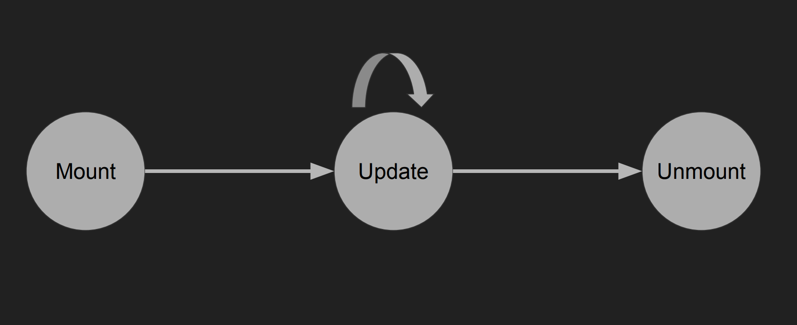

# Mobile App Development with React Native

---

# Lecture 3: React Native

## React Native
● A framework that relies on React core
● Allows us build mobile apps using only JavaScript
	○ “Learn once, write anywhere”
● Supports iOS and Android


## How does React Native work?

● JavaScript is bundled
	○ Transpiled and minified
● Separate threads for UI, layout and JavaScript
● Communicate asynchronously through a “bridge”
	○ JS thread will request UI elements to be shown
	○ JS thread can be blocked and UI will still work

● Example (Block JS)

```js
import React, {Component} from 'react';
import {Button, Text, ScrollView, StyleSheet} from 'react-native'
import{Constants} from 'expo'

export default class App extends Component {
  state = {
    count: 0,
  }

  componentDidMount() {
    setInterval(() => this.setState(prevState => ({count: prevState.count + 1})), 500)
  }
  
  blockJS() {
    console.log('blocking')
    const end = Date.now() + 5000
    while (Date.now() < end) {
      console.log('unblocked')
    }
  }

  render() {
    return (
      <ScrollView style={styles.container}>
        <Button title="block js thread" onPress={this.blockJS} />
          <Text style={styles.paragraph}>
            {this.state.count}
          </Text>
      </ScrollView>
    )
  }
}

const styles = StyleSheet.create({
  container: {
    flex: 1,
    alignItems: 'center',
    justifyContent: 'center',
    paddingTop: Constants.statusBarHeight,
    backgroundColor: '#ecf0f1',
  },
  paragraph: {
    margin: 24,
    fontSize: 18,
    fontWeight: 'bold',
    textAlign: 'center',
    color: '#34495e'
  },
})
```


## Differences between RN and Web

● Base components
● Style
● No browser APIs
	○ CSS animations, Canvas, SVG, etc.
	○ Some have been polyfilled (fetch, timers, console, etc.)
● Navigation


## React Native Components

● Not globally in scope like React web components
	○ Import from 'react-native'
● div → View
● span → Text
	○ All text must be wrapped by a  tag
● button → Button
● ScrollView
https://facebook.github.io/react-native/docs/components-and-apis.html

● Example (TodoApp - React Native Components & Style & Event Handling & Components)

​	

```js
import React from 'react';
import {View, Button, Text, ScrollView, StyleSheet, Switch} from 'react-native'
import {Constants} from 'expo'

let id = 0

const styles = StyleSheet.create({
todoContainer: {
 flexDirection: 'row',
 alignItems: 'center',
},
appContainer: {
 paddingTop: Constants.statusBarHeight,
},
fill: {
 flex: 1,
}
})

const Todo = props => (
<View style={styles.todoContainer}>
 <Switch value={props.todo.checked} onValueChange={props.onToggle} />
 <Button onPress={props.onDelete} title="delete" />
 <Text>{props.todo.text}</Text>
</View>
)

export default class App extends React.Component {
constructor() {
 super()
 this.state = {
   todos: [],
 }
}

addTodo() {
 id++
 const text = `TODO number ${id}`
 this.setState({
   todos: [
     ...this.state.todos,
     {id: id, text: text, checked: false},
   ], 
 })
}

removeTodo(id) {
 this.setState({
   todos: this.state.todos.filter(todo => todo.id !== id)
 })
}

toggleTodo(id) {
 this.setState({
   todos: this.state.todos.map(todo => {
     if (todo.id !== id) return todo
     return {
       id: todo.id,
       text: todo.text,
       checked: !todo.checked,
     }
   })
 })
}

render() {
 return (
   <View style={[styles.appContainer, styles.fill]}>
     <Text>Todo count: {this.state.todos.length}</Text>
     <Text>Unchecked todo count: {this.state.todos.filter(todo => !todo.checked).length}</Text>
     <Button onPress={() => this.addTodo()} title="Add TODO" />
     <ScrollView style={styles.fill}>
       {this.state.todos.map(todo => (
         <Todo
           onToggle={() => this.toggleTodo(todo.id)}
           onDelete={() => this.removeTodo(todo.id)}
           todo={todo}
         />
       ))}
     </ScrollView>
   </View>
 )
}
}
```


## Style

- React Native uses JS objects for styling 
- Object keys are based on CSS properties
- Flexbox layout
  - Default to column layout
- Lengths are in unitless numbers
- style prop can take an array of styles
- StyleSheet.create()
  - Functionally the same as creating objects for style
  - Additional optimization: only sends IDs over the bridge


##Event Handling 

- Unlike web, not every component has every interaction
- Only a few "touchable" components
  - Button
  - TouchableOpacity, TouchableHighlight, TouchableWithoutFeedback
  - TouchableNativeFeedback (Android only)

-  Web handlers will receive the event as an argument, but React Native handlers often receive different arguments
  - Consult the docs (https://facebook.github.io/react-native/)

 

## Components

- Return a node (something that can be rendered)
- Represent a discrete piece of the UI
- "All React components must act like pure functions with respect to their props."
- Two types: 
  - Stateless Functional Component (SFC) a.k.a Pure Functional Component
  - React.Component


## Stateless Functional Component (SFC)

● Simplest component: use when you don’t need state
● A function that takes props and returns a node
	○ Should be “pure” (it should not have any side effects like setting values,
updating arrays, etc.)
● Any change in props will cause the function to be
re-invoked


## React.Component

- An abstract class that can be extended to behave however you want
- These have additional features that SFCs don't
  - Have instances
  - Maintain their own state
  - Have lifecycle methods (similar to hooks or event handlers) that are automatically invoked
- Rendering now becomes a function of props and class properties


## Component Lifecycle




## Mount

- constructor(props)

  - Initialize state or other class properties (bound methods, etc.)

- render( )
  - The meat of a component
  - Return a node

- componentDidMount( )
  - Do anything that isn't needed for UI (async actions, timers, etc.)
  - Setting state here will cause a re-render before updating the UI

- Example (Counter - Mount)

  ```js
  import React, { Component } from 'react';
  import { Text, View, StyleSheet } from 'react-native';
  import { Constants } from 'expo';
  
  class Counter extends Component {
  state = {
   count: 0,
  }
  
  componentDidMount() {
   this.timer = setInterval(this.incrementCount, 1000)
  }
  
  incrementCount = () => {
   this.setState(prevState => ({count: prevState.count + 1}))
  }
  
  render() {
   return <Text>{this.state.count}</Text>
  }
  }
  
  export default class App extends Component {
  render() {
   return (
     <View style={styles.container}>
       <Counter />
     </View>
   );
  }
  }
  
  const styles = StyleSheet.create({
  container: {
   flex: 1,
   alignItems: 'center',
   justifyContent: 'center',
   paddingTop: Constants.statusBarHeight,
   backgroundColor: '#ecf0f1',
  },
  });
  ```

  

## Update

- componentWillReceiveProps(nextProps)
  - Update any state fields that rely on props
- shouldComponentUpdate(nextProps, nextState)
  - Compare changed values, return true if the component should rerender
    - If returned false, the update cycle terminates
  - Almost always a premature optimization
- render( )
- componentDidUpdate(prevProps, prevState)
  - Do anything that isn't needed for UI (network requests, etc.)


## Unmount

- componentWillUnmount( )

  - Clean up
    - Remove event listeners
    - Invalidate network requests
    - Clear timeouts/intervals

- Example (Counter - Unmount)

  ```js
  import React from 'react';
  import {View, Button, Text, StyleSheet} from 'react-native'
  
  const styles = StyleSheet.create({
    appContainer: {
      flex: 1,
      alignItems: 'center',
      justifyContent: 'center',
    },
    count: {
      fontSize: 48,
    }
  })
  
  class Counter extends React.Component {
    constructor() {
      super()
      this.state = {
        count: 0,
      }
    }
    
    componentDidMount() {
      this.interval = setInterval(this.inc, 1000)
    }
    
    componentWillUnmount() {
      clearInterval(this.interval)
    }
    
    inc = () => {
      console.log('increment!')
      this.setState(prevState => ({
        count: prevState.count + 1,
      }))
    }
  
    render() {
      return (
        <Text style={styles.count}>{this.state.count} </Text>
      )
    }
  }
  
  export default class App extends React.Component {
    constructor(props) {
      super(props)
      this.state = {
        showCounter: true,
      }
    }
    
    toggleCounter = () => this.setState(prevState => ({
      showCounter: !prevState.showCounter,
    }))
  
    // this was the render() code originally written in lecture
    render() {
      if (this.state.showCounter) {
        return (
          <View style={styles.appContainer}>
            <Button title="toggle" onPress={this.toggleCounter} />
            <Counter />
          </View>
        )
      } else {
        return (
          <View style={styles.appContainer}>
            <Button title="toggle" onPress={this.toggleCounter} />
          </View>
        )
      }
    }
  
    // this is a more concise version with the same functionality
    render() {
      return (
        <View style={styles.appContainer}>
          <Button title="toggle" onPress={this.toggleCounter} />
          {this.state.showCounter && <Counter />}
        </View>
      )
    }
  }
  ```

  

## Writing React Native

## Expo

- "The fastest way to build an app"
- Suite of tools to accelerate the React Native development process
  - Snack - runs React Native in the browser
  - XDE - a GUI to serve, share, and publish your Expo projects
  - CLI - a command-line interface to serve, share, and publish projects
  - Client - runs your projects on your phone while developing
  - SDK - bundles and exposes cross-platform libraries and APIs


## Import/Export

- Components are great for simplifying code
- We can split components into their own files
  - Helps organize project
  - Export the component from the file

- Import the component before using it in a file
- Default vs named import/export 

- Example (Counter - Import/Export & PropTypes)

  1. App.js

     ```js
     import React, {Component} from 'react';
     import { StyleSheet, Text, View } from 'react-native';
     
     import CustomCount from './Count.js'
     
     export default class App extends React.Component {
       render() {
         return (
           <View style={styles.container}>
             <CustomCount count={0} />
           </View>
         );
       }
     }
     
     const styles = StyleSheet.create({
       container: {
         flex: 1,
         backgroundColor: '#fff',
         alignItems: 'center',
         justifyContent: 'center',
       },
     });
     ```

  2. Count.js

     ```js
     import React from 'react'
     import {StyleSheet, Text} from 'react-native'
     import PropTypes from 'prop-types'
     
     const styles = StyleSheet.create({
       text: {fontSize: 72},
     })
     
     class Count extends React.Component {
       static propTypes = {
         count: PropTypes.number.isRequired,
       }
     
       render() {
         return (
           <Text style={styles.text}>
             {this.props.count}
           </Text>
         )
       }
     }
     
     export default Count
     ```

     

## PropTypes

- React can validate the types of component props at runtime
- Development tool that allows developers to ensure they're passing correct props
- Helps document your components' APIs
- Only runs in development mode


## How to Read Docs

- Have a goal in mind
- See what the library/framework/API offers
- Find something that solves your problem
- Configure using the exposed API