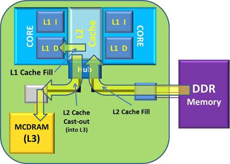
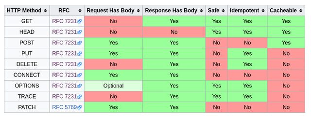

# TIL(Today I Learned)

# Mon Nov 5 2018


# 1. Today I Learned

# 모던 웹 서비스의 구성요소

# Fetch API

- 웹 브라우저의 **XMLHttpRequest를 대체**하기 위해 만들어진 새로운 HTTP client 표준
- 비교적 최근에 도입되어 IE 및 구형 안드로이드 브라우저(4.x)는 지원하지 않음
- [Fetch Polyfill](https://github.com/github/fetch)
- [isomorphic-fetch](https://www.npmjs.com/package/isomorphic-fetch)

※ 최신 브라우저 기능과 똑같이 만들어진 라이브러리 = 폴리필(polyfill) (ex: 최신 문법인 Array.prototype.includes 폴리필)

※ Ajax (Asynchronous JavaScriptAnd XML)

※ XML (Extensible Markup Language): JSON 이전에 많이 쓰이던 데이터 표현 방식

※ transfiler: 최신 문법의 옛날 문법으로 바꿔줌(ex: Barbel)


# Axios vs Fetch API

- Axios는 여러 **편의기능**(instance와 같이 설정을 재사용하거나 요청중인 연결을 취소하는 등)을 제공

- 다만, Axios는 내부적으로 XMLHttpRequest를 사용하고 있는데 **Service Worker 등의 최신 기술이 XMLHttpRequest를 지원하지 않으므로,** Service Worker를 사용할 예정에 있는 프로젝트에서는 Axios 대신 Fetch API를 사용해야만 함


## 간단한 예제

- [정말 멋진 Fetch API](http://hacks.mozilla.or.kr/2015/05/this-api-is-so-fetching/)

Fetch API 의 가장 유용하고, 핵심적인 함수는 `fetch()` 함수입니다. 가장 간단한 형태의 `fetch()` 함수는 URL 을 인자로 받고 응답을 처리하기 위한 promise 를 반환합니다. 응답을 처리할 때 `Response` 객체를 이용할 수 있습니다.

```
fetch("/data.json").then(function(res) {
  // res instanceof Response == true.
  if (res.ok) {
    res.json().then(function(data) {
      console.log(data.entries);
    });
  } else {
    console.log("Looks like the response wasn't perfect, got status", res.status);
  }
}, function(e) {
  console.log("Fetch failed!", e);
});
```

- 위의 예제처럼 Fetch API는 header를 받고 실행되고, body를 받고 다시 실행되므로 promise를 두 번 반환해준다. 


※ 지금 현재는 React 기술을 쓰는 곳에선 Fetch API와 AXIOS를 반반정도 쓰이고 있지만 Fetch API를 쓰는 비율이 늘어날 것으로 예상됨.


# HTTP Cache

## Cache

1. (무기 등의) 은닉처
2. 은닉하다

컴퓨터 분야에서의 캐시는 (주로 접근 속도의 개선을 위해) **데이터를 미리 복사해 놓는 임시 저장소**, 혹은 **그 임시 저장소에 데이터를 저장하는 행위**를 가리킴

'cache' 혹은 'caching'이라는 **용어 자체는 특정 기술을 가리키는 것이 아니라,**접근 속도를 개선하기 위해 따로 저장소를 두는 '방법'을 가리킴

컴퓨터의 **아주 많은 부분**(CPU, GPU, HDD, 네트워크, 웹, 데이터베이스...)에서 사용되고 있음


※ L3 cache memory

Definition of: **L3 cache**. **L3 cache**. (Level 3 **cache**) A memory bank built onto the motherboard or within the CPU module. The**L3 cache** feeds the L2 **cache**, and its memory is typically slower than the L2 memory, but faster than main memory. The**L3 cache** feeds the L2 **cache**, which feeds the L1 **cache**, which feeds the processor.




## HTTP Cache

- 자원의 효율적 로딩을 위한 [웹 표준](https://tools.ietf.org/html/rfc7234)
- **서버에서 가져온 자원**(HTML, CSS, JS, 이미지, ...)을 **가까운 곳**(브라우저, 혹은 다른 서버)에 저장해놓고 재사용
- 캐시를 할 것인지 말 것인지, 어떻게 할 것인지를 결정하는 규칙이 복잡하고, 브라우저마다 조금씩 다름

※ cache를 쓰면 원본과 사본이 달라지는 문제가 항상 생기고 그 문제를 어떻게 처리할 것인가 하는 문제가 있음


## Common Problem

**캐시된 자원**과 **실제 자원**의 **내용이 달라지는 문제**를 
어떻게 해결할 것인가?


## Solution

- Expiration (만료)

  정해진 시간이 지나면 **캐시가 자동으로 삭제**되도록 설정

- Validation (검증)

​	서버에 요청을 보내서 **캐시를 계속 사용할 수 있는지 확인**

​	

## Cache 관련 헤더

[Cache 범주](https://developer.mozilla.org/ko/docs/Web/HTTP/Headers#Caching)

[Conditionals 범주](https://developer.mozilla.org/ko/docs/Web/HTTP/Headers#Conditionals)

- Cache-Control

  (요청, 응답) 캐시와 관련된 다양한 기능을 하는 지시자를 포함. no-cache, max-age가 많이 사용됨. no-cache, max-age=0 지시자는 캐시를 사용하지 않도록 하거나, 캐시를 아직도 쓸 수 있는지 검증하기 위해 사용됨 [(각각의 자세한 의미)](https://stackoverflow.com/questions/1046966/whats-the-difference-between-cache-control-max-age-0-and-no-cache)

- **ETag**

  **(응답) 캐시의 검증을 위해 사용되는 자원의 식별자. 주로 자원의 [해시값](https://namu.wiki/w/%ED%95%B4%EC%8B%9C)이 사용되나, 마지막으로 수정된 시각, 혹은 버전 넘버를 사용하기도 함** (→ 이렇게 식별자를 사용하면 용량이 큰 전체 자원을 보내지 않고도 내용의 수정 여부를 알 수 있다.)

- Expires

  (응답) 캐시를 만료시킬 **시각**을 서버에서 명시적으로 지정


※ [md5 Hash Generator](http://www.miraclesalad.com/webtools/md5.php)

※ 해시(hash) - 아래와 같은 특징을 갖고 있는 연산

1. 같은 입력을 주면 항상 같은 출력이 나온다.
2. 입력이 조금이라도 달라지면 완전히 다른 출력이 나온다. 


## in Request Headers

- Last-Modified

  (응답) 원래 자료가 마지막으로 수정된 시각

- **If-None-Match**

  **(요청) 검증을 위해 사용됨. 이전에 저장해두었던 자원의 ETag 값을 If-None-Match 헤더의 값으로 요청에 포함시켜서 보내면, 서버는 해당 경로에 있는 자원의 ETag와 비교해보고 자원의 전송 여부를 결정** **(ETag와 같이 자주 쓰이므로 엮어서 알아둘 것)**

  - 바뀐 자원이 없는 경우: 브라우저에서 server에 request를 보내고 server가 확인하고 만약 변경된 것이 없다면 304 응답코드를 보낸다. 
  - 
  - 바뀐 자원이 있는 경우: 200 OK 응답코드와 바디에 새로 바뀐 자원을 포함해서 보낸다. 
  - 

※ Netlify에 이 기능이 내장되 있음

- If-Modified-Since

  (요청) 검증을 위해 사용됨. 이전에 저장해두었던 자원의 **Last-Modified** 값을 If-Modified-Since 헤더의 값으로 요청에 포함시켜서 보내면, 서버는 해당 경로에 있는 자원의 Last-Modified와 **비교**해보고 자원의 전송 여부를 결정


※ `cmd` + `shift` + `R` = cache를 지우는 새로고침

※ 개발 과정중에 cache를 비활성화 해야할 경우엔 inspect에서 Disable cache를 체크


## Cacheable Methods



POST 메소드는 [Cacheable](https://developer.mozilla.org/en-US/docs/Glossary/cacheable) 범주에 포함되기는 하지만, 특별한 조건을 만족시켜야 하며 실무에서는 POST cache가 거의 사용되지 않습니다.


## 캐시의 사용

- 브라우저는 이미 캐시를 잘 활용하도록 만들어져 있습니다.
- Express는 이미 캐시를 잘 활용하도록 만들어져 있습니다.
- Netlify는 이미 캐시를 잘 활용하도록 만들어져 있습니다.

일단은 별다른 추가작업 없이도 편하게 캐시 기능을 사용할 수 있지만, 우리가 원하는대로 캐시가 동작하지 않을 때 그 **원인을 파악하기 위해 캐시 관련 헤더는 숙지**해두는 것이 좋습니다. 그리고 **HTTP method를 용도에 맞게**사용하는 것도 중요합니다.


### ※ CDN(Content Delivery Network)

자료를 전 세계 도처에 제공하기 위해서 거점 네트워크를 사용하는 방법

(혹은 global Application Delivery Network (in Netlify))


## 참고 링크

- <https://developers.google.com/web/fundamentals/performance/optimizing-content-efficiency/http-caching?hl=ko>
- <https://developer.mozilla.org/ko/docs/Web/HTTP/Caching>
- <https://stackoverflow.com/questions/18148884/difference-between-no-cache-and-must-revalidate>
- <https://www.w3.org/Protocols/rfc2616/rfc2616-sec14.html#sec14.9.1>


# GraphQL

## REST API의 단점

- (보통의 경우) 각각의 자원마다 경로가 따로 있음. 즉, 여러 자원이 동시에 필요한 경우에는 **요청을 여러 번 보내야 함**(요청의 횟수 면에서 비효율적)

- (보통의 경우) 자원의 필요한 속성만 얻어올 수 없음. 즉, **일부 속성의 필요하더라도 전체 속성을 가져와야만 함**(요청의 용량 면에서 비효율적)

  ※ 아마 한국의 기업 90% 는 REST API를 쓰고 있을 것


## GraphQL

- Facebook에서 2015년 공개한 **데이터 질의(query) 언어**
- REST API를 대체하기 위해 만들어짐
- 클라이언트에서 필요한 **데이터의 구조**를 GraphQL 언어로 정의한 후 질의할 수 있고, 서버는 그에 맞게 **구조화된 데이터를 응답**
- 서버에서는 GraphQL 질의를 해석하기 위해 별도의 해석기가 필요하며, [여러 언어의 구현체](http://graphql.org/code/)가 나와있는 상태 
- REST API와 비교했을 때 굉장히 효율적임(앞으로 사용 비율이 더 늘어날 것으로 예상)

※ 갈려고 하는 회사에서 사용하는지 확인


## 참고 링크

- <https://dev-blog.apollodata.com/graphql-vs-rest-5d425123e34b>

- <http://graphql.org/learn/>

- [Apollo GraphQL](https://www.apollographql.com/)


### ※ Network 

- Protocol:
  - TCP/IP
  - HTTP


## `<template>`

1. 목록 표시
2. 페이지 전환


# 2. 실습

- [cache - in Browser: 200, 304 response code](https://wpsn-axios-example.glitch.me/)

- [GraphQL - Github Developer](https://developer.github.com/v4/explorer/)
  - 화면 왼쪽편은 GraphQL, 오른쪽편은 JSON
- [FDS Template, DocumentFragment](https://codepen.io/yoonjp/pen/QJwqyP)
  - 참고: https://www.html5rocks.com/ko/tutorials/webcomponents/template/
- [FDS Axios Instance, Interceptor](https://codepen.io/yoonjp/pen/EOawmN)
  - 401(토큰이 없을 때 )

- [fds-mid-todo](https://github.com/YoonJP/fds-mid-todo)


# 3. Reference

- [정말 멋진 Fetch API](http://hacks.mozilla.or.kr/2015/05/this-api-is-so-fetching/)

- [md5 Hash Generator](http://www.miraclesalad.com/webtools/md5.php)
- HTTP Cache 참고 링크
  - <https://developers.google.com/web/fundamentals/performance/optimizing-content-efficiency/http-caching?hl=ko>
  - <https://developer.mozilla.org/ko/docs/Web/HTTP/Caching>
  - <https://stackoverflow.com/questions/18148884/difference-between-no-cache-and-must-revalidate>
  - <https://www.w3.org/Protocols/rfc2616/rfc2616-sec14.html#sec14.9.1>

- [GraphQL - Website](https://graphql.org/code/)

- GraphQL 참고 링크
  - <https://dev-blog.apollodata.com/graphql-vs-rest-5d425123e34b>
  - <http://graphql.org/learn/>
  - [Apollo GraphQL](https://www.apollographql.com/)
