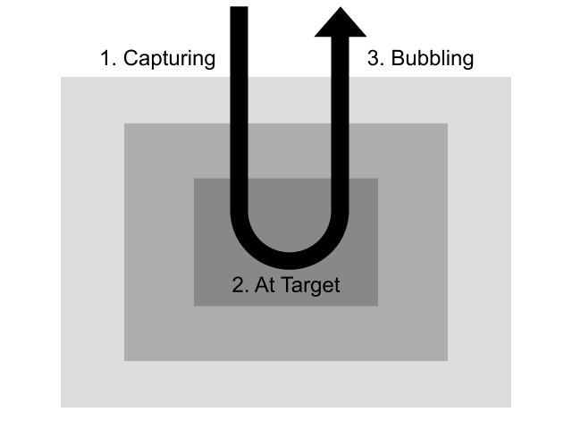

# TIL (Today I learned) 

# 10/15 (월)

# 1. Today I Learned

# 내장 객체 및 생성자(JAVASCRIPT 심화 1)

## JSON

**직렬화(serialization)**: 프로그래밍을 하다 보면 '프로그래밍 언어에서 사용하는 자료구조'를 보조기억장치에 **저장**하거나, 혹은 네트워크를 통해 **전송**해야 할 일이 생깁니다. 이 때 자료구조를 **그대로** 저장/전송할 수는 없으니, 저장/전송 가능한 형태로 변환하는 절차가 필요합니다. (XML도 직렬화 형식이지만 오래된 것)

**역직렬화(deserialization)**: 반대로, 직렬화된 데이터를 프로그래밍 언어에서 다시 사용할 수 있도록 변환해주는 절차

**JSON(JavaScript Object Notation)**: 웹의 세계에서는 가장 많이 사용되는 직렬화 형식. **JavaScript 객체와 유사한 표기법**을 사용하는 **텍스트**를 통해 복잡한 자료구조를 나타냅니다.

```json
{
  "key": "value",
  "arr": [1, 2, 3],
  "nullProp": null
}
```

JSON은 언어에 관계없이 사용할 수 있는 직렬화 형식이고, 실제로 많은 프로그래밍 언어들이 JSON 관련 기능을 내장하고 있습니다.

JavaScript 역시 JSON 관련 기능을 내장하고 있습니다. 같은 이름의 `JSON` 내장 객체의 메소드를 통해 직렬화와 역직렬화를 할 수 있습니다.

```js
// `JSON.stringify`로 직렬화를 할 수 있습니다.
JSON.stringify({
  key: 'value',
  arr: [1, 2, 3],
  nullProp: null,
  undefinedProp: undefined // 값이 `undefined`인 속성은 직렬화 과정에서 제외됩니다.
}); // '{"key":"value","arr":[1,2,3],"nullProp":null}'

// `JSON.parse`로 역직렬화를 할 수 있습니다.
JSON.parse('{"key":"value","arr":[1,2,3],"nullProp":null}') //{ key: 'value', arr: [ 1, 2, 3 ], nullProp: null } 반환


const text = JSON.stringify({
  key: 'value',
  arr: [1, 2, 3],
  nullProp: null,
  undefinedProp: undefined // 값이 `undefined`인 속성은 직렬화 과정에서 제외됩니다.
}); // '{"key":"value","arr":[1,2,3],"nullProp":null}'

const obj = JSON.parse(text) 
```


JSON을 직접 편집해야 할 때는 **JSON이 JavaScript가 아니라는 사실에 주의해야 된다.**

- 속성 이름은 꼭 쌍따옴표를 둘러주어야 합니다.
- `Map`, `Set`, `Date`, `Error`, `RegExp`, `Function`, `Promise`와 같이 특별한 동작방식을 가지는 객체들을 제대로 표현할 수 없습니다.
- `undefined`, `NaN`, `Infinity`과 같은 값을 표현할 수 없습니다.
- 주석을 쓸 수 없습니다.


## Date

`Date`: JavaScript에 내장된 날짜과 시각을 다루기 위한 생성자

※ `Date`를 사용하기 위해서 알아두어야 할 개념들(**중요!**)

- **협정 세계시 (UTC)** - 지구 상의 여러 지역에서는 **시간대(timezone)**와 **일광 절약 시간제(DST)**에 따라 서로 다른 시각을 사용합니다. 이 때문에 발생하는 혼동을 피하기 위해 **위치 및 DST의 사용 여부와 상관 없이 같은 기준으로** 시각을 다룰 필요가 있는데, 이 때 사용되는 것이 협정 세계시(UTC)입니다. UTC가 만들어지기 이전에는 **그리니치 평균시(GMT)**라는 용어가 널리 쓰였습니다. 또한 조금씩 느려지는 지구 자전 속도에 맞추기 위해 UTC에는 가끔씩 **윤초(leap second)**가 추가되기도 합니다.

- **유닉스 시간** - 컴퓨터에서는 시간 데이터를 편하게 다루기 위해서 유닉스 시간이라는 특별한 단위를 사용합니다. 유닉스 시간은 UTC 기준 1970년 1월 1일 0시 0분 0초부터 경과한 시간을 초 단위의 정수로 나타냅니다. 예를 들어, 한국 시간대의 `2017-12-10 12:26:11`라는 시간을 유닉스 시간으로 나타내면 `1512876371`이 됩니다. 유닉스 시간은 POSIX 시간 또는 **Epoch 시간**이라는 이름으로 불리기도 합니다.


### Date 객체의 생성

사용방법

- `new Date()` - **현재 시각**을 나타내는 Date 객체를 반환

- `new Date(value)` - `value`가 정수인 경우, 이를 **밀리초 단위**의 유닉스 시간으로 간주해서 이에 해당하는 Date 객체를 반환합니다. `value`가 문자열인 경우, 이 문자열이 나타내는 Date 객체를 반환합니다. (※ 한국시간은 협정시에서 -9시에 해당하는 시간이다. )

- `new Date(year, month, day, hour, minutes, seconds, milliseconds)` - 년, 월, 일, 시, 분, 초, 밀리초를 **직접 입력**해서 Date 객체를 생성할 수도 있습니다. '월' 부분은 0부터 11까지의 값을 가집니다. 월 이후의 인수는 생략가능하고, 인수를 생략하면 '일'은 1로, 나머지는 모두 0으로 지정됩니다.

`Date` 객체를 생성하고 난 뒤에는, 해당 객체가 나타내는 년, 월, 일, 시, 분, 초, 밀리초를 가져오거나 변경할 수 있습니다.

※  JSON은 `Date` 객체를 제대로 전송, 저장할 수 없으므로 시간을 숫자만으로된 문자열로 변환한 후 쓸 수 있다.


### 문자열로 변환하기

`Date` 객체가 나타내는 시각을 여러 가지 방법으로 문자열로 변환할 수도 있습니다.


```js
const now = new Date();
console.log(now.toString()); // Sun Dec 10 2017 12:49:31 GMT+0900 (KST)
console.log(now.toDateString()); // Sun Dec 10 2017
console.log(now.toTimeString()); // 12:49:31 GMT+0900 (KST)
console.log(now.toUTCString()); // Sun, 10 Dec 2017 03:49:31 GMT

// 자주 쓰이는 것
console.log(now.toLocaleString()); // 2017. 12. 10. 오후 12:49:31 // ※ Locale: 지역과 언어를 묶어서 나타냄
console.log(now.toISOString()); // 2017-12-10T03:49:31.145Z // 시간을 ISO(국제표기법)에 따라 나타냄, Z가 붙어 있으면 UTC기준이라는 표시임
```


### 시간 간격 측정하기

`-` 연산자를 사용해서 두 `Date` 객체 사이의 시간 간격이 얼마나 되는지를 밀리초 단위로 측정할 수 있습니다.

```js
// alert가 뜨는 순간 시작되어서 끝날때 까지의 경과시간을 측정하는 코드
const start = new Date();
alert('시간이 가고 있습니다...');
const end = new Date();
alert(`${end - start} 밀리초 만큼의 시간이 경과되었습니다.`);
```

```js
// 특정값으로 시간간격을 주기적으로 실행시킴
const start = new Date();

setInterval(() => {
  const end = new Date();
  console.log(`경과시간: ${end - start} 밀리초`)
}, 1000)
```


### 라이브러리 사용하기

JavaScript에 내장되어 있는 `Date` 객체는 컴퓨터에서 시간 데이터를 다루기 위한 기본적인 기능들을 제공하지만, 실제 서비스에서 사용하기에는 부족한 점이 많습니다. 이 때문에, 실무에서는 [moment.js](https://momentjs.com/) 혹은 [date-fns](https://date-fns.org/)와 같은 별도의 라이브러리를 사용하는 경우가 많습니다.

```js
const moment = require("moment")
moment.locale('ko');

const now = moment();
console.log(now.format("dddd, MMMM Do YYYY, h:mm:ss a")); // 일요일, 12월 10일 2017, 1:02:42 오후
console.log(now.subtract(7, 'days').calendar()); // 2017.12.03
console.log(moment("20120101", "YYYYMMDD").fromNow()); // 6년 전
```


**∴ 협정 세계시(UTC), 유닉스 시간이 주로 쓰이므로 중요**


## Symbol

심볼(Symbol)은 Javascript의 7가지 원시타입 중 하나며, ES2015에서 도입된 새로운 원시 타입입니다.

`Symbol` 내장 함수를 통해 새 심볼을 생성할 수 있습니다.

```js
const sym = Symbol();
console.log(typeof sym); // symbol
console.log(sym); // Symbol()
```


**심볼은 객체의 속성 키로 사용하기 위해 만들어졌습니다.** 아래와 같이 대괄호 표기법을 통해 심볼을 객체의 속성 키로 사용할 수 있습니다. (※ 속성 키:  속성 이름)

```js
const mySymbol = Symbol('my symbol');

const obj = {
  [mySymbol]: 'hello'
};

console.log(obj); // { [Symbol(my symbol)]: 'hello' }
```

- 내장 심볼(well-known symbol)을 객체의 속성 키로 사용하는 예제:

```js
// 내장 심볼(well-known symbol)을 객체의 속성 키로 사용하는 예제

const arr = [1, 2, 3]

// 배열 뿐만 아니라 iterable 객체를 순회할 때에도 상용할 수 있다. 
for (const item of arr) {
    console.log(item)
}


// iterable 객체란,  Symbol.iterator 속성에 특별한 형태의 함수가 들어있는 객체를 말한다. 

for (const cahr of 'hello') {
    console.log(char)
}


// 객체에도 'for ... of' 구문을 이용해 순회할 수 있게 하는 구문 (객체의 기능을 확장할 수 있다.)
const obj = {
    [Symbol.interator]: function* () {
        yield 1
        yield 2
        yield 3
    }
}

for (const item of obj) {
    console.log(item)
}
```


## Map

ES2015에서 도입된 `Map` 생성자는 객체와 유사하게 **키-값 쌍(key-value pair)**을 저장할 수 있는 새로운 자료구조를 제공합니다.

```js
const m = new Map();

m.set('hello', 'world'); // m.hello = 'world' 와 같은 기능
console.log(m.get('hello')); // 'world'
console.log(m.has('hello')); // true

m.delete('hello'); 
console.log(m.get('hello')); // undefined
console.log(m.has('hello')); // false
```

`Map`으로 생성된 객체는, 일반적인 객체와 비교했을 때 아래와 같은 차이점을 갖습니다.

- 문자열과 심볼만이 객체의 속성 키가 될 수 있는 반면, **어떤 값이라도 `Map` 객체의 키로 사용될 수 있습니다. (예를 들어, 배열이나 객체같은 것도 Map 객체의 키로 쓸 수 있다.)**

- 객체의 속성을 확인할 때는 프로토타입 체인을 확인하는 과정에 필요하지만, `Map` 객체 안에 들어있는 데이터는 **프로토타입의 영향을 받지 않습니다. (그래서 더 빠르다.)**

- `Map` 객체의 `size` 속성을 통해 내부에 들어있는 **데이터의 개수**를 쉽게 알 수 있습니다.

  ```js
  Object.keys(obj).length // 이 방식은 열거가능한 속성들의 갯수만 반환
  ```


`Map` 객체 장단점

- 장점: **데이터의 추가/삭제가 빈번하게 일어나는 경우** 일반적인 객체보다 훨씬 빠르게 동작한다. (게임에 적용하기 좋음)
- 단점: JSON 등으로 **직렬화 하기 어렵다**는 특징이 있습니다.


**∴ 키-값 쌍 형태의 데이터를 다루면서 속도가 중요한 경우에는 `Map`의 사용을 고려해보세요.**


## Set

ES2015에서 도입된 `Set` 생성자는 **집합** 형태의 자료구조를 제공합니다. (배열과 유사)

`Set` 객체 내부에 이미 존재하는 데이터를 추가하려고 하면, 이는 무시됩니다. 즉, `Set` 객체는 내부에 **중복된 데이터가 저장되는지 않는다.**

```js
const s = new Set();

s.add(1);
s.add(1);
s.add(2);

console.log(s); // Set { 1, 2 }
```


**∴ 배열과 유사한 형태의 자료구조**가 필요하지만 **순서가 중요하지 않은 경우,** 그리고 **중복된 데이터의 저장을 허용하지 않아야** 할 경우, `Set`의 사용을 고려해보자.

- 중복된 요소를 제거할 때 집합으로 바꿨다가 다시 배열로 만드는 예제:

```js
// 중복된 요소를 제거할 때 집합으로 바꿨다가 다시 배열로 만듦
function removeDuplicates(arr) {
    const set = new Set(arr)
    return Array.from(set)
}

removeDuplicates([1, 2, 3, 2, 1]) // [1, 2, 3] 반환
```


# FDS 브라우저 측 JavaScript


## 이벤트 리스너

- `el.addEventListener(eventName, callback)` - 이벤트 리스너 등록

- `el.removeEventListener(eventName, callback)` - 이벤트 리스너 제거

  ```js
  // 이벤트 리스터 등록, 제거 버튼 예제
  
  // function 구문 버전
  function popup() {
    alert('버튼이 클릭되었습니다.')
  }
  
  // 화살표 함수 버전
  function popup = e => {
    alert('버튼이 클릭되었습니다.')
  }
  
  document.querySelector('.attach').addEventListener('click', e => {
    document.querySelector('.listener-target').addEventListener('click', popup)
  })
  
  document.querySelector('.detach').addEventListener('click', e => {
    document.querySelector('.listener-target').removeEventListener('click', popup)
  })
  ```


## DOM 엘리먼트 생성하기

- `document.createElement(tagName)` - 새로운 엘리먼트 객체 생성하기 (새로 생성된 엘리먼트 객체는 HTML문서안에 반영될 수 도 있고 아닐 수 도 있다.)
- `el.cloneNode()` - 엘리먼트 복사하기


## DOM 트리 조작하기

- `el.appendChild(newChild)` - 요소 끝에 자식 요소를 삽입하기
- `el.insertBefore(newChild, beforeWhat)` - 원하는 위치에 자식 요소를 삽입하기 (두 번째 인수(beforeWhat)에 null 값을 넣으면 appendChild랑 같은 기능을 한다. / 이미 문서안에 존재하는 인수 객체를 넣으면 복사하지않고 그냥 넘어간다.)
- `el.replaceChild(newChild, oldChild)` - 자식 요소를 교체하기
- `el.removeChild(child)` - 자식 요소 제거하기


※ `el.appendChild(newChild)` 와 `el.insertBefore(newChild, beforeWhat)`는 위치를 이동시킬 때에도 사용된다.

※ document.body.appendChild(div) // HTML 문서에 넣는법


## dataset

- `el.dataset` - `data-*` 어트리뷰트를 가져오기. (`kebab-case`가 `camelCase`로 변환됨)

```js
formEl.dataset.fooBar
"hello"
formEl.dataset.index
"1"

// 아래처럼 할 수 있지만 위의 방법이 더 짧고 편하다.
formEl.getAttribute('data-foo-bar')
"hello"
```


## To-do List 실습

- [CodePen link](https://codepen.io/yoonjp/pen/dgVEQQ)
- HTML:
```html
<button class="add">추가</button>
<ul class="todo-list"></ul>
```
- JS:
```js
const addEl = document.querySelector('.add')
const todoListEl = document.querySelector('.todo-list')

function addTodo(newTodoText) {
  // li 태그를 만들어서, 내용을 채운 뒤에 문서 안에 삽입하기
  const todoItemEl = document.createElement('li')
  todoItemEl.textContent = newTodoText // prompt의 반환값은 다 문자열이므로
  
  todoListEl.appendChild(todoItemEl)
  
  // 삭제 버튼을 만들어서 문서 안에 넣기   
  const deleteButtonEl = document.createElement('button')
  deleteButtonEl.textContent = '삭제'
  todoItemEl.appendChild(deleteButtonEl)
  
  // 삭제 번튼을 클릭했을 때 할일 항목이 삭제되도록 만들기
  deleteButtonEl.addEventListener('click', e => {
    todoListEl.removeChild(todoItemEl)
  })  
}

addEl.addEventListener('click', e => {
  // 클릭 한 번이 되었을 때 수행되어야 할 작업
  const newTodoText = prompt('새 할일을 입력하세요.')
  // alert(newTodoText) 
  addTodo(newTodoText)
})


// 내가 만들고 싶은 기능들을 미리 만듦
addTodo('123')
addTodo('456')
addTodo('789') 
```


## 노드 간 관계

- `el.childNodes` - 자식 노드
- `el.firstElementChild` - 첫 번째 자식 요소
- `el.lastElementChild` - 마지막 자식 요소
- `el.previousElementSibling` - 이전 형제 요소
- `el.nextElementSibling` - 다음 형제 요소
- `el.parentElement` - 부모 요소
- `el.offsetParent` - 포지셔닝의 기준이 되는 조상 요소 (포지션 세팅이 되어있는 가장 가까운 조상 요소)


## 요소의 크기 및 위치

- `el.getBoundingClientRect()` - 화면 좌측 상단으로부터의 요소의 위치 및 요소의 크기를 반환 (※ x, y는 Window Explorer에서 지원안됨, 쓰지 말것)

- `el.offsetHeight` / `el.offsetWidth` - border를 포함한 요소의 크기
- `el.clientHeight` / `el.clientWidth` - border를 제외한 요소의 크기

- `el.scrollHeight` / `el.scrollWidth` - 요소 내부에 포함된 콘텐츠의 크기 (스크롤 가능한 영역의 크기)

- `el.offsetTop` / `el.offsetLeft` - offsetParent로부터의 요소의 위치 (position 세팅이 되있는 가장 가까운 부모기준으로 요소의 위쪽과 좌측으로 부터의 위치)

- `el.scrollTop` / `el.scrollLeft` - 요소 내부의 콘텐츠가 스크롤된 정도

- `el.clientTop` / `el.clientLeft` - border의 너비


------

## 이벤트 객체

- `e.target` - 실제로 이벤트를 일으킨 요소
- `e.currentTarget` - 이벤트 전파 과정 중 현재 이벤트가 위치한 요소
- `e.stopPropagation()` - 이벤트 전파 과정을 멈추기
- `e.preventDefault()` - 이벤트가 일으키는 브라우저의 기본 동작과정을 취소하기

- `e.target` - 실제로 이벤트를 일으킨 요소

  `e.currentTarget` - 이벤트 전파 과정 중 현재 이벤트가 위치한 요소

  `e.stopPropagation()` - 이벤트 전파 과정을 멈추기

  `e.preventDefault()` - 이벤트가 일으키는 브라우저의 기본 동작과정을 취소하기

- ```js
  // 마우스 이벤트 객체 예시:
  MouseEvent {isTrusted: true, screenX: 194, screenY: 311, clientX: 194, clientY: 201, …}
  altKey: false
  bubbles: true
  button: 0
  buttons: 0
  cancelBubble: false
  cancelable: true
  clientX: 194
  clientY: 201
  composed: true
  ctrlKey: false
  currentTarget: null
  defaultPrevented: false
  detail: 1
  eventPhase: 0
  fromElement: null
  isTrusted: true
  layerX: 194
  layerY: 201
  metaKey: false
  movementX: 0
  movementY: 0
  offsetX: 181
  offsetY: 190
  pageX: 194
  pageY: 201
  path: (6) [fieldset, form, body, html, document, Window]
  relatedTarget: null
  returnValue: true
  screenX: 194
  screenY: 311
  shiftKey: false
  sourceCapabilities: InputDeviceCapabilities {firesTouchEvents: false}
  srcElement: fieldset
  target: fieldset
  timeStamp: 765299.8999999836
  toElement: fieldset
  type: "click"
  view: Window {postMessage: ƒ, blur: ƒ, focus: ƒ, close: ƒ, frames: Window, …}
  which: 1
  x: 194
  y: 201
  __proto__: MouseEvent
  ```


## 이벤트 전파



- 이벤트 전파 

  - addEventLinstener를 그냥 사용하면 event가 전부 bubbling 단계에 따라 실행되지만, addEventLinstener에 true 값을 주면 event의 동작(실행) 순서를 변경할 수 있다. 

- 이벤트 전파 예시:

  - form 영역을 클릭했을 때 Event listener를 실행되도록 해놨을 때  form 영역 안에 있는 label을 클릭해도 Event listener가 실행된다.

- FDS Capturing & Bubbling 실습 (이벤트 전파에 따른 event 동작 순서 확인 예제):
  - [CodePen link](https://codepen.io/yoonjp/pen/NOwKVN)
  - HTML:  
  ```html
  <div class="outer">
    <div class="inner">
      <button class="button">버튼</button>
    </div>
  </div>
  <div class="outer2">
  outer2
  </div>
  ```
  - CSS:
  ```css
  .outer {
  background-color: blue;
  padding: 20px;
  }

  .inner {
  background-color: red;
  padding: 20px;
  }
  ```
  - JS:
  ```js
  document.querySelector('.outer').addEventListener('click', e => {
    alert('outer가 클릭되었습니다.');
    // alert('target의 class:' + e.target.getAttribute('class'));
    // alert('currentTarget의 class:' + e.currentTarget.getAttribute('class'));
  }, true); // true 값을 주면 값을 준 outer에서 먼저 실행 되도록 한다. 
  
  document.querySelector('.inner').addEventListener('click', e => {
    alert('inner가 클릭되었습니다.');
    // alert('target의 class:' + e.target.getAttribute('class'));
    // alert('currentTarget의 class:' + e.currentTarget.getAttribute('class'));
  }, true);
  
  document.querySelector('button').addEventListener('click', e => {
    alert('버튼이 클릭되었습니다.');
    // alert('target의 class:' + e.target.getAttribute('class'));
    // alert('currentTarget의 class:' + e.currentTarget.getAttribute('class'));
  }, true);
  
  document.querySelector('.outer2').addEventListener('click', e => {
    alert('outer2가 클릭되었습니다.');
  });
  ```


# 3. Reference

- [JSON.stringify - description in Devdocs](http://devdocs.io/javascript/global_objects/json/stringify)

- 시간 관련 라이브러리: [moment.js](https://momentjs.com/)  /  [date-fns](https://date-fns.org/)
- [add.eventListener - parameter in devdocs](http://devdocs.io/dom/eventtarget/addeventlistener)


