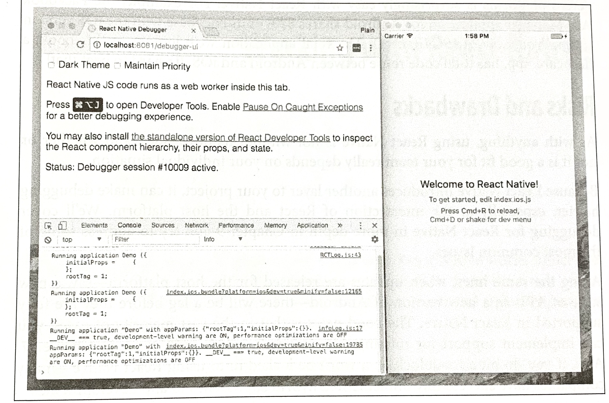

### CHAPTER 1 

## What Is React Native?

React Native is a JavaScript framework for writing real, natively rendering mobile applications for iOS and Android. It's based on React, Facebook's JavaScript library for building user interfaces, but instead of targeting the browser, it targets mobile platforms. In other words, it enables web developers to write mobile applications that look and feel truly "native," all from the comfort of a familiar JavaScript library. Plus, because most of the code you write can be shared between platforms, React Native makes it easy to simultaneously develop for both Android and iOS.

Similar to React for the web, React Native applications are written with mixture of JavaScript and XML-esque markup, known as JSX. Then, under the hood, the React Native "bridge" invokes the native rendering APIs in Objective-C (for iOS) or Java (for Android). Thus, your application will render using real mobile UI components, *not* webviews, and will look and feel like any other mobile application. React Native also exposes JavaScript interfaces for platform APIs, so your React Native apps can access platform feature like the phone camera or the user's location.

The core React Native project supports writing mobile applications for both iOS and Android. Community implementations also provide support for Windows (*https://github.com/Microsoft/react-native-windows*), Ubuntu (*https://github.com/CanonicalLtd/react-native*), the web (*https://github.com/necolas/react-native-web*), and more. 

In this book, we'll build both Android and iOS apps with React Native. The vast majority of the code we write will be cross-platform.

And, yes, you can really use React Native to build production-ready mobile applications. Some anecdata: Facebook (*http://bit.ly/1YipO7A*), Airbnb (*http://bit.ly/2udVlOL*), Walmart (*http://bit.ly/2vuFlXk*), and Baidu (*http://bit.ly/2hzBtnr*) are already using it in production for user-facing applications. 

### Advantages of React Native

The fact that React Native renders using its host platform's  standard rendering APIs distinguishes it from most existing methods of cross-platform application development, like Cordova or Ionic. Existing methods of writing mobile application use combinations of JavaScript, HTML, and CSS and typically render using webviews. While this approach can work, it also comes with drawbacks, especially around performance. Additionally, these methods do not usually have access to the host platform's set of native UI elements. When these frameworks do try to mimic native UI elements, the results usually feel just a little off. In addition, reverse-engineering all the fine details of things like animations takes an enormous amount of effort, and they can quickly become outdated. 

In contrast, React Native actually translates your markup to real, native UI elements, leveraging existing means of rendering views on whatever platform you are working with. Additionally, React works separately from the main UI thread, so your application can maintain high performance without sacrificing capability. The update cycle in React Native is the same as in React: when `props` or `state` change, React Native re-renders the views. The major difference between React Native and React in the browser is that React Native does this by leveraging UI libraries of its host platform, rather than using HTML and CSS markup. 

For developers accustomed to working on the web with React, this means you can write mobile apps with the performance and look and feel of a native application, while using familiar tools. React Native also represents an improvement over normal mobile development in two other areas: developer experience and cross-platform development potential.

#### Developer Experience

If you've developed for mobile before, you might be surprised by how easy React Native is to work with. The React Native team has baked strong developer tools and meaningful error messages into the framework so that working with robust tools is a natural part of your development experience. 

For instance, because React Native is "just" JavaScript, you don't need to rebuild your application in order to see your changes reflected; instead, you can refresh your application just as you would any other web page. All of those minutes spent waiting for your application to build can really add up, and in contrast React Native's quick iteration cycle feels like a godsend. 

Additionally, React Native lets you take advantage of intelligent debugging tools and error reporting. If you are familiar with Chrome or Safari's developer tools (Figure 1-1), you will be happy to know that you can use them for mobile development as well. Likewise, you can use whatever text editor you prefer for JavaScript editing, React Native does not force you to work with Xcode to develop for iOS or in Android Studio for Android development. 

*Figure 1-1. Using the Chrome Debugger with React Native*

Beside the day-to-day improvements to your development experience, React Native also has the potential to positively impact your product release cycle. For instance, Apple and Google both permit you to load JavaScript-only changes to an app's behavior without going through the standard review process. This is particularly nice on iOS, where application updates typically require several days or weeks of review.

All of these small perks add up to saving you and your fellow developers time and energy, allowing you to focus on the more interesting parts of your work and be more productive overall. 

#### Code Reuse and Knowledge Sharing

Working with React Native can dramatically shrink the resources required to build mobile applications. Any developer who knows how to write React code can target the web, iOS, and Android, all with the same skill set. By removing the need to "silo" developers based on their target platform, React Native lets your team iterate more quickly and share knowledge and resource more effectively. 

Not only can you share knowledge, but much of your code can be shared, too. Not *all* the code you write will be cross-platform, and depending on the functionality you need on a specific platform, you may occasionally need to dip into Object-C or Java (we'll cover how so-called native modules work in Chapter 7). But reusing code across platforms is surprisingly easy with React Native. For example, the Facebook Ads Manager application for Android shares 87% of its codebase with the iOS version (*https://youtu.be/PAA9O4E1IM4*). The final application we'll look at in this book, a flashcard app, has total code reuse between Android and iOS. It's hard to beat that!

#### Risks and Drawbacks

As with anything, using React Native is not without its downsides, and whether or not it is a good fit for your team really depends on your individual situation. 

Because React Native introduces another layer to your project, it can make debugging hairier, especially at the intersection of React and the host platform. We'll cover debugging for React Native in more depth in Chapter 9 and try to address some of the most common issues. 

Along the same lines, when updates are released for the host platform—say, a new suite of APIs in a new version of Android—there will be a lag before they are fully supported in React Native. The good news is that in the vast majority of cases, you can implement support for missing APIs yourself, which we'll cover in Chapter 7. Also, if you do hit a roadblock, you won't be locked in to using React Native—many companies have successfully implemented hybrid approaches to app development. 

Changing the platform you use to write your applications is a big choice. Still, I think you'll see that the benefits of React Native outweigh the risks. 

#### Summary

React Native is an exciting framework that enables web developers to create robust mobile applications using their existing JavaScript knowledge. It offers faster mobile development and more efficient code sharing across iOS, Android, and the web without sacrifice the end user's experience or application quality. The tradeoff is that it adds some complexity to your application setup. If your team can handle that and wants to develop mobile applications for more than just one platform, you should be looking at React Native. 

In the next chapter, we go over some of the main ways in which React Native differs from React for the web, and cover some key concepts. If you'd like to skip straight to developing, feel free to jump to Chapter 3, in which we set up out development environment and write our very first React Native application. 
