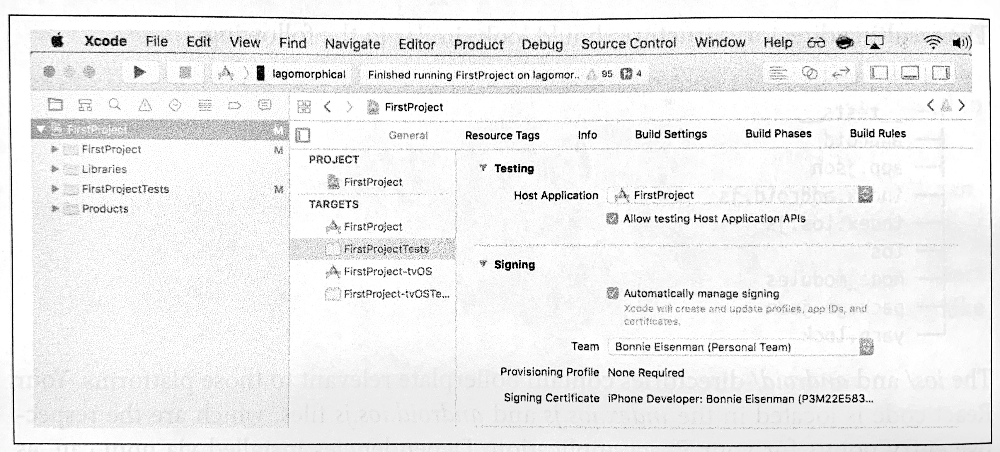
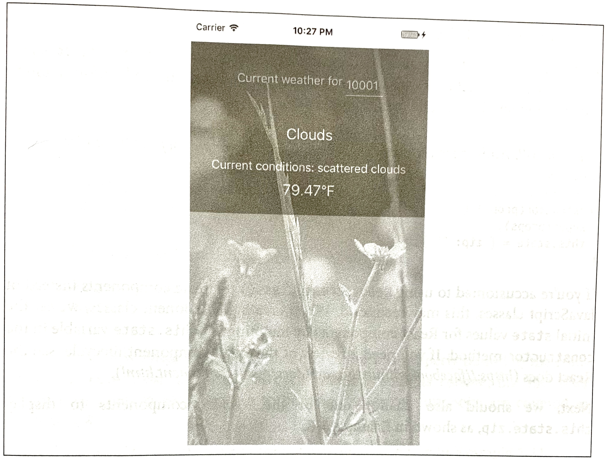
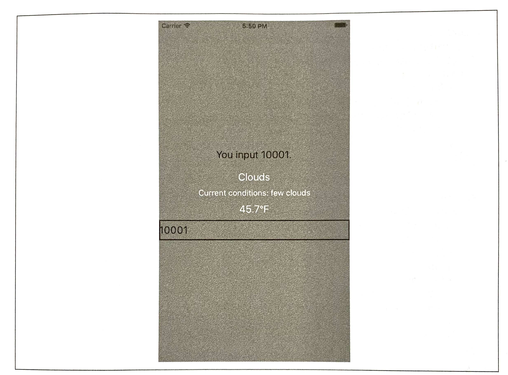
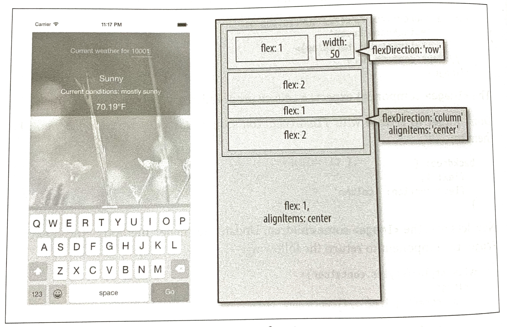

### CHAPTER 3

## Building Your First Application

In this chapter, we will cover how to set up your local development environment for working with React Native. Then we will go through the basics of creating a simple application that you can deploy to your own iOS or Android device.

### Setting Up Your Environment

Setting up your development environment will enable you to follow along with the examples in the book and write your own applications.

There are two general approaches to setting up a development environment for React Native. The first, a tool called Create React Native App, gives you a quicker, easier installation but supports only pure-JavaScript applications. The second, more traditional approach involves fully installing React Native and all of its dependencies. Think of Create React Native App as a shortcut for easier testing and prototyping.

Information on migrating from Create React Native App to a full React Native project can be found in Appendix C.

> **NOTE**
>
> Which approach should you take? I recommend that beginners use Create React Native App for educational purposes and quick prototyping. 
>
> Eventually, if you're working on a React Native app professionally or writing a hybrid app that uses both JavaScript and native Java, Objective-C, or Swift code, you'll want to install the full React Native developer setup.

Both approaches are described next. The example code in subsequent chapters will typically work with either approach; when something is incompatible with Create React Native App and requires a full React Native project, it will be noted. 

### Developer Setup: Create React Native App

Create React Native App (*https://github.com/react-community/create-react-native-app*) is a command-line tool that allows you to quickly create and run React Native applications without needing to install Xcode or Android Studio.

If you want to get up and running quickly, then Create React Native App is the right choice. 

> **TIP**
>
> Create React Native App is a great tool, but as mentioned earlier it supports only pure-JavaScript applications. Later in this book, we'll discuss ways of integrating React Native applications with native code written in Java or Objective-C. Don't worry: if you begin with Create React Native App, you can still "eject" into a full React Native project.

Let's start by installing the create-react-native-app package from npm. React Native uses npm, the Node.js packageg manager, to manage dependencies. The npm registry includes packages for all sorts of JavaScript projects, not just Node.

​	**`npm install -g create-react-native-app`**

#### Creating Your First Application with create-react-native-app

To create a new project with Create React Native App, run the following command: 

​	**`create-react-native-app first-project`**

This will install some JavaScript dependencies, as well as create the boilerplate for your application. Your project directory will look something like this: 

```js
.
├── App.js
├── App.test.js
├── README.md
├── app.json
├── node_modules
├── package.json
└── yarn.lock
```

This structure looks like what you might expect from a simple JavaScript project. There is a *package.json* file, which contains metadata about the project and its dependencies. The *README.md* file includes information for running the project. *App.test.js* includes a simple test file. The code for your application is located in *App.js*. To modify this project and build out your own application, you would begin with *App.js*.

We will cover what this code is doing in more detail once we start building our weather application in "Building a Weather App" on page 22.

#### Previewing Your App on iOS or Android

Create—now your application is ready for testing. To launch your application, run: 

​	**`cd first-project`**

​	**`npm start`**

You should see the screen shown in Figure 3-1.


*Figure 3-1. Previewing a Create React Native App by using a QR code*

In order to view your application, you'll need the Expo app (*https://expo.io/*) for iOS or Android. Once you have it installed, point your phone's camera at the QR code, and your React Native app will load. Note that your phone and computer will need to be on the same network, and able to communicate with each other.

Congrats! You've create your first React Native app, compiled it, and gotten it running on a real device.

In the next section, we'll cover hot to do a full, traditional installation of React Native. You can skip to "Exploring the Sample Code" on page 19 instead if you'd like to get started programming.

### Developer Setup: The Traditional Approach

Instructions for installing React Native and all of its dependencies can be found in the official React Native documentation (*http://facebook.github.io/react-native*).

You can use Windows, macOS, or Linux to develop applications with React Native. However, macOS is required to develop iOS applications. Linux and Windows users can still use React Native to write Android applications.

Because the setup instructions vary by platform and React Native version, we won't go into them in detail here, but you'll need to set up the following:

- node.js
- React Native
- iOS development environment (Xcode)
- Android development environment (JDK, Android SDK, Android Studio)

If you don't want to install developer tools for both iOS and Android, that's fine—just make sure that you have at least one of them set up.

#### Creating Your First Application with react-native

You can use the React Native command-line tools to create a new application. Run the following command to install the command-line tools:

​	**`npm install -g react-native-cli`**

Now we can generate a fresh project with all of the React Native, iOS, and Android boilerplate we'll need by running:

​	**`react-native init FirstProject`**

The resulting directory structure should look similar to the following: 

```js
.
├── __tests__
├── android
├── app.json
├── index.android.js
├── index.ios.js
├── ios
├── node_modules
├── package.json
└── yarn.lock
```

The *ios/* and *android/* directories contain boilerplate relevant to those platforms. Your React code is located in the *index.ios.js* and *android.ios.js* files, which are the respective entry points for your React application. Dependencies installed via npm can, as usual, be found in the *node_modules/* folder.

#### Running Your App on iOS

To run your app on iOS, start by navigating into your newly created project's directory. Then you can run your React Native application like so:

​	**`cd FirstProject`**

​	**`react-native run-ios`**

Alternatively, you can open your application in Xcode and launch the iOS simulator from there:

​		**`open ios/FirstProject.xcodeproj`**

You can also use Xcode to upload your application to a real device for testing. In order to do this, you will need a free Apple ID so that you can configure code signing. 

To configure code signing, open your project in the Xcode Project Navigator and select your main target, which should have the same name as your project. Next, select the General tab. Under the Singing menu, select your Apple developer account from the Team drop-down (see Figure 3-2). You will then need to repeat this step for the Tests target.



*Figure 3-2. Setting the Team in Xcode will allow you to test your application on physical device*

The first time you attempt to run your application on any particular device, Xcode will prompt you to sign into your Apple account and register your device for development. 

For more details on how to run your app on a real iOS device, check out Apple's official documentation (*http://apple.co/2gcjVhy*).

Note that your iOS device and your computer must be on the same network in order for your application to run. 

#### Running Your App on Android

In order to run your application on Android, you need a fully functioning Android developer setup, including Android Studio and the Android SDK. See the Getting Started (*https://facebook.github.io/react-native/docs/getting-started.html*) documentation for a list of Android dependencies.

To launch your React Native platform on Android, run:

​	**`react-native run-android`**

You can also open your application in Android Studio and compile and run it from there. 

You can either run your application in the Android emulator or on a physical device connected via USB. In order to run on a physical device, you will need to enable USB debugging in your device's Developer Options. More detailed instructions are available in the Android Studio documentation (*https://developer.android.com/studio/debug/dev-options.html*)

### Exploring the Sample Code

Now that you have launched and deployed the default application, let's figure out how it works. In this section, we will dig into the source code of the default application and explore the structure of a React Native project.

If you are using Create React Native App, open the file *App.js* (see Example 3-1). If you are using a full React Native project, open up *index.ios.js* or *index,android.js* (see Example 3-2).

*Example 3-1. The starter code in App.js, for Create React Native App projects*

```javascript
import React from "react";
import { StyleSheet, Text, View } from "react-native";

export default class App extends React.Component {
  render() {
    return (
    	<View style={styles.container}>
        <Text>Hello, world!</Text>
      </View>
    );
  }
}

const styles = StyleSheet.create({
  container: {
    flex: 1,
    backgroundColor: "#fff",
    alignItems: "center",
    justifyContent: "center"
  }
});
```

*Example 3-2. The starter code in index.ios.js and index.android.js, for full React Native projects*

```javascript
import React, { Component } from 'react';
import {
  AppRegistry,
  StyleSheet,
  Text,
  View
} from 'react-native';

export default class FirstProject extends Component {
  render() {
    return (
    	<View style={styles.container}>
        <Text style={styles.welcom}>
          Welcom to React Native!
        </Text>
        <Text style={styles.instructions}>
          To get started, edit index.ios.js
        </Text>
        <Text style={styles.instructions}>
          Press Cmd+R to reload,{'\n'}
          Cmd+D or shake for dev menu
        </Text>
      </View>
    );
  }
}

const styles = StyleSheet.create({
  container: {
    flex: 1,
    justifyContent: 'center',
    alignItems: 'center',
    backgroundColor: '#F5FCFF',
  },
 	welcome: {
    fontSize: 20,
    textAlign: 'center',
    margin: 10,
  },
  instructions: {
    textAlign: 'center',
    color: '#333333',
    marginBottom: 5,
  },
});

AppRegistry.registerComponent('FirstProject', () => FirstProject);
```

Either way, let's talk about what's going on here.

As you can see in Example 3-3, the `import` statements used are a bit different than what you might expect from a web-based React project.

*Example 3-3. Importing UI elements in React Native*

```javascript
import React, { Component } from "react";
import { 
  StyleSheet,
  Text,
  View 
} from "react-native";
```

There's some interesting syntax going on here. React is imported as usual, but what is happening on the next line?

One quirk of working with React Native is that you need to explicitly import every Native-provided module you work with. Elements like `<div>` don't simply exist; instead, you need to explicitly import components such as `<View>` and `<Text>`. Library functions such as `StyleSheet` and `AppRegistry` also must be explicitly imported with this syntax. Once we start building our own applications, we will explore the other React Native functions that you may need to import.

If the syntax is unfamiliar with you, check out Example A-4 in Appendix A for an explanation of destructuring in ES6.

Next, let's look at the component class in Example 3-4. This should all look comfortably familiar because it's an ordinary React component. The main difference is its use fo `<Text>` and `<View>` components instead of `<div>` and `<span`, and the use of style objects.

*Example 3-4. FirstProject component, with styles*

```react
export default class FirstProject extends Component {
  render() {
    return (
    	<View style={styles.container}>
        <Text style={styles.welcom}>
          Welcome to React Native!
        </Text>
        <Text style={styles.instructions}>
          To get started, edit index.ios.js
        </Text>
        <Text style={styles.instructions}>
          Press Cmd+R to reload,{'\n'}
          Cmd+D or shake for dev menu
        </Text>
      </View>
    );
  }
}

const styles = StyleSheet.create({
  container: {
    flex: 1,
    justifyContent: 'center',
    alignItems: 'center',
    backgroundColor: '#F5FCFF',
  },
  welcome: {
    fontSize: 20,
    textAlign: 'center',
    margin: 10,
  },
  instructions: {
    textAlign: 'center',
    color: '#333333',
    marginBottom: 5,
  },
});
```

As I mentioned earlier, all styling in React Native is done with style objects rather than stylesheets. The standard method of handling styling is by utilizing the `StyleSheet` library. You can see how the style objects are defined toward the bottom of the file. Note that only `<Text>` components can take text-specific styles like `fontSize`, and the all layout logic is handled by flexbox. We will discuss how to build layouts with flexbox at greater length in Chapter 5.

The sample application is a good demonstration of the basic functions you will need to create React Native applications. It mounts a React component for rendering and demonstrates the basics of styling and rendering in React Native. It also gives us a simple way to test our development setup and try deploying to a real device. However, it's still a very basic application with no user interaction. So now let's try building a more full-featured application.

### Building A Weather App

In this section, we will be building off of the sample application to create a weather app. This will give us a chance to explore how to utilize and combine stylesheets, flexbox, network communication, user input, and images into a useful app we can then deploy to an Android or iOS device.

This section may feel like a bit of a blur, as it will be giving you an overview of these features rather than deep explanations of them. The weather app will serve as a useful reference in future sections as we discuss these features in more detail, however, so don't worry if it feels like we're moving quickly!

As shown in Figure 3-3, the final application includes a text field where users can input a zip code. It will then fetch data from the OpenWeatherMap API and display the current weather.



*Figure 3-3. The finished weather app*

The first thing we'll do is replace the default code from our sample app. Move the initial component out into its own file, *WeatherProject.js*.

If you created a full React Native project, you will need to replace the contents of *index.ios.js* and *index.android.js*, as shown in Example 3-5.

*Example 3-5. Simplified contents of index.ios.js and index.android.js (they should be identical)*

```javascript
import { AppRegistry } from "react-native";
import WeatherProject from "./WeatherProejct";
AppRegistry.registerComponent("WeatherProject", () => WeatherProject);
```

Similarly, if you created a React Native project with Create React Native App, you will need to replace the contents of *App.js*, as shown in Example 3-6.

*Example 3-6. Simplified contents of App.js for Create React Native App projects*

```javascript
import WeatherProject from "./WeatherProject";
export default WeatherProject;
```

#### Handling User Input

We want the user to be able to enter a zip code and get the forecast for that area, so we need to add a text field for user input. We can start by adding zip code information to our component's initial state (see Example 3-7).

*Example 3-7. Adding zip code information to your component, before the render function*

```javascript
constructor(props) {
  super(props);
  this.state = { zip: ""}:
}
```

If you're accustomed to using `React.createClass()` to create components instead of JavaScript classes, this may seem odd. When creating component classes, we set the initial `state` values for React components by mutating the `this.state` variable in the `constructor` method. If you need a review of the React component lifecycle, see the React docs (*https://facebook.github.io/react/docs/react-component.html*).

Next, we should also change one of the `<Text>` components to display `this.state.zip`, as shown in Example 3-8.

*Example 3-8. Adding a `<Text>` component that displays the current zip code*

```javascript
<Text style={styles.welcome}>
	You input {this.state.zip}.
</Text>
```

With that our of the way, let's add a `<TextInput>` component (see Example 3-9). This is a basic component that allows the user to enter text. 

*Example 3-9. The `<TextInput>` component is used for entering text*

```javascript
<TextInput 
	style={styles.input}
	onSubmitEditing={this._handleTextChange}/>
```

The `<TextInput>` component is documented in the React Native docs (*http://facebook.github.io/react-native/docs/textinput.html#content*), along with its properties. You can also pass the `<TextInput>` additional callbacks in order to listen to other events, such as `onChange` or `onFocus`, but we do not need them at the moment.

Note that we've added a simple style to the `<TextInput>`. Add the `input` style to your stylesheet like so:

```javascript
const styles = StyleSheet.create({
	...
  input: {
    fontSize: 20,
    borderWidth: 2,
    height: 40
  }
  ...
});
```

The callback we passed as the `onSubmitEditing` prop should be added as a function on the component, as shown in the Example 3-10.

*Example 3-10. The handleText callback for our `<TextInput>`*

```javascript
_handleTextChange = event => {
  this.setState({zip: event.nativeEvent.text})
}
```

By using fat-arrow syntax, we ensure that our callback is properly bond to the component instance. React autobinds lifecycle methods such as `render`, but for other methods we need to pay attention to binding. Fat-arrow functions are covered in Example A-8.

You will also need to update you `import` statements, as shown in Example 3-11.

*Example 3-11. Importing UI elements in React Native*

```javascript
import {
  ...
  TextInput
  ...
} from "react-native";
```

Now try running your application using either the iOS simulator or the Android emulator. It won't be pretty, but you should be able to successfully submit a zip code and see it reflected in the `<Text>` component.

If we wanted, we could add some simple input validation here to ensure that the user typed in a five-digit number, but we will skip that for now.

Example 3-12 shows the full code for the *WeatherProject.js* component thus far.

*Example 3-12. This version of WeatherProject.js simply accepts and records user input*

```javascript
import React, { Component } from "react";
import { StyleSheet, Text, View, TextInput } from "react-native";

class WeatherProject extends Component {
  constructor(props) {
    super(props);
    this.state = { zip: "" };
  }

  _handleTextChange = event => {
  this.setState({zip: event.nativeEvent.text})
  }

  render() {
    return (
    	<View style={styles.container}>
        <Text style={styles.welcome}>
          You input {this.state.zip}.
        </Text>
        <TextInput 
          style={styles.input}
          onSubmitEditing={this._handleTextChange}
        />
      </View>
    );
  }
}

const styles = StyleSheet.create({
  container: {
    flex: 1,
    justifyContent: 'center',
    alignItems: 'center',
    backgroundColor: '#F5FCFF',
  },
 	welcome: {
    fontSize: 20,
    textAlign: 'center',
    margin: 10,
  },
  input: {
    fontSize: 20,
    borderWidth: 2,
    padding: 2,
    height: 40,
    width: 100,
    textAlign: "center"
  }
});

export default WeatherProject;
```

#### Displaying Data

Now let's work on displaying the forecast for that zip code. We will start by adding some mock data to our initial state value in *WeatherProject.js*:

```javascript
constructor(props) {
    super(props);
    this.state = { zip: "", forecast: null };
}
```

For sanity's sake, let's also pull the forecast rendering into its own component. Make a new file called *Forecast.js* (see Example 3-13).

*Example -13. `<Forecast>` component in Forecast.js*

```javascript
import React, { Component } from "react";

import { StyleSheet, Text, View } from "react-native";

class Forecast extends Component {
  render() {
    return (
      <View style={styles.container}>
        <Text style={styles.bigText}>
          {this.props.main}
        </Text>
        <Text style={styles.mainText}>
          Current conditions: {this.props.description}
        </Text>
        <Text style={styles.bigText}>
          {this.props.temp}℉
        </Text>
      </View>
    );
  }
}

const styles = StyleSheet.create({
  container: { height: 130 },
  bigText: {
    flex: 2,
    fontSize: 20,
    textAlign: "center",
    margin: 10,
    color: "#FFFFFF"
  },
  mainText: { flex: 1, fontSiez: 16, textAlign: "center", color: "#FFFFFF" }
});

export default Forecast;
```

The `<Forecast>` component just renders some `<Text>` based on its props. We've also included some simple styles at the bottom of the file to control things like text color.

Import the `<Forecast>` component and then add it to app's render method, passing it props based on `this.state.forecast` (see Example 3-14). We'll address issues with layout and styling later. You can see how the `<Forecast>` component appears in the resulting application in Figure 3-4.

*Example 3-4. WeatherProject.js, updated to include the `<Forecast>` component*

```javascript
import React, { Component } from "react";

import { StyleSheet, Text, View, TextInput } from "react-native";
import Forecast from "./Forecast";

class WeatherProject extends Component {
  constructor(props) {
    super(props);
    this.state = { zip: "", forecast: null };
  }

  _handleTextChange = event => {
  this.setState({zip: event.nativeEvent.text})
  }

  render() {
    let content = null;
    if (this.state.forecast !== null) {
      content = (
        <Forecast
          main={this.state.forecast.main}
          description={this.state.forecast.decription}
          temp={this.state.forecast.temp}
        />
      );
    }

    return (
    	<View style={styles.container}>
        <Text style={styles.welcome}>
          You input {this.state.zip}.
        </Text>
        {content}
        <TextInput 
          style={styles.input}
          onSubmitEditing={this._handleTextChange}
        />
      </View>
    );
  }
}

const styles = StyleSheet.create({
  container: {
    flex: 1,
    justifyContent: 'center',
    alignItems: 'center',
    backgroundColor: '#F5FCFF',
  },
 	welcome: {
    fontSize: 20,
    textAlign: 'center',
    margin: 10,
  },
  input: {
    fontSize: 20,
    borderWidth: 2,
    padding: 2,
    height: 40,
    width: 100,
    textAlign: "center"
  }
});

export default WeatherProject;
```

Because we still don't have a forecast to render, nothing should change visually yet.

#### Fetching Data from the Web

Next, let's explore using the networking APIs available in React Native. You won't be using jQuery to send AJAX requests from mobile devices. Instead, React Native implements the Fetch API. The Promise-based syntax, shown in Example 3-15, is fairly simple.

*Example 3-15. Using the React Native Fetch API*

```js
fetch('http://www.somesite.com')
	.then((response) => response.text())
	.then((responseText) => {
  	console.log(responseText);
	});
```

If you're not accustomed to working with Promises, see "Working with Promises" on page 213.

We will be using the OpenWeatherMap API, which provides us with a simple endpoint that returns the current weather for a given zip code. A small library for this API is provided in *open_weather_map.js*, shown in Example 3-16.

*Example 3-16. The OpenWeatherMap library, from src/weather/open_weather_map.js*

```js
const WEATHER_API_KEY = "bbeb34ebf60ad50f7440a1e2b0b";
const API_STEM = "http://api.openweathermap.org/data/2.5/weather?";

function zipUrl(zip) {
  return `${API_STEM}q=${zip}&units=imperial&APPID=${WEATHER_API_KEY}`;  
}

function fetchForecast(zip) {
  return fetch(zipUrl(zip))
    .then(response => response.json())
    .then(responseJSON => {
      return {
        main: responseJSON.weather[0].main,
        description: responseJSON.weather[0].description,
        temp:responseJSON.main.temp
      };
    })
    .catch(error => {
      console.error(error);
    });
}

export default { fetchForecast: fetchForecast };
```

Let's import it now:

```js
import OpenWeatherMap from "./open_weather_map";
```

To integrate it into our application, we can change the callback on the `<TextInput>` component to query the OpenWeatherMap API, as shown in Example 3-17.

*Example 3-17. Fetching data from the OpenWeatherMap API*

```js
_handleTextChange = event => {
  let zip = event.nativeEvent.text;
  OpenWeatherMap.fetchForecast(zip).then(forecast => {
    console.log(forecast);
    this.setState({ forecast: forecast });
  });
};
```

Logging the forecast here is a nice sanity check for us; for more detailed information on how to view the console output, see "Debugging with console.log" on page 141.

Finally, we also need to update the styling for our `container` so that we can see the forecast text render:

```javascript
container: {
  flex: 1,
    justifyContent: 'center',
      alignItems: 'center',
        backgroundColor: '#666666',
}
```

Now, when you enter a zip code, you should actually see a forecast render (Figure 3-4).



*Figure 3-4. The weather app so far*

The updated code for *WeatherProject.js* is shown in Example 3-18.

*Example 3-18. WeatherProejct.js*: now with real data!

```javascript
import React, { Component } from "react";

import { StyleSheet, Text, View, TextInput } from "react-native";
import OpenWeatherMap from "./open_weather_map";
import Forecast from "./Forecast";

class WeatherProject extends Component {
  constructor(props) {
    super(props);
    this.state = { zip: "", forecast: null };
  }

  _handleTextChange = event => {
    let zip = event.nativeEvent.text;
    OpenWeatherMap.fetchForecast(zip).then(forecast => {
      this.setState({ forecast: forecast, zip: zip });
    });
  };

  render() {
    let content = null;
    if (this.state.forecast !== null) {
      content = (
        <Forecast
          main={this.state.forecast.main}
          description={this.state.forecast.description}
          temp={this.state.forecast.temp}
        />
      );
    }
    
    return (
    	<View style={styles.container}>
        <Text style={styles.welcome}>
          You input {this.state.zip}.
        </Text>
        {content}
        <TextInput 
          style={styles.input}
          onSubmitEditing={this._handleTextChange}
        />
      </View>
    );
  }
}

const styles = StyleSheet.create({
  container: {
    flex: 1,
    justifyContent: 'center',
    alignItems: 'center',
    backgroundColor: '#666666',
  },
 	welcome: {
    fontSize: 20,
    textAlign: 'center',
    margin: 10,
  },
  input: {
    fontSize: 20,
    borderWidth: 2,
    padding: 2,
    height: 40,
    width: 100,
    textAlign: "center"
  }
});

export default WeatherProject;
```

#### Adding a Background Image

Plain background colors are boring. Let's display a background image to go along with our forecast. 

Image assets are managed much like any other code asset: you can include them with a `require` call. We are going to use a file called *flower.png* as our background image. It can be required like so:

```javascript
<Image source={require('./flowers.png')}/>
```

The image file is available in the GitHub repository (*https://github.com/bonniee/learning-react-native/blob/2.0.0/src/weather/flowers.png*).

Just like JavaScript assets, if you have a *flowers.ios.png* and a *flowers.android.png* file, the React Native packager will load the appropriate image based on the platform. Likewise, you can use the `@2x` and `@3x` suffixes to provide different image files for different screen densities. So, hypothetically, we could structure our project directory like so:

```js
.
├── flowers.png
├── flowers@2x.png
├── flowers@3x.png
...
```

To add a background image to a `<View>`, we don't set a `background` property on a `<div>` like we do on the web. Instead, we use an `<Image>` component as a container:

```javascript
<Image source={require('./flowers.png')}
        resizeMode='cover'
        style={styles.backdrop}>	
  // Your content here
</Image>
```

The `<Image>` component expects a `source` prop, which we get by using `require`.

Don't forget to style it with `flexDirection` so that its children render as we'd like them to:

```javascript
backdrop: {
  flex: 1,
  flexDirection: 'column'
}
```

Now let's give the `<Image>` some children. Update the `render` method of the `<WeatherProject>` component to return the following:

```javascript
<View style={styles.container}>
  <Image
    source={require("./flowers.png")}
    resizeMode="cover"
    style={styles.backdrop}>
    <View style={styles.overlay}>
      <View stlye={styles.row}>
        <Text style={styles.mainText}>
          Current weather for
        </Text>
        <View style={styles.zipContainer}>
          <TextInput
            style={[styles.zipCode, styles.mainText]}
            onSubmitEditing={event => this._handleTextChange(event)}
            />
        </View>
      </View>
      {content}
    </View>
  </Image>  
</View>
```

You'll notice that I'm using some additional styles that we haven't discussed yet, such as `row`, `overlay`, `zipContainer`, and `zipCode`. You can skip ahead to Example 3-19 to see the full stylesheet.

#### Putting It All Together

For the final version of the application, I've reorganized the `<WeatherProject>` component's `render` function and tweaked the styles. The main change is to the layout logic, which is diagrammed in Figure 3-5. 



*Figure 3-5. Layout of the finished weather application*

Okay, ready to see it all in one place? Example 3-19 shows the finished code for the `<WeatherProject>` component in full, including the stylesheets. The `<Forecast>` component will be the same as shown previously in Example 3-13.

*Example 3-19. Finished code for WeatherProject.js*

```javascript
import React, { Component } from "react";

import { StyleSheet, Text, View, TextInput, Image } from "react-native";

import Forecast from "./Forecast";
import OpenWeatherMap from "./open_weather_map";

class WeatherProject extends Component {
  constructor(props) {
    super(props);
    this.state = { zip: "", forecast: null };
  }

  _handleTextChange = event => {
    let zip = event.nativeEvent.text;
    OpenWeatherMap.fetchForecast(zip).then(forecast => {
      this.setState({ zip: zip, forecast: forecast });
    });
  };

  render() {
    let content = null;
    if (this.state.forecast !== null) {
      content = (
        <Forecast
          main={this.state.forecast.main}
          description={this.state.forecast.description}
          temp={this.state.forecast.temp}
        />
      );
    }
    return (
    	<View style={styles.container}>
        <Image
          source={require("./flowers.png")}
          resizeMode="cover"
          style={styles.backdrop}>
          <View style={styles.overlay}>
            <View stlye={styles.row}>
              <Text style={styles.mainText}>
                Current weather for
              </Text>
              <View style={styles.zipContainer}>
                <TextInput
                  style={[styles.zipCode, styles.mainText]}
									onSubmitEditing={this._handleTextChange}
                  underlineColorAndroid="transparent"
                />
              </View>
            </View>
            {content}
          </View>
        </Image>  
      </View>
    );
  }
}

const baseFontSize = 16;

const styles = StyleSheet.create({
  container: { flex: 1, alignItems: 'center', paddingTop: 30 },
  backdrop: { flex: 1, flexDirection: "column" },
  overlay: {
    paddingTop: 5,
    backgroundColor: "#000000",
    opacity: 0.5,
    flexDirection: "column",
    alignItems: "center"
  },
  row: {
    flexDirection: "row",
    flexWrap: "nowrap",
    alignItems: "flex-start",
    padding: 30
  },
  zipContainer: {
    fontSize: baseFontSize + 10,
    borderBottomColor: "#DDDDDD",
    borderBottomWidth: 1,
    marginLeft: 5,
    marginTop: 3
  },
  zipCode: { flex: 1, flexBasis: 1, width: 50, height: baseFontSize },
  mainText: { fontSize: baseFontSize, color: "#FFFFFF" }
});

export default WeatherProject;
```

Now that we're done, try launching the application. It should work on both Android and iOS in an emulator or on your physical device. What would you like to change or improve?

You can view the completed application in the GitHub repository (*https://github.com/bonniee/learning-react-native/tree/2.0.0/src/weather*).

### Summary

For our first real application, we've already covered a lot of ground. We introduced a new UI component, `<TextInput>`, and learned how to use it to get information from the user. We demonstrated how to implement basic styling in React Native, as well as how to use images and include assets in our application. Finally, we learned how to use the React Native networking API to request data from external web sources. Not bad for a first application!

Hopefully, this chapter has demonstrated how quickly you can build React Native applications with useful features that feel at home on a mobile device. 

If you want to extend your application further, here are some things to try:

- Add more images and change them based on the forecast
- Add validation to the zip code field
- Switch to using a more appropriate keypad for the zip code input
- Display the five-day weather forecast

Once we cover more topics, such as geolocation, you will be able to extend the weather application even further.

Of course, this has been a pretty quick survey. In the next few chapters, we will focus on gaining a deeper understanding of React Native best practices, and look at how to use a lot more features, too!