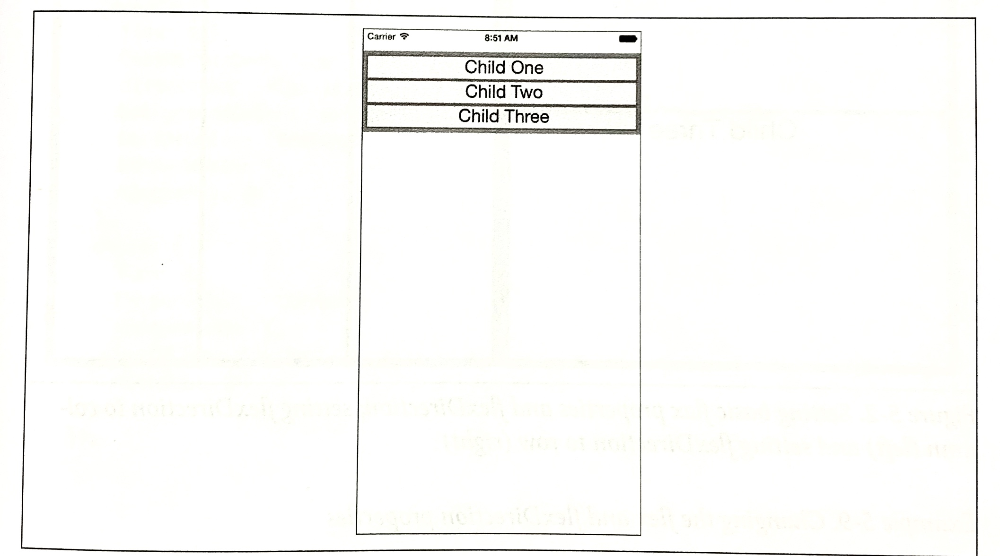
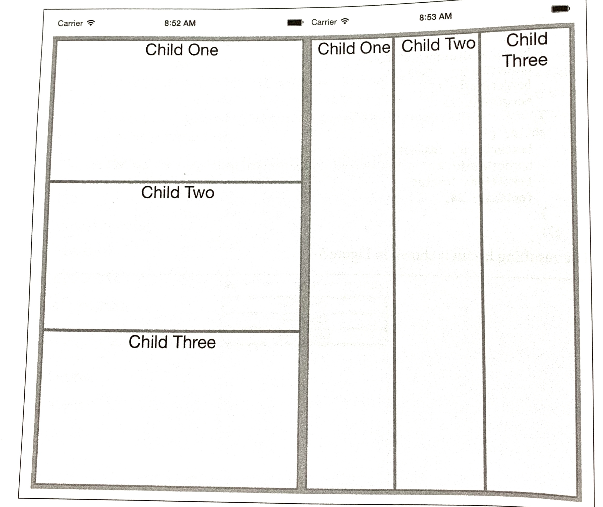
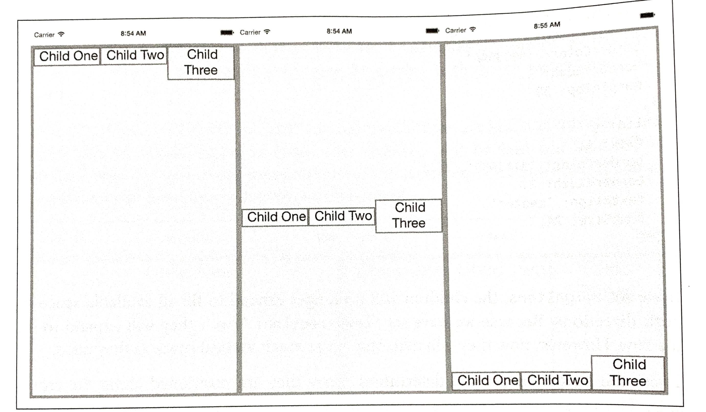
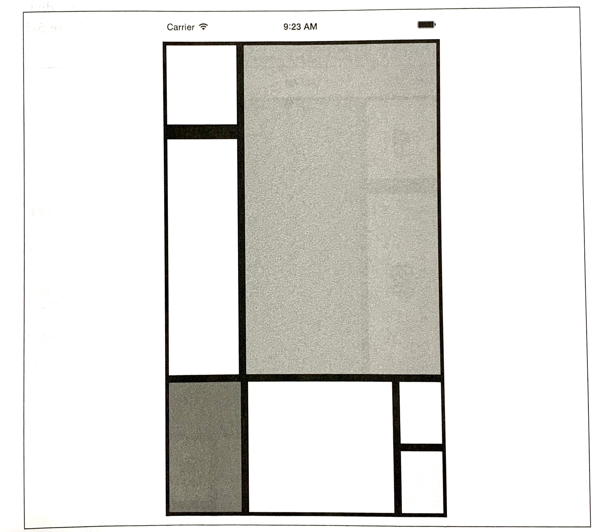
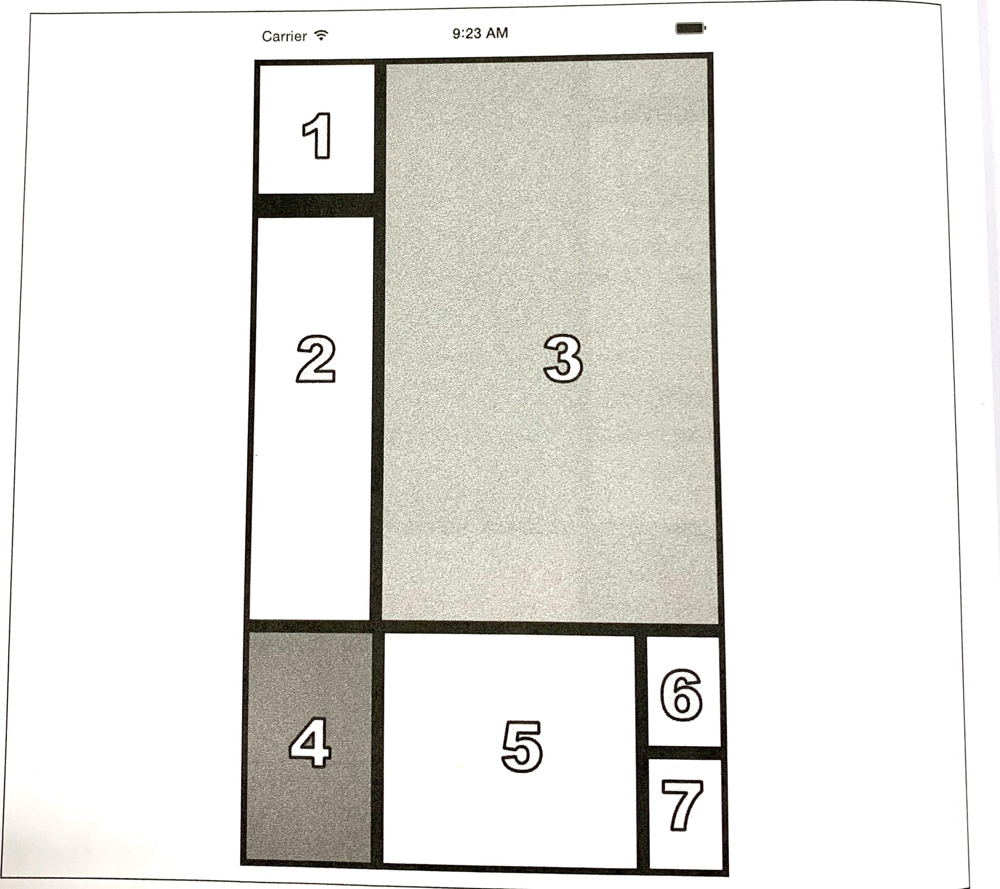

### CHAPTER 5

## Styles

It's great to be able to build functional applications, but if you can't style them effectively, you won't get very far! In Chapter 3, we built a simple weather application with some basic styles. While this gave us an overview of how to style React Native components, we glossed over many of the details.  In this chapter, we will take a closer look at how styles work in React Native. We'll cover how to create and manage your stylesheets, as well as the details of React Native's implementation of CSS rules. By the end of this chapter, you should feel comfortable creating and styling your own React Native components and applications. 

If you want to share styles between your React Native and web applications, the React Styles project on GitHub (*https://github.com/js-next/react-style*) provides a version of React Native's style system for the web.

### Declaring and Manipulating Styles

When working with React for the web, we typically use separate stylesheet files, which may be written in CSS, SASS, or LESS. React Native takes a radically different approach, bringing styles entirely into the world of JavaScript and forcing you to link style objects explicitly to components. This approach tends to provoke strong reactions, as it represents a significant departure from CSS-based styling norms.   

To understand the design of React Native's styles, first we need to consider some of the headaches associated with traditional CSS stylesheets. CSS has a number of problems. All CSS rules and class names are global in scope, meaning that styling one component cam easily break another if you're not careful. For instance, if you include the popular Twitter Bootstrap library, you will introduce over 600 new global variables. Because CSS is not explicitly connected to the HTML elements it styles, dead code elimination is difficult, and it can be nontrivial to determine which styles will apply to a given element.

Languages like SASS and LESS attempt to work around some of CSS's uglier parts, but many of the same fundamental problems remain. With React, we have the opportunity to keep the desirable parts of CSS, but also the freedom for significant divergence. React Native implements a subset of the available CSS styles, focusing on keeping the styling API narrow yet still highly expressive. Positioning is dramatically different, as we'll see later in this chapter. Additionally, React Native does not support pseudoclasses, animations, or selectors. A full list of supported properties can be found in the docs (*https://facebook.github.io/react-native/docs/view.html#style*).

Instead of stylesheets, in React Native we work with JavaScript-based style objects. One of React's greatest strengths is that is forces you to keep your JavaScript code—your components—modular. By bringing styles into the realm of JavaScript, React Native pushes us to write modular styles, too.

In this section, we'll cover the mechanics of how these style objects are created and manipulated in React Native.

#### Using Inline Styles

Inline styles are the simplest way, syntactically, to style a component in React Native, though they are not usually the *best* way. As you can see in Example 5-1, the syntax for inline styles in React Native is the same as for React for the browser.

*Example 5-1. Using inline styles*

```react
<Text>
  The quick <Text style={{fontStyle: "italic"}}>brown</Text> fox
  jumped over the lazy <Text style={{fontWeight: "bold"}}>dog</Text>.
</Text>
```

Inline styles have some advantages. They're quick and dirty, allowing you to rapidly experiment. 

However, you should avoid them in general because they're less efficient. Inline style objects must be recreated during each render pass. Even when you want to modify styles in response to props or state, you don't need to use inline styles, as we'll see in a moment.

#### Styling with Objects

If you take a look at the inline style syntax, you will see that it's simply passing an object to the `style` attribute. There's not need to create the style object in the `render` method, though. Instead, you can separate it out, as shown in Example 5-2.

*Example 5-2. The style attribute will accept a JavaScript object*

```react
const italic = {
  fontStyle: "italic"
};
const bold = {
  fontWeight: "bold"
}

...

render() {
  return (
    <Text>
      The quick <Text style={italic}>brown</Text> fox
      jumped over the lazy <Text style={bold}>dog</Text>.
    </Text>
  );
}
```

#### Using StyleSheet.create

You will notice that almost all of the React Native example code makes use of `StyleSheet.create`. This function is a small piece of syntactic sugar with some added perks. 

Creating StyleSheets rather than passing around raw JavaScript objects can reduce the number of allocations (thus benefiting performance); it also encourages you to organize your code more cleanly. These StyleSheets are immutable, which is usually helpful.

Using `StyleSheet.create` is strictly optional, but in general you'll want to use it. 

*PanDemo.js*, from Example 4-10, gives us a good counterexample in which the immutability provided by `StyleSheet.create` is a hindrance rather than a help. Recall that we wanted to update the location o f a circle based on movement—in other words, each time we received an update from the `PanResponder`, we needed to update state as well as change the styles on the circle. In this circumstance, we don't want immutability at all, at least not for the style controlling the circle's location. Therefore, we can use a plain object to store the style for the circle. 

#### Concatenating Styles

What happens if you want to combine two or more styles?

Recall that earlier we said that we should prefer reusing styled components over styles. That's true, but sometimes style reuse is also useful. For instance, if you have `button` style and an `accentText` style, you may want to combine them to create an `AccentButton` component. 

If the styles look like this:

```react
	const styles = StyleSheet.create({
    button: {
  		borderRadius "8px",
      backgroundColor: "#99CCFF"
	  },
    accentText: {
      fontSize: 18,
      fontWeight: "bold"
    }
	});
```

Then you can create a component that has *both* of those styles applied through simple concatenation (Example 5-3).

*Example 5-3. The style attribute also accepts an array of objects*

```react
class AccentButton extends Component {
  render() {
    return (
    	<Text style={[stlyes.button, styles.accentText]}>
        {this.props.children}
      </Text>
    );
  }
}
```

As you can see, the `style` attribute can take an array of style objects. You can also add inline styles here if you want (Example 5-4).

*Example 5-4. You can mix style objects and inline styles*

```react
class AccentButton extends Component {
  render() {
    return (
      <Text style={[styles.button, styles.accentText, {color: "#FFFFFF"}]}>
        {this.props.children}
      </Text>
    );
  }
}
```

In the case of a conflict, such as when two objects specify the same property, React Native will resolve the conflict for you. The rightmost elements in the style array take precedence, and false values (`false`, `null`, `undefined`) are ignored.

You can leverage this pattern to apply conditional styles. For example, if we had a `<Button>` component and wanted to apply extra style rules if it's being touched, we could use the code shown in Example 5-5.

*Example 5-5. Using conditional styles*

```react
<View style={[styles.button, this.state.touching && styles.highlight]} />
```

This shortcut can help you keep your rendering logic concise.

In general, style concatenation is a useful tool for combining styles. It's interesting to contrast concatenation with web-based stylesheet approaches: `@extend` in SASS, or nesting and overriding classes in vanilla CSS. Style concatenation is a more limited tool, which is arguably a good thing: it keeps the logic simple and makes it easier to reason about which styles are being applied and how. 

### Organization and Inheritance

In most of the examples so far, we append our style code to the end of the main JavaScript file with a single call to `StyleSheet.create`. For example code, this works well enough, but it's not something you'll likely want to do in an actual application. How should we actually organize styles? In this section, we will take a look at ways of organizing your styles, and how to share and inherit styles. 

#### Exporting Style Objects

As your styles grow more complex, you will want to keep them separate from your components' JavaScript files. One common approach is to have a separate folder for each component. If you have a component named `<ComponentName>`, you would create a folder named *ComponentName/* and structure it like so:

```
	- ComponentName
		|- index.js
		|- styles.js
```

Within *styles.js*, you create a stylesheet and export it (Example 5-6).

*Example 5-6. Exporting styles from a JavaScript file*

```react
import { StyleSheet } from "react-native";

const styles = StyleSheet.create({
  text: {
    color: "#FF00FF",
    fontSize: 16
  },
  bold: {
    fontWeight: "bold"
  }
});

export default styles;
```

Within *index.js*, we can import our styles like so:

```react
	import styles from "./styles";
```

Then we can use them in our component (Example 5-7).

*Example 5-7. Importing styles from an external JavaScript file*

```react
import React, { Component } from "react";
import { StyleSheet, View, Text } from "react-native";
import styles from "./styles";

class ComponentName extends Component {
  render() {
    return (
      <Text style={[styles.text, styles.bold]}>
        Hello, world
      </Text>
    );
  }
}
```

#### Passing Styles as Props

Styles may also be passed as properties on a component.

You can use this pattern to create extensible components, which can be more effectively controlled and styled by their parents. For example, a component might take in an optional `style` prop (Example 5-8). This is a good way to mimic the "cascading" behavior of CSS.

*Example 5-8. Components can receive style objects via props*

```react
import React, { Component } from "react";
import { View, Text } from "react-native";

class CustomizableText extends Component {
  render() {
    return (
      <Text style={[{fontSize: 18}, this.props.style]}>
        Hello, world
      </Text>
    );
  }
}
```

By adding `this.props.style` to the end of the style array, we ensure that you can override the default props. 

#### Reusing and Sharing Styles

We typically prefer to reuse styled components rather than reusing styles, but there are clearly some instances in which you will want to share styles between components. In this case, a common pattern is to organize your project roughly like so:

```
	- js
		|- components
			 |- Button
			 		|- index.js
			 		|- styles.js
		|- styles
			 |- styles.js
			 |- colors.js
			 |- fonts.js
```

By having separate directories for components and for styles, you can keep the intended use of each file clear based on context. A component's folder should contain its React class, as well as any component-specific files. Shared styles should be kept out of component folders. Shared styles may include things such as your palette, fonts, standardized margins and padding, and so on.

*styles/styles.js* imports the other shared styles files and exposes them; then your components can import *styles.js* and use shared files as needed. Or you may prefer to have components import specific stylesheets from the *styles/* directory instead.

Because we've now moved our styles into JavaScript, organizing them is really a question of general code organization—there's no single correct approach here.

### Positioning and Designing Layouts

One of the biggest changes when working with styling in React Native is positioning. CSS supports a proliferation of positioning techniques. Between `float`, absolute positioning, tables, block layout, and more, it's easy to get lost! React Native's approach to positioning is more focused, relying primarily on flexbox as well as absolute positioning, along with the familiar properties of `margin` and `padding`. In this section, we'll look at how layouts are constructed in React Native, and finish off by building a layout in the style of a Mondrian painting.

#### Using Layouts with Flexbox

Flexbox is a CSS3 layout mode. Unlike existing layout modes such as block and inline, flexbox gives us a direction-agnostic way of constructing layouts. (That's right: finally, vertically centering is easy!) React Native leans heavily on flexbox. If you want to read more about the general specification, the MDN documentation (*http://mzl.la/1Ta8Zcj*) is a good place to start.

With React Native, the following flexbox props are available:

- `flex`
- `flexDirection`
- `flexWrap`
- `alignSelf`
- `alignItems`

Additionally, these related values impact layout:

- `height`
- `width`
- `margin`
- `border`
- `padding`

If you have worked with flexbox on the web before, there won't be many surprises here. Because flexbox is so important to constructing layouts in React Native, though, we'll spend some time now exploring how it works.

The basic idea behind flexbox is that you should be able to create predictably structured layouts, even with dynamically sized elements. Because we're designing for mobile and need to accommodate multiple screen sizes and orientations, this is a useful (dare I say necessary?) feature. 

We'll start with a parent `<View>` and some children:

```react
	<View style={styles.parent}>
  	<Text style={styles.child}> Child One </Text>
  	<Text style={styles.child}> Child Two </Text>
  	<Text style={styles.child}> Child Three </Text>
	</View>
```

We've applied some basic styles to the views, but haven't touched the positioning yet:

```react
	const styles = StyleSheet.create({
    parent: {
      backgroundColor: '#F5FCFF',
      borderColor: '#0099AA',
      borderWidth: 5,
      marginTop: 30
    },
    child: {
      borderColor: '#AA0099',
      borderWidth: 2,
      textAlign: 'center',
      fontSize: 24,
    }
  });
```

The resulting layout is shown in Figure 5-1.



*Figure 5-1. The layout before we add flex properties*

Next, we will set `flex` on both the parent and the child. By setting the `flex` property, we are explicitly opting in to flexbox behavior. `flex` takes a number, which determines the relative weight each child gets; by setting it to 1, we weight each child equally. 

We also set `flexDirection: 'column'` so that the children are laid out vertically. If we switch this to `flexDirection: 'row'`, the children will be laid out horizontally instead. These changes to the styles can be seen in Example 5-9. Figure 5-2 illustrates the difference in how these values impact the layout.



*Figure 5-2. Setting basic flex properties and flexDirection; setting flexDirection to column (left) and setting flexDirection to row (right)*

*Example 5-9. Changing the flex and flexDirection properties*

```react
const styles = StyleSheet.create({
  parent: {
    flex: 1,
    flexDirection: 'column',
    backgroundColor: '#F5FCFF',
    borderColor: '#0099AA',
    borderWidth: 5,
    marginTop: 30
  },
  child: {
    flex: 1,
    borderColor: '#AA0099',
    borderWidth: 2,
    textAlign: 'center',
 		fontSize: 24,
  }
});
```

If we set `alignItems`, the children will no longer expand to fill all available space in both directions. Because we set `flexDirection: 'row'`, they will expand to fill the row. However, now they will take only up as much vertical space as they need.

Then, the `alignItems` value determines *where* they are positioned along the cross-axis. The cross-axis is the axis orthogonal to the `flexDirection`. In this case, the cross-axis is vertical. `flex-start` places the children at the top, `center` centers them, and `flex-end` places them at the bottom. 

Let's see what happens when we set `alignItems` (the result is shown in Figure 5-3):

```react
	const styles = StyleSheet.create({
    parent: {
      flex: 1,
      flexDirection: "row",
      alignItems: "flex-start",
      backgroundColor: "#F5FCFF",
      borderColor: "#0099AA",
      borderWidth: 5,
      marginTop: 30
    },
    child: {
      flex: 1,
      borderColor: "#AA0099",
      borderWidth: 2,
      textAlign: "center",
      fontSize: 24,
    }
  });
```



*Figure 5-3. Setting alignItems positions children on the cross-axis, which is the axis orthogonal to the flexDirection; here, we see flex-start, center, and flex-end*

#### Using Absolute Positioning

In addition to flexbox, React Native supports absolute positioning. It works much as it does on the web. You can enable it by setting the `position` property:

```react
	position: absolute
```

Then you can control the component's positioning with the familiar properties `left`, `right`, `top`, and `bottom`.

An absolutely positioned child will apply these coordinates relative to its parent's position, so you can lay out a parent element using flexbox and then use absolute position for a child within it. 

There are some limitations to this. We don't have `z-index`, for instance, so layering views on top of each other is a bit complicated. The last view in a stack typically takes precedence. 

Absolute positioning can be very useful. For instance, if you want to create a container view that sits below the phone's status bar, absolute positioning makes this easy:

```react
	container: {
    position: "absolute",
    top: 30,
    left: 0,
    right: 0,
    bottom: 0
  }
```

#### Putting It Together

Let's try using these positioning techniques to create a more complicated layout. Say we want to mimic a Mondrian painting. Figure 5-4 shows the end result.



*Figure 5-4. We'll use flexbox to construct this layout*

How should we go about constructing this kind of layout?

To start with, we create a `parent` style to act as the container. We will use absolute positioning on the parent because it's most appropriate: we want it to fill all available space except for a 30-pixel offset at top to accommodate the status bar at the top of the screen. We'll also set its `flexDirection` to `column`:

```react
	parent: {
    flexDirection: "column",
    position: "absolute",
    top: 30,
    left: 0,
    right: 0,
    bottom: 0
  }
```

Looking back at the image, we can divide the layout into larger blocks. These divisions are in many ways arbitrary, so we'll pick an option and roll with it. Figure 5-5 shows one way we can segment the layout.



*Figure 5-5. The order in which we'll style the sections*

We start by cutting the layout into a top and bottom block:

```react
	<View style={styles.parent}>
  	<View style={styles.topBlock}>
  	</View>
  	<View style={styles.bottomBlock}>
  	</View>
	</View>
```

Then we add in the next layer. This includes both a "left column" and "bottom right" sector, as well as the actual `<View>` components for cells three, four, and five:

```react
	<View style={styles.parent}>
  	<View style={styles.topBlock}>
      <View style={styles.leftCol}>
      </View>
      <View style={[styles.cellThree, styles.base]}/>
  	</View>
  	<View style={styles.bottomBlock}>
      <View style={[styles.cellFour, styles.base]}/>
      <View style={[styles.cellFive, styles.base]}/>
      <View style={styles.bottomRight}>
      </View>
  	</View>
	</View>
```

The final markup contains all seven cells. Example 5-10 shows the full component.

*Example 5-10. styles/Mondrian/index.js*

```react
import React, { Component } from "react";
import { StylesSheet, Text, View } from "react-native";

import styles from "./styles";

class Mondrain extends Component {
  render() {
    return (
      <View style={styles.parent}>
        <View style={styles.topBlock}>
          <View style={styles.leftCol}>
            <View style={[styles.cellOne, styles.base]} />
            <View style={[styles.base, styles.cellTwo]} />
          </View>
          <View style={[styles.cellThree, styles.base]}/>
        </View>
        <View style={styles.bottomBlock}>
          <View style={[styles.cellFour, styles.base]}/>
          <View style={[styles.cellFive, styles.base]}/>
          <View style={styles.bottomRight}>
            <View style={[styles.cellSix, styles.base]} />
            <View style={[styles.cellSeven, styles.base]} />
          </View>
        </View>
      </View>
    );
  }
}

export default Modrian;
```

Now let's add the styles that makes it work (Example 5-11).

*Example 5-11. styles/Mondrian/style.js*

```react
import React from "react";
import { StyleSheet } from "react-native";

const styles = StylesSheet.create({
  parent: {
    flexDirection: "column",
    position: "absolute",
    top: 30,
    left: 0,
    right: 0,
    bottom: 0
  },
  base: { borderColor: "#000000", borderWidth: 5 },
  topBlock: { flexDirection: "row", flex: 5 },
  leftCol: { flex: 2 },
  bottomBlock: { flex: 2, flexDirection: "row" },
  bottomRight: { flexDirection: "column", flex: 2 },
  cellOne: { flex: 1, borderBottomWidth: 15 },
  cellTwo: { flex: 3},
  cellThree: { backgroundColor: "#FF0000", flex: 5 },
  ceelFour: { flex: 3, backgoundColor: "#0000FF" },
  cellFive: { flex: 6 },
  cellSix: { flex: 1 },
  cellSeven: { flex: 1, backgroundColor: "#FFFF00" }
});

export default styles;
```

### Summary

In this chapter, we looked at how styles work in React Native. While in many ways styling is similar to how CSS works on the web, React Native introduces a different structure and approach to styling. There's plenty of new material to digest here! At this point, you should be able to use styles effectively to create the mobile UIs you need with React Native. And best of all, experimenting with styles is easy: being able to hit "reload" in the simulator grants us a tight feedback loop. (It's worth noting that with traditional mobile development, editing a style would typically require rebuilding your application. Yikes.)

If you want more practice with styles, try going back to the *New York Times* Best Sellers list or weather applications and adjusting their styling and layouts. As we build more sample applications in future chapters, you'll have plenty of material to practice with, too!