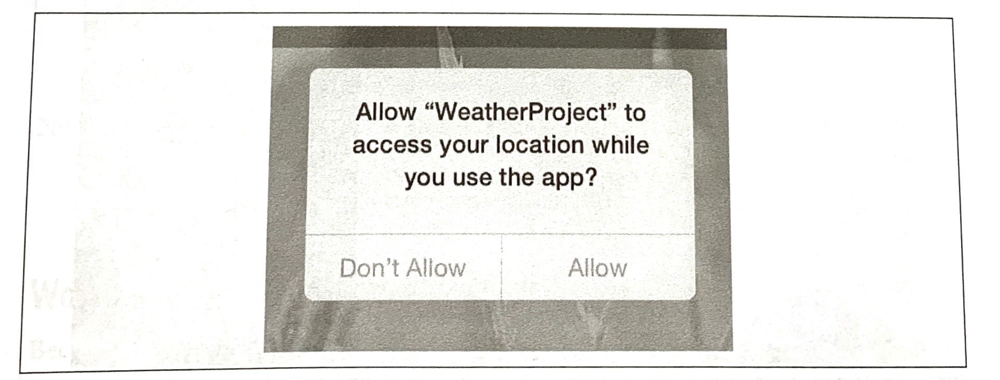
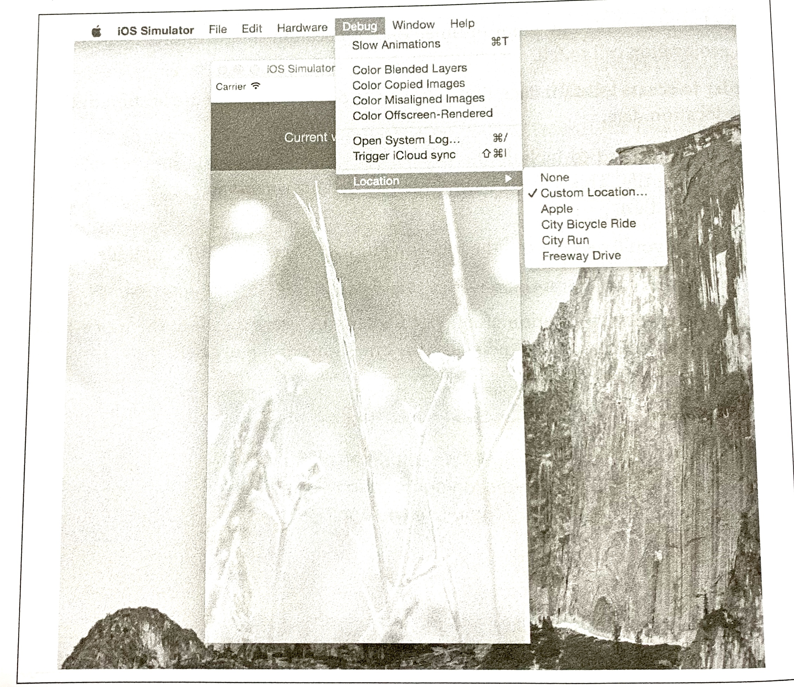
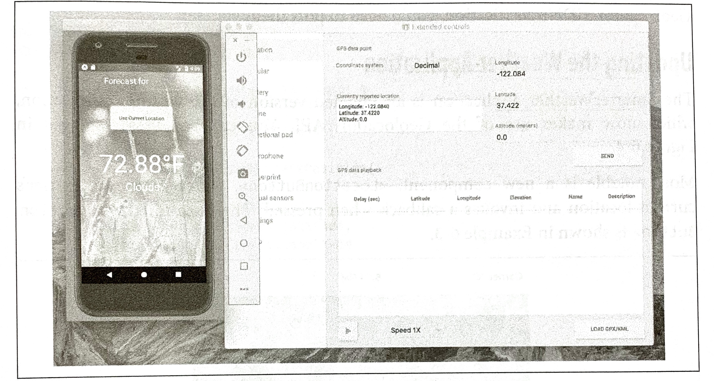
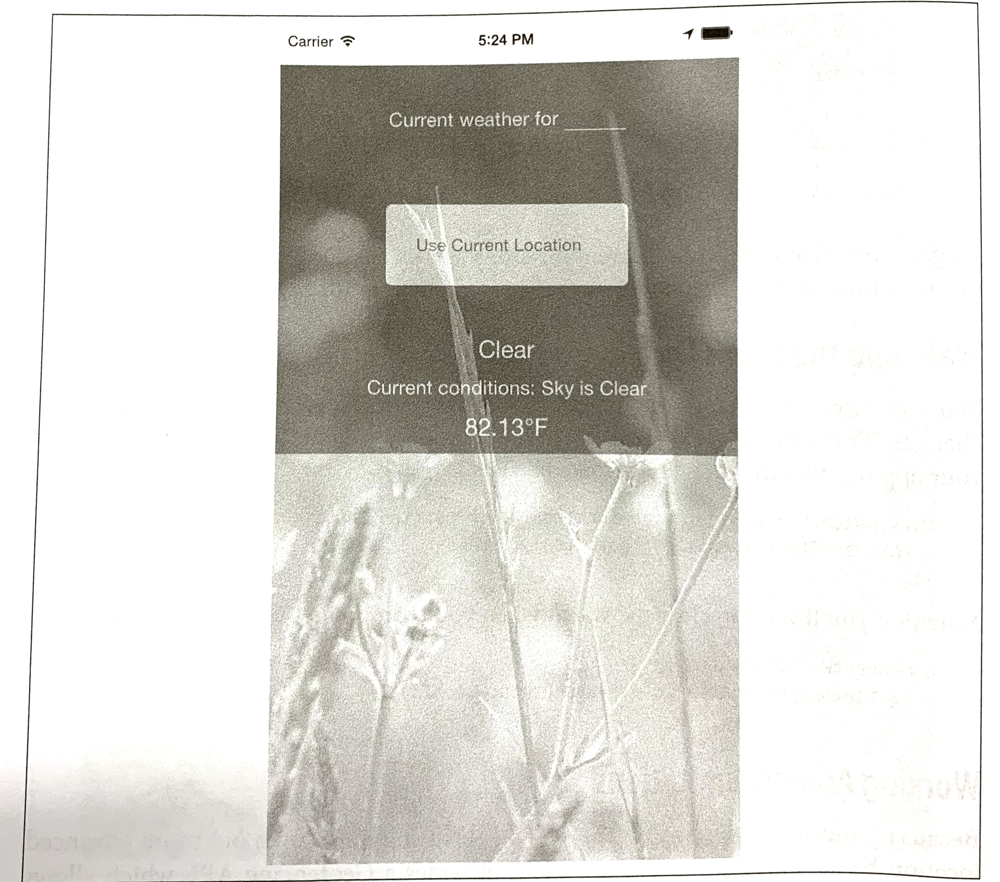
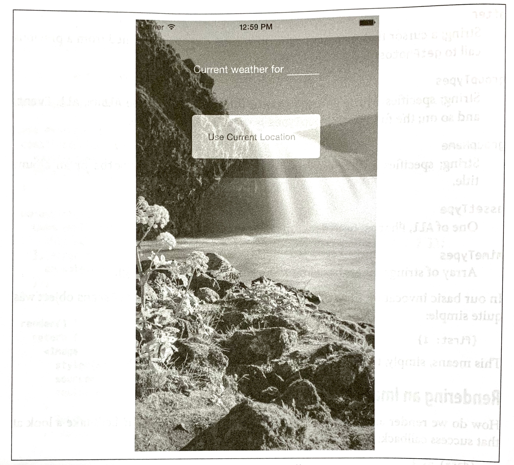

### CHAPTER 6

## Platform APIs

When building mobile applications, you will naturally want to take advantage of the host platform's specific APIs. React Native makes it easy to access things like the phone's camera roll, location, and persistent storage. These platform APIs are made available to React Native through included modules, which provide us with easy-to-use asynchronous JavaScript interfaces to these capabilities.

React Native does not wrap all of its host platform's functionality by default; some platform APIs will require you to either write your own modules, or use modules written by others in the React Native community. We will cover that process in Chapter 7. The docs (*https://facebook.github.io/react-native*) are the best place to check if an API is supported.

This chapter covers some of the available platform APIs. For our example, we'll make some modifications to the weather application from earlier. We'll add geolocation to the app so that it detects the user's location automatically. We will also add "memory" to the app so it will remember your previously searched locations. Finally, we'll use the camera roll to change the background image to one of the user's photos.

While relevant code snippets will be presented in each section, the full code for the application is included in "The SmarterWeather Application" on page 104.

### Using Geolocation

For mobile applications, knowing the user's location is often critical. It allows you to serve the user contextually relevant information. Many mobile applications make extensive use of this data.

React Native has built-in support for geolocation. This is provided as a platform-agnostic "polyfill". It returns data based on the MDN Geolocation API web specification (*http://mzl.la/1lELM6N*). Because we're using the Geolocation specification, you won't need to deal with platform-specific APIs like Location Services, and any location-aware code you write should be fully portable.

#### Reading the User's Location

Using the Geolocation API to get a user's location is a breeze. As shown in Example 6-1, we need to make a call to `navigator.geolocation`.

*Example 6-1. Getting the user's location with a navigator.geolocation call*

```javascript
navigator.geolocation.getCurrentPosition(
  (position) => {
    console.log(position);
  },
  (error) => {alert(error.message)},
  {enableHighAccuracy: true, timeout: 20000, maximumAge: 1000}
);
```

The position will be printed to the JavaScript console; see "Debugging with console.log" on page 141 for more information on how to work with the console.

In conformance to the Geolocation specification, we don't import the location API as a separate module; it's simply available for our use.

The `getCurrentPosition` call takes three arguments: a success callback, an error callback, and a set of `geoOptions`. Only the success callback is required. 

The `position` object passed to the success callback will contain coordinates, as well as a timestamp. Example 6-2 shows the format and possible values.

*Example 6-2. Shape of the response returned from a getCurrentPosition call*

```javascript
{
  coords: {
    speed:-1,
    longitude:-122.03031802,
    latitude:37.33259551999998,
    accuracy:500,
    heading:-1,
    altitude:0,
    altitudeAccuracy:-1
	},
  timestamp:459780747046.605
}
```

`geoOptions` should be an object, which optionally includes they keys `timeout`, `enableHighAccuracy`, and `maximumAge`. `timeout` is probably the most relevant of the bunch when it comes to affecting your application logic.

Note that this won't actually work until you add the proper permissions to either your *Info.plist* file (for iOS) or your *AndroidManifest.xml* file (for Android), as we'll discuss next.

#### Handling Permissions

Location data is sensitive information, and therefore will not be accessible to your application by default. Your application should be able to handle permissions being accepted or rejected. 

Most mobile platforms have some notion of location permissions. A user may opt to block Location Services entirely on iOS, for instance, or they may manage permissions on a per-app basis. It's important to note that location permissions can be revoked at essentially any point in time. Your application should always be prepared for a geolocation call to fail. 

In order to access location data, first you need to declare that your application intends to use location data.

On iOS, you'll need to include they key `NSLocationWhenInUseUsageDescription` in your *Info.plist* file. This should be included by default when you create a new React Native application.

On Android, you'll need to add the following to your *AndroidManifest.xml* file:

```java
<user-permission android="android.permission.ACCESS_FINE_LOCATION" />
```

The first time your application attempts to access the user's location, the user will be presented with a permissions dialog like the one shown in Figure 6-1. 



*Figure 6-1. Location request*

While this dialog is active, neither callback will fire; once the user selects an option, the appropriate callback will be invoked. This setting will persist for your application, so the next time such a check won't be necessary.

If the user denies permissions, you can fail silently if you want, but most apps use an alert dialog to request permissions again.

#### Testing Geolocation in Emulated Devices

Chances are, you'll be doing most of your testing and development from within a simulator, or at the very least, at your desk. How can you test how your app will behave at different locations?

The iOS simulator allows you to easily spoof a different location. By default, you'll be placed near Apple HQ in California, but you can specify any other coordinates as well by navigating to Debug → Location → Custom Location..., as shown in Figure 6-2. 



*Figure 6-2. Picking a location from the iOS simulator*

Similarly, on Android, you can select which GPS coordinates to send (Figure 6-3). You can even import data and control the playback speed to simulate changing locations.



*Figure 6-3. Picking a location from the Android emulator*

It's good practice to try out different locations as part of your testing process. For rigorous testing, of course, you will want to load your application onto an actual device.

#### Watching the User's Location

You can also set a watch on the user's location, and receive updates whenever it changes. This can be used to track a user's location over time, or just to ensure that your app receives the most up-to-date position:

```javascript
this.watchID = navigator.geolocation.watchPosition((position) => {
  this.setState({position: position});
});
```

Note that you'll want to clear the watch when your component unmounts as well:

```javascript
componentWillUnmount() {
  navigator.geolocation.clearWatch(this.watchID);
}
```

#### Working Around Limitations

Because geolocation is based on the MDN specification, it leaves out more advanced location-based features. For example, iOS provides a Geofencing API, which allows your application to receive notifications when the user enters or leaves a designated geographical region (the *geofence*). React Native does not expose this API.

This means that if you want to use location-based features that aren't included in the Geolocation MDN specification, you'll need to port them yourself.

#### Updating the Weather Application

The SmarterWeather application is an updated version of the weather application, which now makes use of the Geolocation API. You can see these changes in Figure 6-4.

Most notable is a new component, `<LocationButton>`, which fetches the user's current location and invokes a callback when pressed. The code for the `<LocationButton>` is shown in Example 6-3.



*Figure 6-4. Displaying forecast based on the user's current location*

*Example 6-3. smarter-weather/LocationButton/index.js: when pressed, the button gets the user's location*

```javascript
import React, { Component } from "react";

import Button from "./../Button";
import styles from "./style.js";

const style = { backgroundColor: "#DDDDDD" };

class LocationButton extends Component {
  _onPress() {
    navigator.geolocation.getCurrentPosition(
      initialPosition => {
        this.props.onGetCoords(
          initialPosition.coords.latitude,
          initialPosition.coords.longitude
        );
      },
      error => {
        alter(error.message);
      },
      { enableHighAccuracy: true, timeout: 20000, maximumAge: 1000 }
    );
  }
  
  render() {
    return (
    	<Button 
        label="Use Current Location"
        style={style}
        onPress={this._onPress.bind(this)}
      />
    );
  }
}

export default LocationButton;
```

The `<Button>` component used by `<LocationButton>` is included at the end of this chapter; it simply warps a `<Text>` component in an appropriate `<TouchableHighlight>` with some basic styling.

We've also had to update the main *weather_project.js* file to accommodate two kinds of queries (Example 6-4). Happily, the OpenWeatherMap API allows us to query by latitude and longitude as well as zip code.

*Example 6-4. Adding_getForecatForCoords and _getForecastForZip functions*

```javascript
const WEATHER_API_KEY = 'bbeb34ef60ad50f7893e7440a1e2b0b';
const API_STEM = 'http://api.openweathermap.org/data/2.5/weather?';

...

_getForecastForZip: function(zip) {
  this._getForecast(
  	`${API_STEM}q=${zip}&units=imperial&APPID=${WEATHER_API_KEY}`);
},
  
_getForecastForCoords: function(lat, lon) {
  this._getForecast(
 		`${API_STEM}lat=${lat}&lon=${lon}&units=imperial&APPID=${WEATHER_API_KEY}`);
},
  
_getForecast: function(url, cb) {
  fetch(url)
  	.then((response) => response.json())
  	.then((responseJSON) => {
    	console.log(responseJSON);
    	this.setState({
        forecast: {
          main: responseJSON.weather[0].main,
          description: responseJSON.weather[0].description,
          temp: responseJSON.main.temp
        }
      });
  	})
  	.catch((error) => {
    	console.warn(error);
  	});
}
```

Then we include the `<LocationButton>` in the main view with `_getForecastForCoords` as the callback:

```javascript
<LocationButton onGetCoord={this._getForecastForCoords}/>
```

Relevant style updates are not shown here, as the fully updated application code will be included at the end of this chapter. 

There's plenty of work left to be done if you wanted to actually ship this to users—for example, a more complete app would include better error messages and additional UI feedback. But basic location fetching is surprisingly straightforward!

### Accessing the User's Images and Camera

>**NOTE**
>
>**Project with Native Code Required**
>
>The examples in this section apply only to projects created with react-native-init, or ejected projects created with create-react-native-app. For more information, see Appendix C.

Having access to a phone's local images and camera is another critical part of many mobile applications. In this section, we'll explore your options for interacting with users' image data as well as the camera. 

We'll still be using the SmarterWeather project. Let's change the background to use an image from the user's photos.

#### Interacting with the CameralRoll Module

React Native provides an interface into the camera roll, which contains the images stored on the user's phone that were taken with the camera.

Interacting with the camera roll in its most basic form is not too complicated. First we import the `CameraRoll` module, as per usual:

```javascript
import { CameraRoll } from "react-native";
```

Then, we make use of the module to fetch information about the user's photos, as shown in Example 6-5.

*Example 6-5. Basic usage of CameraRoll.getPhotos*

```javascript
CameraRoll.getPhotos(
  {first: 1},
  (data) => {
    console.log(data);
  },
  (error) => {
    console.warn(error)
  });
```

We make a call to `getPhotos` with the appropriate query, and it returns some data related to the camera roll images.

In `SmarterWeather`, let's replace the top-level `<Image>` component with a new component, `<PhotoBackdrop>` (Example 6-6). For now, `<PhotoBackdrop>` simply displays a photo from the user's camera roll.

*Example 6-6. smarter-weather/PhotoBackdrop/index.js*

```javascript
import React, { Component } from "react";

import { Image, CameraRoll } from "react-native";

import styles from "./style";

class PhotoBackdrop extends Component {
  constructor(props) {
    super(props);
    this.state = { photoSource: null };
  }
  
  componentDidMount() {
    CameraRoll.getPhotos({first: 1}).then(data => {
      this.setState({ photoSource: { uri: data.edges[3].node.image.uri } });
    }, error => {
      console.warn(error);
    });
  }
  
  render() {
    return (
      <Image 
        style={styles.backdrop}
        source={this.state.photoSource}
        resizeMode="cover"
      >
        {this.props.children}
      </Image>
    );
  }
}

export default PhotoBackdrop;
```

`CameraRoll.getPhotos` takes three arguments: an object with params, a success callback, and an error callback.

#### Requesting Images with GetPhotoParams

The `getPhotoParams` object can take a variety of options. We can take a look at the React Native source code (*http://bit.ly/1kPZnrQ*) to see which options are available to us:

`first`

​		Number; the number of photos wanted in reverse order of the photo application (i.e., most recent first for `SavedPhotos`)

`after`

​		String; a cursor that matches `page_info {end_cursor}` returned from a previous call to `getPhotos`.

`groupTypes`

​		String; specifies which group to use to filter results. May be `Album`, `All`, `Event`, and so on; the full list of `GroupTypes` is specified in the source.

`groupName`

​		String; specifies a filter on group names, such as `Recent Photos` or an album title.

`assetType`

​		One of `All`, `Photos`, or `Videos`; specifies a filter on asset type.

`mimeTypes`

​		Array of strings; filters based on mimetype (such as *image/jpeg*).

In our basic invocation of `getPhotos` in Example 6-5, our `getPhotoParams` object was quite simple:

```javascript
{first: 1}
```

This means, simply, that we are looking for the most recent photo.

#### Rendering an Image from the Camera Roll

How do we render an image we've received from the camera roll? Let's take a look at that success callback:

```javascript
(data) => {
  this.setState({
    photoSource: {uri: data.edges[0].node.image.uri}
  })},
```

The structure of the data object is not immediately apparent, so you'll likely want to use the debugger to inspect the object. Each of the objects in `data.edges` has a `node` that represents a photo; from there, you can get the URI of the actual asset.

You may recall that an `<Image>` component can take a URI as its `source` property. So, we can render an image obtained form the camera roll by setting the source property appropriately:

```javascript
<Image source={this.state.photoSource} />
```

That's it! You can see the resulting application, including the image, in Figure 6-5.



*Figure 6-5. Rendering an image from the camera roll*

#### Uploading an Image to a Server

What if you want to upload a photo somewhere? React Native ships with build-in image uploading functionality in the XHR module. The basic approach looks like this:

```javascript
let formdata = new FormData();
...
formdata.append('image', {...this.state.randomPhoto, name: 'image.jpg'});
... 
xhr.send(formdata);
```

XHR is short for `XMLHttpRequest`. React Native implements the XHR API on top of the iOS networking APIs. Similar to geolocation, React Native's XHR implementation is based on the MDN specification (*http://bit.ly/xmlhttpreq*).

Using XHR for network requests is somewhat more complex that the Fetch API, but the basic approach should look something like Example 6-7.

*Example 6-7. Basic structure for POSTing a photo using XHR*

```javascript
let xhr = new XMLHttpRequest();
xhr.open('POST', 'http://posttestserver.com/post.php');
let formdata = new FormData();
formdata.append('image', {...this.state.photo, name: 'iamge.jpg'});
xhr.send(formdata);
```

Omitted here are the various callbacks you will want to register with the XHR request.

### Storing Persistent Data with AsyncStorage

Most applications will need to keep track of some variety of data persistently. How do you accomplish this with React Native.

React Native provides us with AsyncStorage, a key-value store that is global to your application. If you have used LocalStorage on the web, AsyncStorage ought to feel quite similar. Its implementation varies by platform, but the JavaScript API is the same regardless of whether you are using Android or iOS.

Let's take a look at how to use the React Native AsyncStorage module.

The storage key used by AsyncStorage can be any string; it's customary to use the format `@AppName:key`, like so: 

```javascript
const STORAGE_KEY = '@StarterWeather:zip';
```

The AsyncStorage module returns a promise in response to both `getItem` and `setItem`. For the SmarterWeather app, let's load the stored zip code in `componentDidMount`:

```javascript
AsyncStorage.getItem(STORAGE_KEY)
  .then((value) => {
  if (value !== null) {
    this._getForecastForZip(value);
  	}
	})
  .catch((error) => console.log('AsyncStorage error: ' + error.message))
  .done();
```

Then, in `_getForecastForZip`, we can store the zip code value:

```javascript
AsyncStorage.setItem(STORAGE_KEY, zip)
  .then(() => console.log('Saved selection to disk: ' + zip))
  .catch((error) => console.log('AsyncStorage error: ' + error.message))
  .done();
```

AsyncStorage also provides methods for deleting keys, merging keys, and fetching all available keys.

### The SmarterWeather Application

All of the example code in this chapter can be found in the *SmarterWeather/* directory. The original weather application form Chapter 3 has changed quite a bit, so let's take a look at the structure of the entire application again (Example 6-8).

*Example 6-8. Contents of the SmarterWeather project*

```
smarter-weather
├── Button
│		├── index.js
│		└── style.js
├── Forecast
│   └── index.js
├── LocationButton
│		├── index.js
│		└── style.js
├── PhotoBadckDrop
│		├── flowers.png
│		├── index.js
│		├── local_image.js
│		└── style.js
├── index.js
├── open_weather_map.js
├── styles
│		└── typography.js		
└── wather_project.js		
```

The top-level component is located in *weather_project.js*. Shared font styles are located in *styles/typography.js*. The folders *Forecast/*, *PhotoBackdrop/*, *Button/*, and *LocationButton/* all contain React components used in the new SmarterWeather application.

#### The `<WeatherProject>` Component

The top-level `<WeatherProject>` component is located in *weather_project.js* (Example 6-9). This includes the use of AsyncStorage to store the most recent location.

*Example 6-9. smarter-weather/weather_project.js*

```javascript
import React, { Component } from "react";
import { 
  StyleSheet, 
  Text, 
  View, 
  TextInput, 
  AsyncStorage,
  Image 
} from "react-native";

import Forecast from "./Forecast";
import LocationButton from "./LocationButton";
import textStyles from "./styles/typography.js";

const STORAGE_KEY = "@SmarterWeather:zip";

import OpenWeatherMap from "./open_weather_map";

// This version uses flowers.png from local assets
import PhotoBackdrop from "./PhotoBackdrop/local_image";

// This versiont pulls a specified photo from the camera roll
// import PhotoBackdrop from './PhotoBackdrop';

class WeatherProject extends Component {
  constructor(props) {
    super(props);
    this.state = { forecast: null };
  }

  componentDidMount() {
    AsyncStorage
      .getItem(STORAGE_KEY)
      .then(value => {
        if (value !== null) {
          this._getForecastForZip(value);
        }
      })
      .catch((error) => console.log('AsyncStorage error: ' + error.message))
      .done();
  }

  _getForecastForZip = zip => {
    // Store zip code
    AsyncStorage
      .setItem(STORAGE_KEY, zip)
      .then(() => console.log('Saved selection to disk: ' + zip))
      .catch((error) => console.log('AsyncStorage error: ' + error.message))
      .done();
    OpenWeatherMap.fetchZipForecast(zip).then(forecast => {
      this.setState({ forecast: forecast });
    });
  }

  _getForecastForCoords = (lat, lon) => {
    OpenWeatherMap.fetchLatLonForecast(lat, lon).then(forecast => {
      this.setState({ forecast: forecast });
    });
  };

  _handleTextChange = event => {
    let zip = event.nativeEvent.text;
    this._getForecastForZip(zip);
  };

  render() {
    let content = null;
    if (this.state.forecast !== null) {
      content = (
        <View style={styles.row}>
          <Forecast
            main={this.state.forecast.main}
            temp={this.state.forecast.temp}
          />
        </View>
      );
    }

    return (
      <PhotoBackdrop>
        <View style={styles.overlay}>
          <View style={styles.row}>
            <Text style={styles.mainText}>
              Forecast for
            </Text>

            <View style={styles.zipContainer}>
              <TextInput
                style={[textStyles.mainText, styles.zipCode]}
                onSubmitEditing={this._handleTextChange}
                underlineColorAndroid="transparent"
              />
            </View>
          </View>

          <View style={styles.row}>
            <LocationButton onGetCoords={this._getForecastForCoords} />
          </View>

          {content}

        </View>
      </PhotoBackdrop>  
    );
  }
}

const styles = StyleSheet.create({
  overlay: { backgroundColor: "rgba(0,0,0,0.1)" },
  row: {
    flexDirection: "row",
    flexWrap: "nowrap",
    alignItems: "center",
    justifyContent: "center",
    padding: 24,
  },
  zipContainer: {
    borderBottomColor: "#DDDDDD",
    borderBottomWidth: 1,
    marginLeft: 5,
    marginTop: 3,
    width: 80,
    height: textStyles.baseFontSize * 2,
    justifyContent: "flex-end"
  },
  zipCode: { flex: 1 }
});

export default WeatherProject;
```

It makes use of shared styles located in *styles/typography.js* (Example 6-10).

*Example 6-10. Shared font styles are located in smarter-weather/styles/typography.js*

```javascript
import { StyleSheet } from "react-native";

const baseFontSize = 24;

const styles = StyleSheet.create({
  bigText: { fontSize: baseFontSize + 8, color: "#FFFFFF" },
  mainText: { fontSize: baseFontSize, color: "#FFFFFF" }
});

// For use elsewhere...
styles["baseFontSize"] = baseFontSize

export default styles;
```

#### The `<Forecast>` Component

The `<Forecast>` component displays the forecast information, including the temperature. It's used by the `<WeatherProject>` component just shown. The code for the `<Forecast>` component is provided in Example 6-11.

*Example 6-11. `<Forecast>` component renders information about the forecast*

```javascript
import React, { Component } from "react";

import { Text, View, StyleSheet } from "react-native";

class Forecast extends Component {
  render() {
    return (
      <View style={styles.forecast}>
        <Text style=>
          {this.props.temp}℉
        </Text>
        <Text style=>
          {this.props.main}
        </Text>
      </View>
    );
  }
}

const styles = StyleSheet.create({ forecast: { alignItems: "center" } });

export default Forecast;
```

#### The `<Button>` Component

The `<Button>` component is a reusable container-style component. It provides a properly styled `<Text>` wrapped by a `<TouchableHighlight>`. The main component file is provided in Example 6-12, and its associated styles are provided in Example 6-13.

*Example 6-12. The `<Button>` component provides an appropriately styled `<TouchableHighlight>` containing a `<Text>`*

```javascript
import React, { Component } from "react";

import { Text, View, TouchableHighlight } from "react-native";

import styles from "./style";

class Button extends Component {
  render() {
    return (
      <TouchableHighlight onPress={this.props.onPress}>
        <View style={[styles.button, this.props.style]}>
          <Text>
            {this.props.label}
          </Text>
        </View>
      </TouchableHighlight>
    );
  }
}

export default Button;
```

*Example 6-13. Styles for the `<Button>` component*

```javascript
import { StyleSheet } from "react-native";

const styles = StyleSheet.create({
  button: { backgroundColor: "#FFDDFF", padding: 25, borderRadius: 5 }
});

export default styles;
```

#### The `<LocationButton>` Component

When pressed, the `<LocationButton>` fetches the user's location and invokes a callback. The component's main JavaScript file is provided in Example 6-14, and its styles are provided in Example 6-15.

*Example 6-14. The `<LocationButton>` component*

```javascript
import React, { Component } from 'react';

import Button from "./../Button";
import styles from "./style.js"

const style = { backgroundColor: "#DDDDDD" };

class LocationButton extends Component {
  _onPress() {
    navigator.geolocation.getCurrentPosition(
      initialPosition => {
        this.props.onGetCoords(
          initialPosition.coords.latitude,
          initialPosition.coords.logitude
        );
      },
      error => {
        alert(error.message);
      },
      { enableHighAccuray: true, timeout: 20000, maximumAge: 1000 }
    );
  }

  render() {
    return (
      <Button 
        label="Use Current Location"
        style={style}
        onPress={this._onPress.bind(this)}
      />
    );
  }
}

export default LocationButton;
```

*Example 6-15. Styles for `<LocationButton>`*

```javascript
import { StyleSheet } from "react-native";

const styles = StyleSheet.create({
  locationButton: { width: 200, padding: 25, borderRadius: 5 }
});

export default styles;
```

#### The `<PhotoBackdrop>` Component

There are two versions of `<PhotoBackdrop>` provided, to demonstrate different methods of selecting an image for the background. The first, provided in Example 6-16 and listed as *local_image.js* in the GitHub repository, uses a simple require call to load a standard image asset. The second, as seen in Example 6-17, selects an image from the user's camera roll.

*Example 6-16. local_image.js is the original version; it uses a simple require call*

```javascript
import React, { Component } from 'react';

import { Image } from "react-native";

import styles from "./style.js"

class PhotoBackdrop extends Component {
  render() {
    return (
      <Image 
        style={styles.backdrop}
        source={require("./flowers.png")}
        resizeMode="cover"
      >
        {this.props.children}
      </Image>
    );
  }
}

export default PhotoBackdrop;
```

*Example 6-17. src/smarter-weather/PhotoBackdrop/index.js programmatically selects an image from the camera roll*

```javascript
import React, { Component } from 'react';

import { Image, CameraRoll } from "react-native";

import styles from "./style"

class PhotoBackdrop extends Component {
  constructor(props) {
    super(props);
    this.state = { photoSource: null };
  }

  componentDidMount() {
    CameraRoll.getPhotos({ first: 1 }).then(data => {
      this.setState({ photoSource: { uri: data.edges[3].node.image.uri } });
    }, error => {
      console.warn(error);
    });
  }

  render() {
    return (
      <Image 
        style={styles.backdrop}
        source={this.state.photoSource}
        resizeMode="cover"
      >
        {this.props.children}
      </Image>
    );
  }
}

export default PhotoBackdrop;
```

Both versions share the same stylesheet, shown in Example 6-18.

*Example 6-18. Both versions of the `<PhotoBackdrop>` use this stylesheet*

```javascript
import { StyleSheet } from "react-native";

export default StyleSheet.create({
  backdrop: {
    flex: 1,
    flexDirection: "column",
    width: undefined,
    height: undefined
  },
  button: { flex: 1, margin: 100, alignItems: "center" }
});
```

### Summary

In this chapter, we made some modifications to the weather application. We looked at the Geolocation, CameraRoll, and AsyncStorage APIs, and learned how to incorporate these modules into our applications.

When React Native ships with support for a host platform API, it makes usage a breeze. But what happens if React Native does not yet support a given API, such as in the case of video playback, and you want to use a library or module that isn't yet available in JavaScript? In the next chapter, we'll take a closer look at this scenario.