### CHAPTER 9

## Debugging and Developer Tools

As you develop your own applications, chances are that something will go wrong along the way. When it's time to debug your applications, we happily have some React Native-specific tools that will make the job easier. There are also some nasty bugs that can crop up at the intersection of React Native and its host platform. In this chapter, we'll dig into the common pitfalls of React Native development and the tools you can use to tackle them. And because any discussion of debugging would be incomplete without reference to testing, we'll also cover the basics of getting automated testing set up for your React Native code.

### JavaScript Debugging Practices, Translated

When working with the React for the web, we have a number of common JavaScript-based tools and techniques to help us debug our applications. Most of theses are also available for React Native, though occasionally with minor adjustments. React Native gives us access to the console, debugger, and React developer tools that we're accustomed to using, so debugging JavaScript-based issues in React Native should feel familiar.

#### Activating the Developer Options

In order to avail yourself of these tools, you'll need to enable Chrome Developer Tools in the in-app developer menu (Figure 9-1).

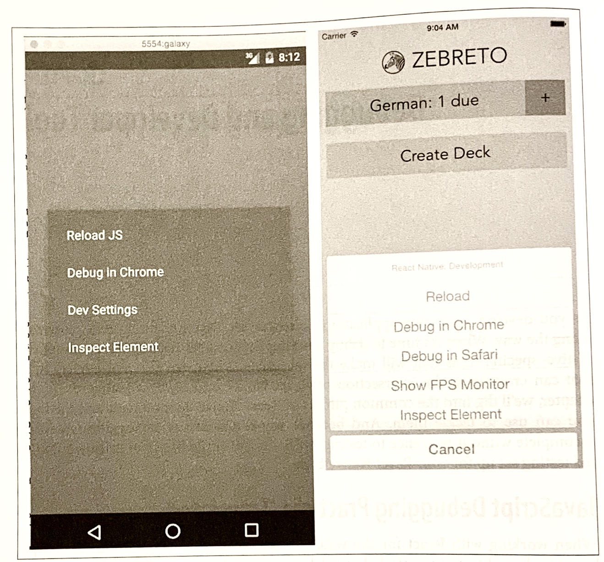

*Figure 9-1. The in-app developer menu, as viewed from Android (left) and iOS (right)*

Note that the developer menu is disabled in production builds.

If you're using an Expo app (i.e., one created with Create React Native App), the same shortcuts will open the Expo developer menu (see Figure 9-2).

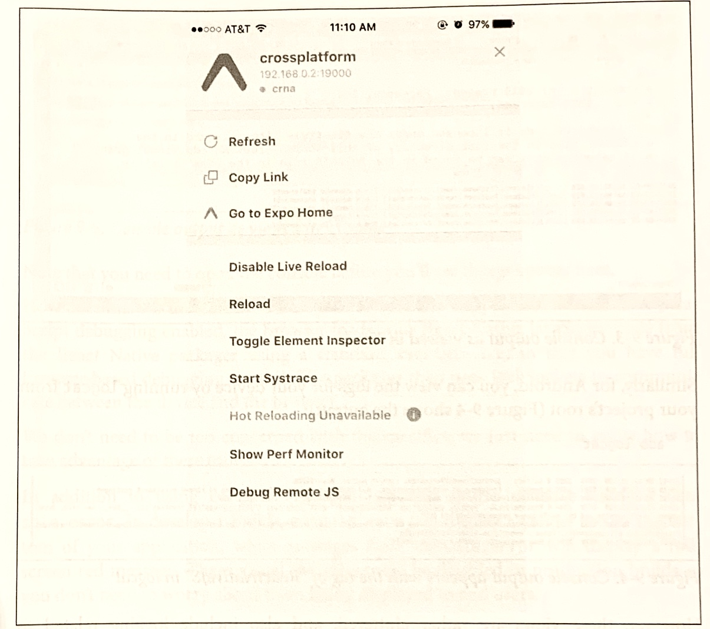

*Figure 9-2. Expo developer menu*

#### Debugging with console.log

One of the most basic, and common, forms of debugging is the "print it out and see what's happening" tactic. For many web-based developers, being able to add `console.log` to our code is an almost unconscious part of our workflow.

The JavaScript console works straight out of the box with React Native; you don't need to do any special configuration in order to use your `print` statements.

When using Xcode, you will see your console statements as output in the Xcode console (Figure 9-3). Note that you can expand how much room is allotted to the console by tweaking the visible Xcode panes. 

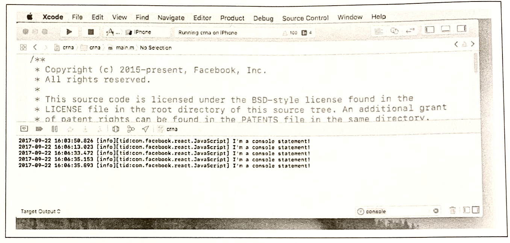

*Figure 9-3. Console output as viewed in Xcode*

Similarly, for Android, you can view the logs for your device by running `logcat` from your project's root (Figure 9-4 shows the output):

​	`adb logcat`

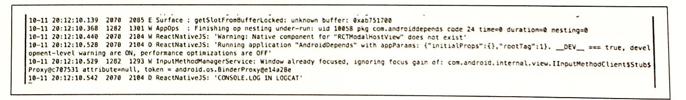

*Figure 9-4. Console output appears with the tag of "ReactNativeJS" in logcat*

However, these views are rather cluttered, and also include logging related to platform-specific things. Console output is tagged with `ReactNativeJS`, so we can instead run:

​	`adb logcat | grep ReactNativeJS`

We can hop over into the browser-based developer tools for a more familiar—and cleaner—experience. Activate the developer menu and select Debug Remote JS, and then open the console in your web browser. As shown in Figure 9-5, you will be able to see the console output from the Chrome developer tools.

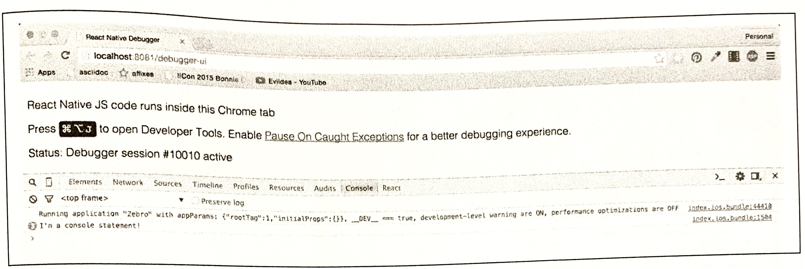

*Figure 9-5. Console output as viewed in Chrome*

Note that you need to open the console before you'll see things appear here. 

How does this work? When you load your React Native application with remote JavaScript debugging enabled, the browser loads your React Native JavaScript code from the React Native packager using a standard `<script>` tag, so that you have full browser-based debugging control. The packager then uses WebSockets to communicate between the device and the browser.

We don't need to be too concerned with the specifics; we just need to know how to take advantage of these tools!

In addition to using `console.log`, you can also utilize `console.warn` or `console.error`. IN developer builds, `console.warn` will display a yellow box at the bottom of your application, while messages from `console.error` will display a full-screen red message. These visual indicators will be disabled in production builds so you don't need to worry about them being displayed to end users.

#### Using the JavaScript Debugger

You can also use the JavaScript debugger just as you normally would for web-based React development. Open up the developer tools in Chrome and switch to the source tab, and then your breakpoints will be activated. You can see this in action in Figure 9-6.

Note that, similar to the JavaScript console, if you don't already have the developer tools pane open, the debugger many not be activated on your breakpoints. Likewise, if you don't have Debug Remote JS enabled, the debugger will not be activated.

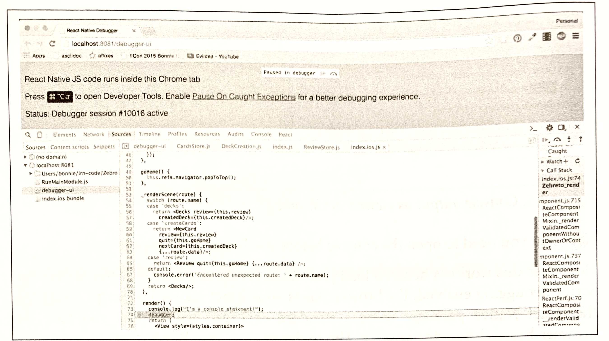

*Figure 9-6. Using the debugger*

When using the debugger, you have access to the usual view of your source code from within Chrome, and you can interact with the current JavaScript context via the in-browser console as well.

#### Working with the React Developer Tools

When you're developing with React for the web, the React developer tools are quite useful. They allow you to inspect the component hierarchy, examine the props and state of components, and modify the state from your browser. The React developer tools are available as a Chrome extension (*http://bit.ly/1O5DTlX*).

The React developer tools work with React Native as well. You'll need to install the standalone version to use them with React Native:

​	`npm install -g react-dvetools`

Then launch the DevTools app, shown in Figure 9-7, by running: 

​	`react-devtools`

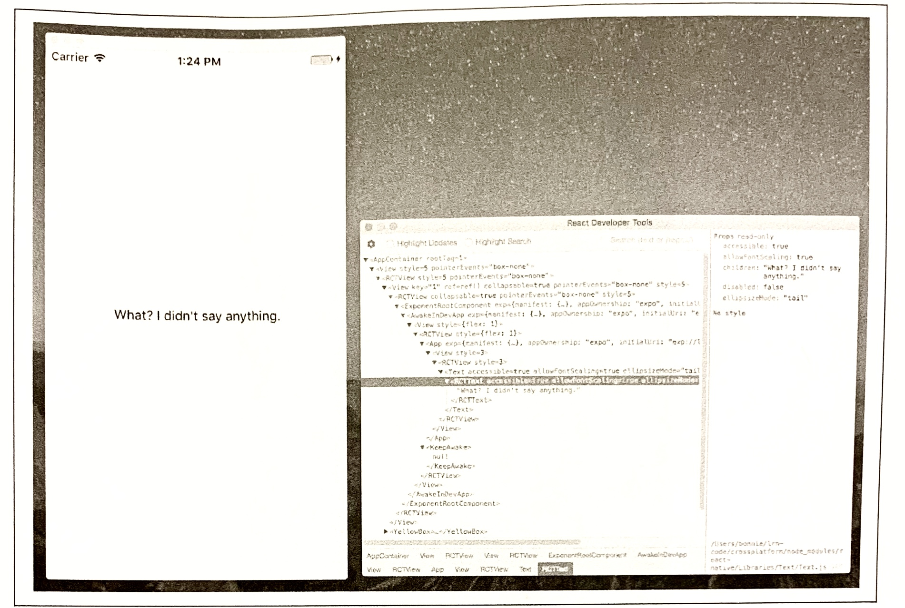

*Figure 9-7. The React DevTools application*

### React Native Debugging Tools

In addition to the usual JavaScript-based web debugging tools, there are also some features specific to React Native that are relevant to debugging.

#### Using Inspect Element

While you can use the React developer tools via the browser, you may find that the "inspect element" functionality leaves something to be desired. However, there's also an in-app "inspect element" that you may find helpful. It has support for viewing things like style and gives you a quick way to dig through the component hierarchy. In Figure 9-8, you can see the result of inspecting a `<Button>` component. 

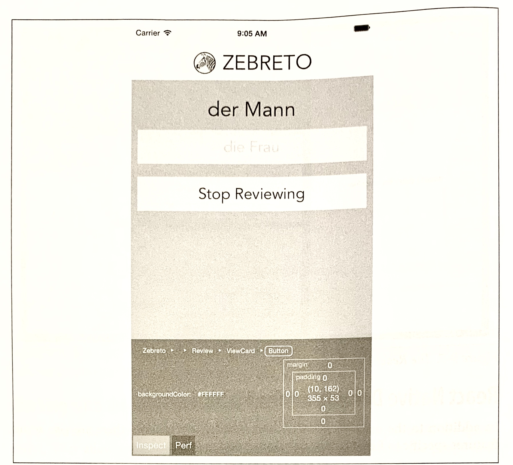*Figure 9-8. Using Inspect Element will let you click on a component to view more information*

This view also displays some performance metrics.

#### Interpreting the Red Screen of Death

One of the most common sights you'll see during application development is the Red Screen of Death. Alarming appearance aside, the Red Screen of Death is actually a boon: it takes errors and parses them into meaningful messages. So, learning to parse the information it displays is critical to an effective developer workflow.

For example, a syntax error might produce the output shown in Figure 9-9, indicating the file and line number where the error occurred.

*Figure 9-9. Red Screen of Death for a syntax error*

Other common errors include attempting to use a variable without importing or defining it. For instance, a common issue is failing to explicitly import the `<Text>` component, like so:

```react
	import React, { Component } from "react";

	export default class App extends Component {
    render() {
      return (
      	<View>
        	<Text>
            I haven't imported things properly!
          </Text>
        </View>
      );
    }
  }
```

This results in the error message shown in Figure 9-10.


*Figure 9-10. Error message from forgetting to import <Text>*

Attempting to use an undeclared variable results in another error message (see Figure 9-11).


*Figure 9-11. Error message from attempting to use an undeclared variable*

Of particular use are the style-related error messages. For instance, if you pass in a bad value to a `StyleSheet.create` call, React Native will helpfully inform you which values would have been appropriated (see Figure 9-12).

*Figure 9-12. Error message from missetting a style property*

While the Red Screen of Death may look alarming, it's really there to help you, and the error messages it presents are useful information. If for some reason you need to dismiss the screen, pressing the Escape key in the device simulator will take you back to your application.

### Debugging Beyond JavaScript

As you write mobile applications with React Native, you will encounter errors not only in your React code but also in your application in general. If you are new to mobile development, these issues can be frustrating. Additionally, sometimes you'll see cryptic error messages and issues where your JavaScript codebase meets the host platforms; the combination of host platform code and React Native can lead to confusing symptoms.

Learning to debug issues outside of pure JavaScript-based problem is critical to a productive development process with React Native. Happily, many of these issues are simpler than they might seem at first glance, and we have plenty of tools to help us along the way. 

#### Common Development Environment Issues

Managing your developer environment for iOS, Android, and JavaScript can be a bit annoying, and it's not uncommon to encounter issues with any combination of the above. 

If you encounter issues with the packager starting, or with building or running your application using `npm start` or `react-native	run-android`, it's possible that you have dependency problem.

If you're having dependency issues, one common solution is just to clean out your installed npm packages and reinstall them:

```bash
	rm -rf node_modules
	npm install
```

#### Common Xcode Problems

When you build your iOS application, if your application has any errors, they will appear in the Issues pane in Xcode (Figure 9-13). You can view them by selecting the warning icon. 


*Figure 9-13. Viewing the issues pane*

Xcode will then point you to the relevant file and line number, and highlight the issue in the IDE. Figure 9-14 shows an example of a common error.

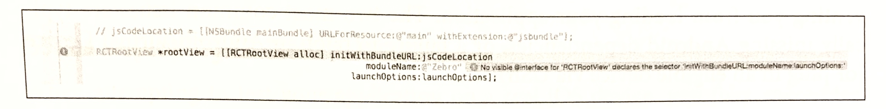

*Figure 9-14. Interface error*  

This "No visible interface for RCTRootView" issue indicates that React Native's Objective-C classes are for some reason not visible to Xcode. In general, if you encounter "X is undefined" error messages in Xcode, where X is an RCT-prefixed class or otherwise part of React Native, it's a good idea to check on the packager and make sure that your JavaScript dependencies are in order:

1. Quit the packager.
2. Quite Xcode.
3. Run `npm install` from the project directory.
4. Reopen Xcode.

Another common problem deals with asset sizes (see Figure 9-15).

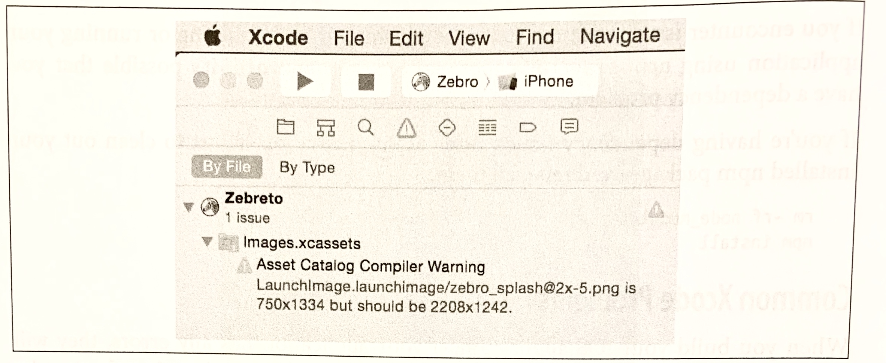

*Figure 9-15. Warning regarding a missized image*

Because assets should be sized appropriately for the device they're intended for (especially your application's icon), Xcode will throw a warning if you include an asset of an inappropriate size.

Deciphering Xcode's warnings may take some time at first, especially if you are unfamiliar with Objective-C. Some of the most confusing issues deal with the integration of React Native and your Xcode project, but doing a clean install of React Native usually clears up any problems. 

#### Common Android Problems

When you run `react-native	run-android`, some error messages may appear, preventing you from loading your application. The two most common issues are typically missing Android dependencies, or a failure to boot an Android Virtual Device (or plug in an eligible via USB).

If you receive a warning about a missing package, run `android` and check to see if that package is listed at "installed." If not, install it. If it *is* installed but React Native can't find it, follow the steps just given to try to fix any issues with your development environment. You should also check to make sure that your `ANDROID_HOME` environment variable is properly set and points to your installation of the Android SDK. For example, on my system it looks like this: 

```
	$ echo $ANDROID_HOME
	/usr/local/opt/android-sdk
```

If you receive a warning about no eligible device being available as a build target, check your device. Did you attempt to launch the emulator? If the emulator is still booting, the `react-native	run-android` command will fail; give it a few seconds and try again. For a physical device, make sure that USB debugging is enabled. 

You may also see issues after you create a signed version of your Android app:

```
	$./gradlew installRelease
	...
	INSTALL_PARSE_FAILED_INCONSISTENT_CERTIFICATES:
	New package has a different signature
```

You can solve this by uninstalling the old application from your device or emulator, and reattempting the installation. The error is caused by attempting to install an application with a different signing key—which happens after you generate your first signed APK.

#### The React Native Packager

Because React Native depends on the packager in order to rebuild your code, issues with the packager will manifest in problems fairly quickly.

The React Native packager will launch automatically when you run your project, either from Xcode or using `react-native	run-android`. However, it will not quite automatically when you close your project. This means that if you switch projects, the packager will still be running—just from the wrong directory, so it will fail to compile your code. Always make sure that the packager is running from your project's root directory. You can launch it yourself with `npm start`.

If the React Native packager throws strange errors upon starting, chances are good that your development environment is in a bad state. Following the steps just described, make sure that your  local installations of npm, Node, and react-native are all in a good state. 

#### Issues Deploying to an iOS Device

When attempting to test your application on a real iOS device, you may encounter some peculiar issues. 

If you are having trouble uploading to your iOS device, make sure that your device is selected correctly as the build target. Is your device of a supported type, based on your project settings? If your app explicitly disallows iPads, for instance, you won't be able to deploy to an iPad.

If you are using the React Native packager to rebuild your files as you make edits, you may see the screen shown in Figure 9-16.

*Figure 9-16. Could not connect to the development server*

This indicates that your application has attempted to load its bundled JavaScript file from the React Native packager but is unable to do so. In this case, run through the following checks:

* Are your computer and iOS device on the same WiFi network?
* Is the React Native packager running from the project directory?

#### Simulator Behavior

You may also see strange behavior in the device simulator from time to time. If your application continues to crash repeatedly or it seems like changes to your code are not being reflected on the simulator, the easiest first step is to delete your application from the device.

Note that simply deleting your application may not have the desired effect; on many systems, your app may leave behind files that can cause side effects later on. As shown in Figure 9-17, the most strightforward way to start over with a clean slate on iOS is to reset the device simulator entirely, which removes *all* files and applications from the simulated device.

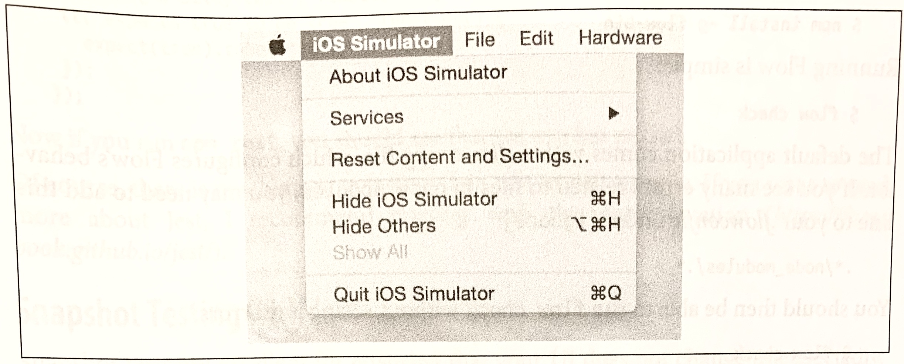*Figure 9-17. The Reset Content and Settings... option will delete everything from your device*

Similarly, for Android emulators, you can delete the emulator and start over with a fresh device.

### Testing Your Code

Debugging is all well and good, but you'll also want to prevent errors *before* they arise (and catch them when they inevitably do!). Automated tests and static type checking are useful tools that you'll probably want to make use of in your applications. 

>**TIP**
>
>**Testing JavaScript Code**
>
>Much of the React Native code you write may not even be aware that it's running in a mobile environment. For example, any business logic can probably be isolated from rendering logic. That means that you can test your JavaScript code using whatever tools you prefer for ordinary JavaScript development.

In this section, we're going to look specifically at type checking with Flow and unit testing with Jest.

#### Type Checking with Flow

Flow (*http://flowtype.org/*) is a JavaScript library for static type checking. It relies on type inference to detect type errors—even in unannotated code—and allows you to slowly add type annotations to existing projects. Type checking can help you detect possible issues early and helps you enforce sane APIs between various components and modules. 

You can install Flow using npm: 

```bash
	$ npm install -g flow-bin
```

Running Flow is simple:

```bash
	$ Flow check
```

The default application comes with a *.flowconfig* file, which configures Flow's behavior. If you see many errors related to files in `node_modules`, you may need to add this line to your *.flowconfig* under `[ignore]`:

```bash
	.*/node_modules/.*
```

You should then be able to run `flow check` without seeing any errors:

```bash
	$ flow check
	$Found 0 errors.
```

Feel free to use Flow to assist you as you develop your React Native applications.

#### Unit Testing with Jest

React Native supports testing of React components using Jest. Jest is a unit testing framework built on top of Jasmine. It provides aggressive automocking of dependencies, and it meshes nicely with React's testing utilities.

To use Jest, you will first need to install it:

```bash
	npm install jest-cli --save-dev
```

Because we only need jest for development, not for our product build, we install it with the `--save-dev` flag.

Update your `package.json` file to include a `test` script:

```bash
	{
		...
		"script": {
			"test": "jest"
		}
		...
	}
```

This will run `jest` when you type `npm test`.

Next, create the *tests/* directory. Jest will recursively search for files in a *tests/* directory, and run them:

```bash
	mkdir __tests__
```

Now let's create a new file, *tests/dummy-test.js*, and write our first test:

```react
	'use strict';

	describe('a silly test', function() {
    it('expects true to be true', function() {
      expect(true).toBe(true);
		});
  });
```

Now if you run **`npm test`**, you should see that the test has passed.

Of course, there is much more to testing than this trivial example. If you want to read more about Just, I recommend starting with the documentation (*https://facebook.github.io/jest*).

#### Snapshot Testing with Jest

Snapshot tests are excellent for ensuring that your UI does not change unexpectedly. This makes them a good fit for React components. Plus, snapshot tests are easy to write and require minimal configuration.

Snapshot testing for React Native requires the `react-test-renderer` package.

​	**`npm install --save react-test-renderer`**

Example 9-1 demonstrates a simple Jest test.

*Example 9-1. Styles/tests/FlexDemo-test.js*

```react
import React from "react"l
import FlexDemo from "../FlexDemo";

import renderer from "react-test-renderer";

test("renderer correctly", () => {
  const tree = renderer.create(<FlexDemo />).toJSON();
  
  expect(tree).toMatchSnapshot();
});
```

As you can see, very little code is needed to add a snapshot test.

You'll also need to update your *package.json* file to add Jest as a dependency, with the `react-native` testing preset.

```bash
	"dependencies": {
		...
		"jest": "*"
		...
	},
	"jest": {
		"preset": "react-native"
	}
```

The first time you run `npm test`, a "snapshot" will be generated.

```bash
	$ npm test
	 PASS __tests__/FlexDemo-test.js
	 ✔︎ renders correctly (1216ms)
	 
	Snapshot Summary
	 › 1 snapshot written in 1 test suite.
```

The snapshot file will look something like Example 9-2.

*Example 9-2. The inital snapshot file*

```bash
// Jest Snapshot v1, https://goo.gl/fbAQLP

exports[`renders correctly 1`] = `
<View
	style={
		Object {
			"alignItems": "flex-end",
			"backgroundColor": "#F5FCFF",
			"borderColor": "#0099AA",
			"borderWidth": 5,
			"flex": 1,
			"flexDirection": "row",
			"marginTop": 30,
		}
	}
>
	<Text
		accessible={true}
		allowFontScaling={true}
		ellipsizeMode="tail"
		style={
			Object {
				"borderColor": "#AA0099",
				"borderWidth": 2,
				"flex": 1,
				"fontSize": 24,
				"textAlign": "center",
			}
		}
	>
		Child One
	</Text>
	<Text
		accessible={true}
		allowFontScaling={true}
		ellipsizeMode="tail"
		style={
			Object {
				"borderColor": "#AA0099",
				"borderWidth": 2,
				"flex": 1,
				"fontSize": 24,
				"textAlign": "center",
			}	
		}
	>
		Child Two
	</Text>
	<Text 
		accessible={true}
		allowFontScaling={true}
		ellipsizeMode="tail"
		style={
			Object {
				"borderColor": "#AA0099",
				"borderWidth": 2,
				"flex": 1,
				"fontSize": 24,
				"textAlign": "center",
			}
		}
	>
		Child Three
	</Text>
</View>
`;
```

Don't edit these files manually. Instead, when you update your application, run `npm test` again. If a component renders differently from the snapshot, Jest will fail and show you a diff between the expected and received version of the component:

```bash
	$ npm test
	 FAIL	__texts__/FlexDemo-test.js
	 	• renders correctly
	 		
	 		expect(value).toMatchSnapshot()
	 		Received value does not match stored snapshot 1.
	 		
	 		- Snapshot
	 		+ Received
	 		
	 		@@ -41,22 +41,6 @@
      				}
						}
          >
          	 Child Two
          </Text>
			-		<Text
			- 		accessible={true}
      -			allowFontScaling={true}
      -			ellipsizeMode="tail"
      -			style={
      -				Object {
      -					"borderColor": "##AA0099",
      -					"borderWidth": 2,
      -					"flex": 1,
      -					"fontSize": 24,
      - 				"textAlign": "center",
     	-				 }
      - 		}
			- 	>
			-			Child Three
			-		</Text>
				</View>
				
					at Object.<anonymous> (__test__/FlexDemo-test.js:11:14)
          
		X renders correctly (66ms)
		
	Snapshot Summary
	 › 1 snapshot test failed in 1 test suite.
```

When inspecting the diff, you can then decide whether or not the changes were in error or if you want to update your snapshot to reflect the changes. Snapshot files should be checked into source control.

### When You're Stuck

If you end up with a particularly nasty problem that you can't solve on your own, you can try consulting the community. There are plenty of places to go to ask for advice:

* The #reactnative IRC chat (*irc.lc/freenode/reactnative*)
* The React discussion forum (*https://discuss.reactjs.org/*)
* StackOverflow (*http://stackoverflow.com/questions/tagged/react-native*)

If you suspect your issue may be a bug in React Native itself, check the existing list of issues on GitHub (*https://github.com/fecebook/react-native/issues*). When you report issues, it's useful to create a small proof-of-concept application demonstrating the problem.

### Summary

In general, debugging with React Native should feel quite similar to debugging your React code on the web. Most of the tools you are already familiar with are available here, too, which makes the transition to React Native much easier. That being said, React Native applications bring their own variety of complexity, and sometimes that complexity can manifest in frustrating bugs. Knowing how to debug your applications and becoming familiar with the error messages produced by your environment will go a long way in helping you to cultivate a productive workflow.